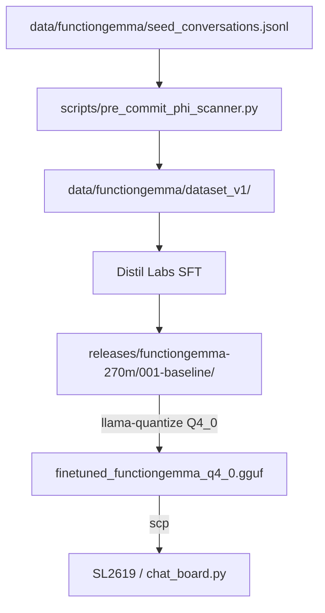
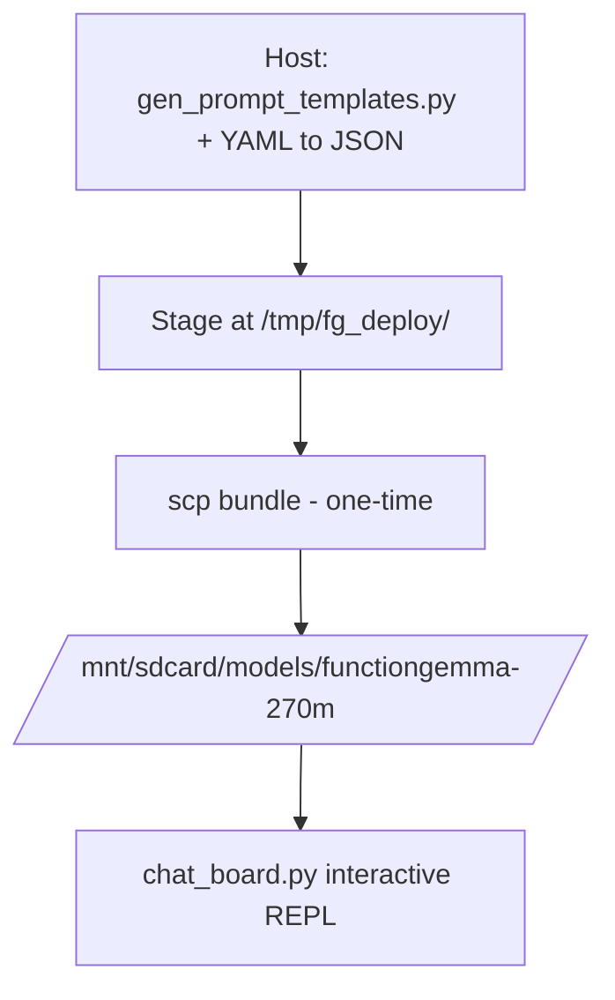

# CLAUDE.md — gemma3-270M-finetune

Claude Code instructions specific to this repository. The human-facing entry
point is [`README.md`](README.md); this file is the agent's self-reference.

## Repository purpose

Active focus: **FunctionGemma 270M-IT** (function-calling on the SL2619
Synaptics Astra Machina board). Iteration 001 was produced via Distil Labs;
the deliverable is at `releases/functiongemma-270m/001-baseline/`. The 2026-05-02
quantization sweep selected **Q4_0** as the on-board variant.

The original Gemma 3 270M-IT health-QA SFT track is preserved as a working
reference under `archive/gemma3-270m-health-qa/` (with live code at
`src/gemma_tools/_legacy/`, `tests/_legacy/`, `data/_legacy/` so its tests
still pass in CI). Do NOT mix new work into that track.

## High-level flow



## Key paths

| Path | Role |
|---|---|
| `src/gemma_tools/__init__.py` | Package shim — version only |
| `src/gemma_tools/health_table.py` | Patient-record schema + Pydantic loader (dual-use: legacy bench AND FunctionGemma tools) |
| `src/gemma_tools/functiongemma/` | Active sub-package — `dataset.py`, `tools.py` |
| `src/gemma_tools/_legacy/` | Frozen Gemma 3 270M health-QA modules (importable; tests under `tests/_legacy/` still run) |
| `scripts/functiongemma/chat.py` | Host interactive REPL (the local FunctionGemma demo) |
| `scripts/functiongemma/{bench,smoke}.py` | Bench harness (local + remote SL2619) and smoke runner |
| `scripts/functiongemma/data/` | Dataset prep — build_seeds, build_splits, ingest, quality_audit, gen_prompt_templates |
| `scripts/functiongemma/quantize/build_variants.sh` | Idempotent host `llama-quantize` driver |
| `scripts/functiongemma/bench/aggregate_quant.py` | Sweep JSONL → Markdown aggregator |
| `scripts/functiongemma/train/finetune_local.py` | Unsloth-based local SFT fallback (when Distil platform is not used) |
| `scripts/functiongemma/eval/eval_holdout.py` | Holdout evaluation; HF (`--checkpoint`) + GGUF (`--gguf`) seams |
| `scripts/functiongemma/deploy/` | Board deploy: `chat_board.py`, `ask_board.sh`, `run_prompt.sh` |
| `scripts/setup/server-bootstrap.sh` | Idempotent Ubuntu-server SFT-stack bootstrap (RTX 5080) |
| `scripts/pre_commit_phi_scanner.py` | PHI scanner for FunctionGemma data ingest |
| `data/health_table_v1.yaml` | Synthetic patient record (no real PHI) |
| `data/functiongemma/dataset_v1/{train,val,test}.jsonl` | Active Distil iteration-001 training splits |
| `data/functiongemma/seed_conversations.jsonl` | 50-row hand-authored seeds |
| `data/functiongemma/eval_holdout_v{1,2_clean,2_contaminated}.jsonl` | Active eval holdouts |
| `data/_legacy/` | Frozen gemma3-270m SFT corpora and `prompts.yaml` |
| `releases/functiongemma-270m/001-baseline/` | Iteration-001 deployable: `merged/`, `adapter/`, `gguf/`, `distil/`, `Modelfile`, `model_client.py`, `RECIPE.md` |
| `releases/functiongemma-270m/001-baseline/distil/` | Distil platform deliverables (config, predictions, training-analysis, teacher-eval-analysis, README) — what `distil model download-artifact` produces |
| `releases/functiongemma-270m/001-baseline/gguf/` | `CHECKSUMS.txt` (committed), `RECOMMENDED.md`, `Modelfile`, plus the `finetuned_functiongemma_{fp16,q4_0}.gguf` files (gitignored) |
| `bench/functiongemma/runs/2026-05-02-quant/` | Quant sweep JSONL outputs |
| `docs/plans/functiongemma/` | Active plan docs — `recipe.md`, `decisions-log.md`, `quantization-plan.md`, `seed-authoring-recipe.md`, `llm-augmentation-prompt.md`, `upstream-issue-drafts.md` |
| `docs/bench-notes/functiongemma/2026-05-02_quantization-sweep.md` | The single canonical sweep report |
| `docs/deployment/sl2619-board.md` | Board cross-compile + deploy runbook |
| `docs/deployment/functiongemma-board-deploy.md` | FunctionGemma-specific board deploy recipe |
| `docs/conventions/` | Normative coding/repo/workflow rules (Python, shell, testing, doc-update) |
| `docs/references/` | Upstream source notes + opt-in submodules under `upstream/{gemma,llama.cpp}` |
| `docs/tmp/` | Local-only `/board_probe` snapshots (gitignored) |
| `archive/gemma3-270m-health-qa/` | Frozen gemma3-270m track (plans, bench, scripts, model-card) |
| `archive/functiongemma-pre-distil/` | Frozen pre-distil FunctionGemma path (plans, scripts, bench, data) |

## Workflows

### Install (host dev)

```bash
cd /home/lanhp-wsl/nouslogic/gemma3-270M-finetune
uv venv .venv && source .venv/bin/activate
uv pip install -e ".[dev,functiongemma]"
```

### Tests, lint, typecheck

```bash
uv run pytest                            # 545 tests (active + _legacy)
uv run ruff check src tests scripts/functiongemma
uv run mypy src
```

### Quantize from canonical FP16

```bash
# One-time host build of llama-quantize (if not already built)
cd docs/references/upstream/llama.cpp
cmake -B build -DCMAKE_BUILD_TYPE=Release -DLLAMA_CURL=OFF -DLLAMA_BUILD_SERVER=ON
cmake --build build --target llama-quantize -j$(nproc)
cd ../../../..

# Generate Q4_0 (default; only the recommended on-board variant)
scripts/functiongemma/quantize/build_variants.sh

# Generate ALL variants (Q4_0, Q4_K_M, Q5_K_M, Q8_0, IQ4_XS) for sweep reproduction
scripts/functiongemma/quantize/build_variants.sh --all
```

### Run the local demo

```bash
uv run python scripts/functiongemma/chat.py
```

Defaults to `releases/functiongemma-270m/001-baseline/{gguf/finetuned_functiongemma_fp16.gguf, merged/}`
and `data/health_table_v1.yaml` for tool dispatch. Override with
`--model finetuned_functiongemma_q4_0.gguf` to chat against the deployed
quant on host.

### Bench

```bash
uv run python scripts/functiongemma/bench.py --mode local --warmup 1
uv run python scripts/functiongemma/bench.py --mode remote \
    --ssh-host nouslogic-sl2619 \
    --remote-binary /mnt/sdcard/llama-cpp/llama-completion \
    --remote-model  /mnt/sdcard/models/functiongemma-270m/finetuned_functiongemma_q4_0.gguf
```

Output lands in `bench/functiongemma/runs/`. Always pass `--remote-model`
explicitly when running against a specific variant.

### Holdout eval (HF or GGUF seam)

```bash
# HF transformers seam (server-side; needs torch + transformers)
uv run python scripts/functiongemma/eval/eval_holdout.py \
    --checkpoint releases/functiongemma-270m/001-baseline/merged \
    --holdout data/functiongemma/eval_holdout_v2_clean.jsonl

# GGUF seam (host CPU via llama-cpp-python; 5–10× faster than on-board eval)
uv run python scripts/functiongemma/eval/eval_holdout.py \
    --gguf releases/functiongemma-270m/001-baseline/gguf/finetuned_functiongemma_q4_0.gguf \
    --tokenizer-dir releases/functiongemma-270m/001-baseline/merged \
    --holdout data/functiongemma/eval_holdout_v2_clean.jsonl
```

### Server-side fine-tune (local fallback)

```bash
# 1. One-time server bootstrap
scp scripts/setup/server-bootstrap.sh nouslogic-server:~/
ssh -t nouslogic-server 'bash ~/server-bootstrap.sh --with-system-deps'

# 2. Upload data + script and run SFT
scp data/functiongemma/dataset_v1/{train,val,test}.jsonl nouslogic-server:~/functiongemma-finetune/data/
ssh nouslogic-server 'cd ~/functiongemma-finetune && source .venv/bin/activate && \
    python finetune_local.py ...'
```

For Distil Labs platform invocations (current production path), see
`releases/functiongemma-270m/001-baseline/distil/README.md`.

### Deploy to board



Full recipe: [`docs/deployment/functiongemma-board-deploy.md`](docs/deployment/functiongemma-board-deploy.md).
After deploy, run on board:

```bash
ssh nouslogic-sl2619 'python3 /mnt/sdcard/models/functiongemma-270m/chat_board.py'
# First turn primes /tmp/fg_pc_<model>.bin (~32 s, one-time).
# Subsequent turns: ~6 s wall, 10.3 tok/s decode.
```

The cache is per-model (`/tmp/fg_pc_<model_basename>.bin`); switching
quants = priming a new cache. Clear with `rm /tmp/fg_pc_*.bin` if the
prefix changes.

## Discipline

- **No model weights in git** — `*.gguf`, `*.bin`, `*.safetensors`, `*.pt` are gitignored. `releases/.../gguf/CHECKSUMS.txt` is the authoritative SHA record.
- **SSH to board is read-only** — deployment commands are emitted for the user; the agent never mutates the board (R3 in `.claude/CLAUDE.local.md`).
- **PHI scanner gates data ingest** — `scripts/pre_commit_phi_scanner.py` scans every staged JSONL before merge into `llm_expanded_v1.jsonl`. Patient YAML stays synthetic; OQ-5 covers any switch to real PHI.
- **Tests before any data pipeline change** — `uv run pytest` must be green before editing `gemma_tools.functiongemma.dataset`, `gemma_tools.functiongemma.tools`, or `health_table.py`.
- **Submodules are opt-in** — `docs/references/upstream/{gemma,llama.cpp}` are shallow git submodules with `update = none`. Initialize on demand: `git submodule update --init docs/references/upstream/<name>`.
- **`unsloth-notebooks` is a nested git repo, not a submodule** — `docs/references/upstream/unsloth-notebooks/` is a standalone shallow clone with sparse-checkout (single notebook).
- **Archive is read-only** — `archive/` and `data/_legacy/` are frozen reference. New work goes under active dirs (`docs/`, `src/`, `scripts/`, `tests/`, `data/`, `releases/`, `bench/`).
- **`docs/conventions/` is normative** — agent edits go through normal PRs with review; this dir's protocols (Python style, shell style, testing, doc-update) bind agent behavior.
- **`docs/tmp/` is gitignored** — `/board_probe` snapshots contain board IPs / server usernames; they live locally only.

## On-board variant: Q4_0 only

The 2026-05-02 sweep tested Q4_0, Q4_K_M, Q5_K_M, Q8_0, IQ4_XS. Only Q4_0
preserves the FunctionGemma wire format on the board's `b8925`/`0adede8`
runtime — every other quant drops the `<start_function_call>` open token
or stops at `?` due to K-quant scale-factor encoding skew with the older
runtime. Repository ships only Q4_0 + FP16 source on disk; the other
variants are reproducible via `build_variants.sh --all` if the on-board
binary is refreshed against `b8981`+.

Pinned recommendation:
[`releases/functiongemma-270m/001-baseline/gguf/RECOMMENDED.md`](releases/functiongemma-270m/001-baseline/gguf/RECOMMENDED.md).

## Pointers

- `docs/conventions/doc-update.md` — DRY canonical-ownership registry.
- `docs/conventions/code-style-python.md`, `code-style-shell.md`, `testing.md` — normative rules.
- `docs/plans/functiongemma/recipe.md` — current FunctionGemma working recipe (model identity, wire format, train/eval paths).
- `docs/plans/functiongemma/decisions-log.md` — decisions table.
- `docs/plans/functiongemma/quantization-plan.md` — Stage-1 done; Stage-2 deferred.
- `docs/bench-notes/functiongemma/2026-05-02_quantization-sweep.md` — the single canonical sweep report.
- `releases/functiongemma-270m/001-baseline/RECIPE.md` — how iter-001 was produced + reproduce steps.
- `releases/functiongemma-270m/001-baseline/distil/README.md` — Distil platform invocation timeline.
- `releases/functiongemma-270m/001-baseline/gguf/RECOMMENDED.md` — Q4_0 selection rationale.
- `archive/README.md` — archive index.
