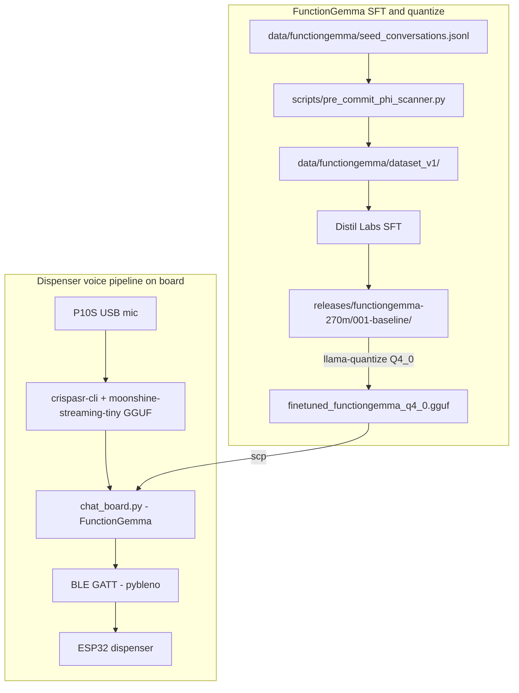
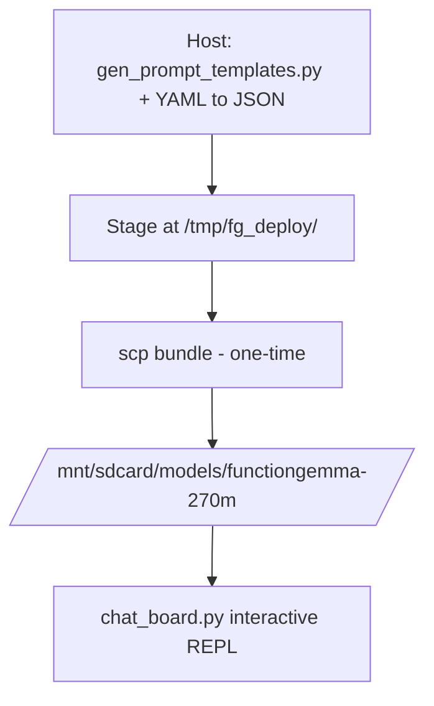

# CLAUDE.md — gemma3-270M-finetune

Claude Code instructions specific to this repository. The human-facing entry
point is [`README.md`](README.md); this file is the agent's self-reference.

## Repository purpose

Two active focuses sharing one board (Synaptics SL2619, Cortex-A55 ×2,
1.87 GiB RAM, ARMv8.2-A NEON+DOTPROD, no NPU/Vulkan):

1. **FunctionGemma 270M-IT** — closed-world function-calling over a synthetic
   patient registry. Iteration 001 (Distil Labs SFT) shipped at
   `releases/functiongemma-270m/001-baseline/`; the 2026-05-02 quantization
   sweep selected **Q4_0** as the on-board variant. No retrain planned.
2. **Dispenser demo** (active, Phase 0 closed 2026-05-11) — voice-driven
   medication dispenser stacking **CrispASR + Moonshine Streaming Tiny GGUF**
   for STT on top of the FunctionGemma tool-call brain, with BLE GATT to an
   ESP32-controlled dispenser. Plan + decisions live under
   `docs/plans/dispenser-demo/`. Phase 1 (data + Distil retrain) and Phase 2
   (BLE bring-up) run next, in parallel.

The original Gemma 3 270M-IT health-QA SFT track is frozen as a reference
under `archive/gemma3-270m-health-qa/`; live code at `src/gemma_tools/_legacy/`,
`tests/_legacy/`, `data/_legacy/` keeps its tests green in CI. Do NOT mix new
work into that track.

## High-level flow



## Key paths

| Path | Role |
| --- | --- |
| `src/gemma_tools/health_table.py` | Patient-record Pydantic loader (dual-use: legacy bench + FunctionGemma tools) |
| `src/gemma_tools/functiongemma/` | Active sub-package — `dataset.py`, `tools.py` |
| `src/gemma_tools/_legacy/` | Frozen Gemma 3 270M health-QA modules (tests under `tests/_legacy/` still run) |
| `scripts/functiongemma/chat.py` | Host interactive REPL (the local FunctionGemma demo) |
| `scripts/functiongemma/{bench,smoke}.py` | Bench harness (local + remote SL2619) and smoke runner |
| `scripts/functiongemma/data/` | Dataset prep — build_seeds, build_splits, ingest, quality_audit, gen_prompt_templates |
| `scripts/functiongemma/quantize/build_variants.sh` | Idempotent host `llama-quantize` driver |
| `scripts/functiongemma/bench/aggregate_quant.py` | Sweep JSONL → Markdown aggregator |
| `scripts/functiongemma/train/finetune_local.py` | Unsloth-based local SFT fallback |
| `scripts/functiongemma/eval/eval_holdout.py` | Holdout evaluation; HF (`--checkpoint`) + GGUF (`--gguf`) seams |
| `scripts/functiongemma/deploy/` | Board deploy: `chat_board.py`, `ask_board.sh`, `run_prompt.sh` |
| `scripts/dispenser_demo/spike/crispasr_host_smoke.py` | Phase 0 host-side CrispASR smoke (Python, uv-run) |
| `scripts/dispenser_demo/spike/crispasr_board_smoke.sh` | Phase 0 board-side dispatcher (SSH read-only pre-flight + decode + VmRSS poll) |
| `scripts/setup/server-bootstrap.sh` | Idempotent Ubuntu-server SFT-stack bootstrap (RTX 5080) |
| `scripts/sl2619/p10s_aec_probe.py` | P10S firmware AEC tone-suppression probe (duplex; verdict via Goertzel) |
| `scripts/sl2619/p10s_aec_speech_probe.py` | P10S speech-survival follow-up — operator speaks during duplex |
| `scripts/pre_commit_phi_scanner.py` | PHI scanner for FunctionGemma data ingest |
| `tests/dispenser_demo/test_crispasr_smoke_scripts.py` | 23 cases gating the Phase 0 smoke scripts |
| `data/health_table_v1.yaml` | Synthetic patient record (no real PHI) |
| `data/functiongemma/dataset_v1/{train,val,test}.jsonl` | Active Distil iter-001 training splits |
| `data/functiongemma/seed_conversations.jsonl` | 50-row hand-authored seeds |
| `data/functiongemma/eval_holdout_v{1,2_clean,2_contaminated}.jsonl` | Active eval holdouts |
| `data/_legacy/` | Frozen gemma3-270m SFT corpora and `prompts.yaml` |
| `releases/functiongemma-270m/001-baseline/` | Iter-001 deployable: `merged/`, `adapter/`, `gguf/`, `distil/`, `Modelfile`, `model_client.py`, `RECIPE.md` |
| `releases/functiongemma-270m/001-baseline/gguf/` | `CHECKSUMS.txt` (committed), `RECOMMENDED.md`, `Modelfile`; FP16 + Q4_0 GGUF gitignored |
| `bench/functiongemma/runs/2026-05-02-quant/` | Quant sweep JSONL outputs |
| `docs/plans/functiongemma/` | FunctionGemma plan docs — recipe, decisions-log, quantization-plan, seed-authoring-recipe, llm-augmentation-prompt, upstream-issue-drafts |
| `docs/plans/dispenser-demo/` | Dispenser demo — `plan.md`, `crispasr-spike-notes.md`, `decisions-log.md` (Phase 0 closed) |
| `docs/bench-notes/functiongemma/2026-05-02_quantization-sweep.md` | Single canonical quant sweep report |
| `docs/deployment/{sl2619-board,functiongemma-board-deploy}.md` | Board cross-compile + FunctionGemma deploy runbooks |
| `docs/guides/usb-audio-testing-sl2619.md` | USB speaker + mic + P10S firmware AEC probe recipe |
| `docs/conventions/` | Normative coding/repo/workflow rules (Python, shell, testing, doc-update) |
| `docs/references/upstream/` | Opt-in shallow submodules: `gemma`, `llama.cpp`, `CrispASR`, `Synaptics/*`, `unsloth-notebooks` (nested clone) |
| `docs/tmp/` | Local-only `/board_probe` snapshots (gitignored) |
| `archive/{gemma3-270m-health-qa,functiongemma-pre-distil}/` | Frozen historical tracks |

## Workflows

### Install (host dev)

```bash
cd /home/lanhp-wsl/nouslogic/gemma3-270M-finetune
uv venv .venv && source .venv/bin/activate
uv pip install -e ".[dev,functiongemma]"
```

### Tests, lint, typecheck

```bash
uv run pytest                            # 568 tests (active + dispenser_demo + _legacy)
uv run ruff check src tests scripts/functiongemma
uv run mypy src
```

### Quantize from canonical FP16

```bash
# One-time host build of llama-quantize
cd docs/references/upstream/llama.cpp
cmake -B build -DCMAKE_BUILD_TYPE=Release -DLLAMA_CURL=OFF -DLLAMA_BUILD_SERVER=ON
cmake --build build --target llama-quantize -j$(nproc)
cd ../../../..

# Default Q4_0 only; --all for the sweep (Q4_0, Q4_K_M, Q5_K_M, Q8_0, IQ4_XS)
scripts/functiongemma/quantize/build_variants.sh
```

### Run the local FunctionGemma demo

```bash
uv run python scripts/functiongemma/chat.py
```

Defaults to `releases/functiongemma-270m/001-baseline/{gguf/finetuned_functiongemma_fp16.gguf, merged/}`
and `data/health_table_v1.yaml`. Override with `--model finetuned_functiongemma_q4_0.gguf` to
chat against the on-board quant from host.

### Bench

```bash
uv run python scripts/functiongemma/bench.py --mode local --warmup 1
uv run python scripts/functiongemma/bench.py --mode remote \
    --ssh-host nouslogic-sl2619 \
    --remote-binary /mnt/sdcard/llama-cpp/llama-completion \
    --remote-model  /mnt/sdcard/models/functiongemma-270m/finetuned_functiongemma_q4_0.gguf
```

Output lands in `bench/functiongemma/runs/`. Always pass `--remote-model` explicitly.

### Holdout eval (HF or GGUF seam)

```bash
# HF seam (server-side; torch + transformers)
uv run python scripts/functiongemma/eval/eval_holdout.py \
    --checkpoint releases/functiongemma-270m/001-baseline/merged \
    --holdout data/functiongemma/eval_holdout_v2_clean.jsonl

# GGUF seam (host CPU via llama-cpp-python; 5–10× faster than on-board eval)
uv run python scripts/functiongemma/eval/eval_holdout.py \
    --gguf releases/functiongemma-270m/001-baseline/gguf/finetuned_functiongemma_q4_0.gguf \
    --tokenizer-dir releases/functiongemma-270m/001-baseline/merged \
    --holdout data/functiongemma/eval_holdout_v2_clean.jsonl
```

### CrispASR Phase 0 smoke (host then board)

```bash
# Host-side build + decode
uv run python scripts/dispenser_demo/spike/crispasr_host_smoke.py

# Board-side dispatcher (read-only pre-flight, decode, VmRSS poll)
bash scripts/dispenser_demo/spike/crispasr_board_smoke.sh
```

Full audit trail (transcripts, RSS, gate verdict) is in
`docs/plans/dispenser-demo/crispasr-spike-notes.md`. Build profile + production
launcher flags are pinned in `docs/plans/dispenser-demo/decisions-log.md`.

### Deploy FunctionGemma to board



Recipe: [`docs/deployment/functiongemma-board-deploy.md`](docs/deployment/functiongemma-board-deploy.md).
First turn primes `/tmp/fg_pc_<model>.bin` (~32 s, one-time). Subsequent turns:
~6 s wall, 10.3 tok/s decode. The cache is per-model; switching quants = priming
a new cache. Clear with `rm /tmp/fg_pc_*.bin` if the prefix changes.

## Discipline

- **No model weights in git** — `*.gguf`, `*.bin`, `*.safetensors`, `*.pt` are gitignored. `releases/.../gguf/CHECKSUMS.txt` is the authoritative SHA record.
- **SSH to board is read-only** — deployment commands are emitted for the user; the agent never mutates the board (R3 in `.claude/CLAUDE.local.md`).
- **CrispASR runtime traps** — any code invoking the board's crispasr binary MUST pass `-l en --no-punctuation -t 2`. Auto-LID (without `-l <code>`) silently fetches `ggml-tiny.bin` (~77 MB) from HF at runtime; auto-punctuation (without `--no-punctuation`) fetches `fireredpunc-q4_k.gguf` (~80 MB) and adds a ~3–4 s second pass on A55. Both are fatal on the offline SL2619. See `docs/plans/dispenser-demo/decisions-log.md`.
- **BusyBox quirks on SL2619** — board's `date` emits literal `%N` instead of nanoseconds; use `awk '{print $1; exit}' /proc/uptime` for sub-second timing. `head -20` fails (use `head -n 20`); no `grep -P` (use `-E`).
- **PHI scanner gates data ingest** — `scripts/pre_commit_phi_scanner.py` scans every staged JSONL. Patient YAML stays synthetic; OQ-5 covers any switch to real PHI.
- **Tests before any data pipeline change** — `uv run pytest` must be green before editing `gemma_tools.functiongemma.dataset`, `gemma_tools.functiongemma.tools`, or `health_table.py`.
- **Submodules are opt-in** — `docs/references/upstream/{gemma,llama.cpp,CrispASR,Synaptics/*}` are shallow submodules with `update = none`. Initialize on demand: `git submodule update --init docs/references/upstream/<name>`. `unsloth-notebooks/` is a standalone shallow clone (not a submodule), with sparse-checkout.
- **Archive is read-only** — `archive/` and `data/_legacy/` are frozen reference. New work goes under active dirs (`docs/`, `src/`, `scripts/`, `tests/`, `data/`, `releases/`, `bench/`).
- **`docs/conventions/` is normative** — agent edits go through normal PRs with review.
- **`docs/tmp/` is gitignored** — `/board_probe` snapshots contain board IPs / server usernames.

## Pinned runtime variants

- **FunctionGemma on board: Q4_0 only.** The 2026-05-02 sweep tested Q4_0, Q4_K_M, Q5_K_M, Q8_0, IQ4_XS. Only Q4_0 preserves the FunctionGemma wire format on the board's `b8925`/`0adede8` runtime (K-quant scale-factor encoding skew with the older runtime drops `<start_function_call>`). Repo ships only Q4_0 + FP16 source on disk. Rationale: [`releases/functiongemma-270m/001-baseline/gguf/RECOMMENDED.md`](releases/functiongemma-270m/001-baseline/gguf/RECOMMENDED.md).
- **STT on board: CrispASR + Moonshine Streaming Tiny GGUF (q4_k).** Build profile: static aarch64, no OpenMP, `crispasr-cli` target (NOT bare `crispasr`, which builds only `libcrispasr.so`). Phase 0 (2026-05-11) measured 7.48 s wall on an 11 s clip / 69.5 MB RSS on board (host: 1.10 s / 155 MB) — extrapolated 3 s utterance ≈ 2.0 s wall, ≈ 70 MB RSS, meeting `plan.md` §9 Phase 0 gate. Full flag list, decision rationale, and reproduction in [`docs/plans/dispenser-demo/decisions-log.md`](docs/plans/dispenser-demo/decisions-log.md) and [`docs/plans/dispenser-demo/crispasr-spike-notes.md`](docs/plans/dispenser-demo/crispasr-spike-notes.md).

## Pointers

- `docs/conventions/doc-update.md` — DRY canonical-ownership registry.
- `docs/conventions/{code-style-python,code-style-shell,testing}.md` — normative rules.
- `docs/plans/functiongemma/{recipe,decisions-log,quantization-plan}.md` — FunctionGemma working recipe + decisions.
- `docs/plans/dispenser-demo/plan.md` — full dispenser demo plan (phases, BLE wire contract, state machine).
- `docs/plans/dispenser-demo/crispasr-spike-notes.md` — Phase 0 STT spike audit trail.
- `docs/plans/dispenser-demo/decisions-log.md` — binding Phase 0 STT decisions (runtime, flags, build profile).
- `docs/bench-notes/functiongemma/2026-05-02_quantization-sweep.md` — single canonical sweep report.
- `docs/guides/usb-audio-testing-sl2619.md` — USB speaker + mic + P10S firmware AEC probe (verified 2026-05-11: firmware AEC handles echo cancellation, no software AEC needed for duplex voice pipeline).
- `releases/functiongemma-270m/001-baseline/{RECIPE.md,distil/README.md,gguf/RECOMMENDED.md}` — iter-001 reproduce + Distil timeline + Q4_0 rationale.
- `archive/README.md` — archive index.

Last refreshed: 2026-05-11
