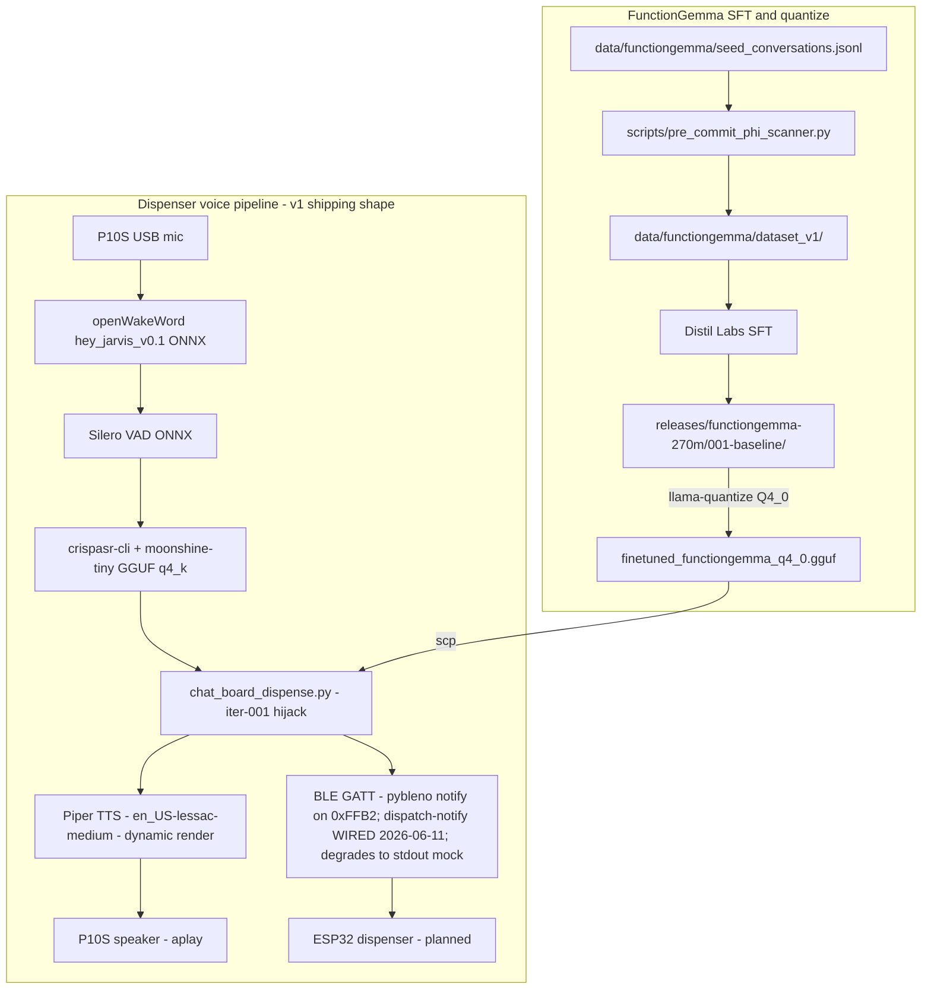
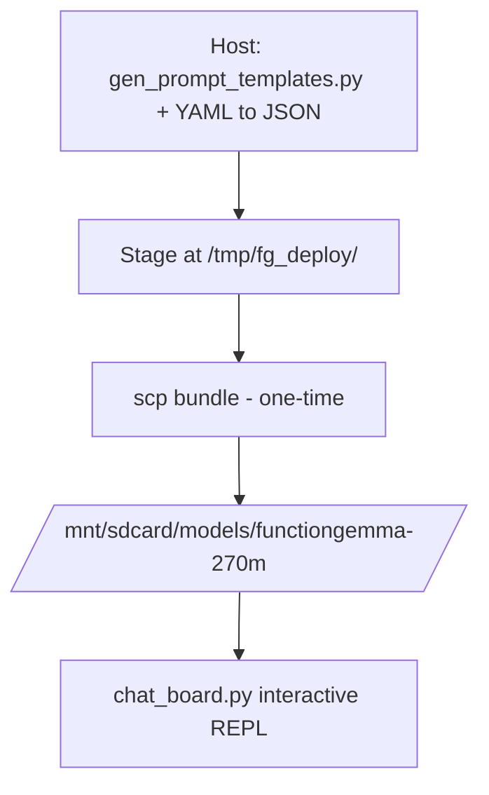

# CLAUDE.md — gemma3-270M-finetune

Claude Code instructions specific to this repository. The human-facing entry
point is [`README.md`](README.md); this file is the agent's self-reference.

## Repository purpose

Two active focuses sharing one board (Synaptics SL2619, Cortex-A55 ×2,
1.87 GiB RAM, ARMv8.2-A NEON+DOTPROD, no NPU/Vulkan):

1. **FunctionGemma 270M-IT** — closed-world function-calling over a synthetic
   patient registry. Iteration 001 (Distil Labs SFT) shipped at
   `releases/functiongemma-270m/001-baseline/`; the 2026-05-02 quantization
   sweep selected **Q4_0** as the on-board variant. No retrain planned.
2. **Dispenser demo** — voice-driven medication dispenser. v1 voice loop **closed end-to-end 2026-05-12** (Phase 3 Layers B/C/D all green) on **iter-001 + dispatcher-hijack** (`scripts/functiongemma/deploy/chat_board_dispense.py`) wired into the long-running `scripts/dispenser_demo/deploy/dispenser_voice.py`: openWakeWord `hey_jarvis_v0.1` → Silero VAD → CrispASR (Moonshine Tiny GGUF) → FunctionGemma → **Piper neural TTS** (dynamic per-turn render) → P10S speaker. First-run wall ~10.7 s/turn including Piper render. **BLE PROVEN END-TO-END — phone 2026-06-01, real ESP32 dispenser 2026-06-10** — the revB pin-mux blocker (Synaptics bug 37861/37374) is **resolved by Astra v2.4.0**; `hci0` (UART / SYN43711 combo) enumerates + patches, and pybleno (`PyBlenoBleClient` via `scripts/dispenser_demo/deploy/ble_test.py`) advertised `NousVoice`; a phone (2026-06-01) then the **real dispenser** (2026-06-10) subscribed to `0xFFB2` and received repeated `5A A5 01 00` notifies (full plan §6.2 wire contract). Board deps staged manually (no `pip`/`fcntl` on board → `scripts/dispenser_demo/deploy/{patch_pybleno_bluetoothhci.py,board_fcntl_shim.py}` + `/tmp/pylibs`, rebuilt after each reboot — `/tmp` is volatile); mandatory pre-bleno reset cycle `hciconfig hci0 up && hciconfig hci0 down` (else `Command Disallowed`). **BLE dispatch-notify now WIRED (2026-06-11):** `chat_board_dispense.py:dispatch` fires a real `PyBlenoBleClient.send_dispense_notify` on `0xFFB2` via a `set_ble_client` injection seam; `dispenser_voice.py` owns the radio (advertise `NousVoice` once inside the mic context, notify per dispense turn, release `hci0` on exit) behind `--ble-hci`/`--ble-libs`/`--no-ble` flags, and any radio failure degrades to the `[BLE→ESP32]` stdout mock so the demo never blocks (host-side injection covered by `tests/dispenser_demo/test_ble_client_injection.py`). Remaining ops polish (not blocking the demo): boot-auto-up `hci0` check + persist staging off volatile `/tmp` to `/mnt/sdcard`. Integration task prompt: [`docs/plans/dispenser-demo/ble-integration-task-prompt.md`](docs/plans/dispenser-demo/ble-integration-task-prompt.md). Full runbook: [`docs/deployment/sl2619-ble-bringup.md`](docs/deployment/sl2619-ble-bringup.md). Iter-002 (`releases/functiongemma-270m/002-dispenser-demo/`) is trained but **NOT deployed** for v1 (host Q4_0 collapsed; on-board output drops `<start_function_call>`); Phase 1 retrain deferred. Layer A skipped (no WSL mic). Custom "Hey Sago" deferred. Full layer state, per-stage timing, and the 2026-05-12 (afternoon) Layer-D fixes (Piper dynamic render, humanizer helpers, `OUT_OF_SCOPE_TOOL` refusal-as-TTS, post-STT chime, `-v` / `--trace` split) live in [`docs/plans/dispenser-demo/{plan.md,decisions-log.md}`](docs/plans/dispenser-demo/).

The original Gemma 3 270M-IT health-QA SFT track is frozen as a reference
under `archive/gemma3-270m-health-qa/`; live code at `src/gemma_tools/_legacy/`,
`tests/_legacy/`, `data/_legacy/` keeps its tests green in CI. Do NOT mix new
work into that track.

## High-level flow



## Key paths

| Path | Role |
| --- | --- |
| `src/gemma_tools/health_table.py` | Patient-record Pydantic loader (dual-use: legacy bench + FunctionGemma tools) |
| `src/gemma_tools/functiongemma/` | Active sub-package — `dataset.py`, `tools.py` |
| `src/gemma_tools/_legacy/` | Frozen Gemma 3 270M health-QA modules (tests under `tests/_legacy/` still run) |
| `scripts/functiongemma/chat.py` | Host interactive REPL (the local FunctionGemma demo) |
| `scripts/functiongemma/{bench,smoke}.py` | Bench harness (local + remote SL2619) and smoke runner |
| `scripts/functiongemma/data/` | Dataset prep — build_seeds, build_splits, ingest, quality_audit, gen_prompt_templates |
| `scripts/functiongemma/quantize/build_variants.sh` | Idempotent host `llama-quantize` driver |
| `scripts/functiongemma/bench/aggregate_quant.py` | Sweep JSONL → Markdown aggregator |
| `scripts/functiongemma/train/finetune_local.py` | Unsloth-based local SFT fallback |
| `scripts/functiongemma/eval/eval_holdout.py` | Holdout evaluation; HF (`--checkpoint`) + GGUF (`--gguf`) seams |
| `scripts/functiongemma/deploy/` | Board deploy: `chat_board.py`, `chat_board_dispense.py` (v1 dispense-intent wrapper), `ask_board.sh`, `run_prompt.sh` |
| `scripts/dispenser_demo/spike/crispasr_host_smoke.py` | Phase 0 host-side CrispASR smoke (Python, uv-run) |
| `scripts/dispenser_demo/spike/crispasr_board_smoke.sh` | Phase 0 board-side dispatcher (SSH read-only pre-flight + decode + VmRSS poll) |
| `scripts/dispenser_demo/{data,eval,deploy}/` | Iter-002 substrate — dataset build, holdout eval, `ble_test.py`. NOT the v1 demo path (v1 = iter-001 hijack via `scripts/functiongemma/deploy/chat_board_dispense.py`) |
| `scripts/dispenser_demo/deploy/dispenser_voice.py` | **v1 demo voice loop** (Phase 3 Layers B/C/D, closed 2026-05-12). Long-running: wake → VAD → STT → FunctionGemma → Piper TTS → speaker. Imports `chat_board_dispense.py` for the dispense override; primes FG KV cache; sets ALSA mixer; SIGSTOP/SIGCONT around aplay; `ArecordMic.drain()` after each turn; chimes; `-v` / `--trace` logging split. Owns the BLE radio — advertise once inside the mic context, notify per dispense turn, release `hci0` on exit via `set_ble_client`; `--ble-hci`/`--ble-libs`/`--no-ble` flags |
| `src/gemma_tools/dispenser_demo/ble_client.py` | BLE peripheral: `BleClient` Protocol + `PyBlenoBleClient` (real pybleno notify on `0xFFB2`, lazy import) + `MockBleClient` (host tests). On the v1 demo path — injected into `chat_board_dispense.dispatch` by `dispenser_voice.py` |
| `scripts/dispenser_demo/voice/{wake_stt_board_smoke.py,build_tts_canned.py}` | Phase 3 Layer B smoke + host-side Piper TTS WAV baking (per-tool fallback wavs in `<tts_dir>/<tool>.wav`) |
| `scripts/dispenser_demo/chat.py` | Iter-002 host REPL (not the v1 demo path) |
| `scripts/setup/server-bootstrap.sh` | Idempotent Ubuntu-server SFT-stack bootstrap (RTX 5080) |
| `scripts/sl2619/p10s_aec_probe.py` | P10S firmware AEC tone-suppression probe (duplex; verdict via Goertzel) |
| `scripts/sl2619/p10s_aec_speech_probe.py` | P10S speech-survival follow-up — operator speaks during duplex |
| `scripts/pre_commit_phi_scanner.py` | PHI scanner for FunctionGemma data ingest |
| `tests/dispenser_demo/test_crispasr_smoke_scripts.py` | 23 cases gating the Phase 0 smoke scripts |
| `data/health_table_v1.yaml` | Synthetic patient record (no real PHI) |
| `data/health_table_v1_dispense_demo.yaml` | Dispenser-demo patient (David Smith) — paired with `chat_board_dispense.py`; renders to `health_table_dispense.json` on board so `health_table.json` (v1 fixture) is preserved |
| `data/health_table_v2.yaml` | Iter-002 patient fixture (v2 schema) |
| `data/dispenser_demo/{dataset_v1,seed_conversations.jsonl}` | Iter-002 training substrate (NOT used by the v1 demo) |
| `data/functiongemma/dataset_v1/{train,val,test}.jsonl` | Active Distil iter-001 training splits |
| `data/functiongemma/seed_conversations.jsonl` | 50-row hand-authored seeds |
| `data/functiongemma/eval_holdout_v{1,2_clean,2_contaminated}.jsonl` | Active eval holdouts |
| `data/_legacy/` | Frozen gemma3-270m SFT corpora and `prompts.yaml` |
| `releases/functiongemma-270m/001-baseline/` | Iter-001 deployable: `merged/`, `adapter/`, `gguf/`, `distil/`, `Modelfile`, `model_client.py`, `RECIPE.md`. **Source of the v1 dispenser-demo runtime** (via `chat_board_dispense.py`) |
| `releases/functiongemma-270m/001-baseline/gguf/` | `CHECKSUMS.txt` (committed), `RECOMMENDED.md`, `Modelfile`; FP16 + Q4_0 GGUF gitignored |
| `releases/functiongemma-270m/002-dispenser-demo/` | Iter-002 deliverable: `merged/`, `adapter/`, `gguf/`, `distil/`, `Modelfile`, `model_client.py`, `DISTIL_README.md`. **Trained but NOT deployed for v1** — two open quirks (host Q4_0 collapse, on-board missing `<start_function_call>` opener) blocked promotion; see `docs/plans/dispenser-demo/decisions-log.md` 2026-05-12 entries |
| `bench/functiongemma/runs/2026-05-02-quant/` | Quant sweep JSONL outputs |
| `docs/plans/functiongemma/` | FunctionGemma plan docs — recipe, decisions-log, quantization-plan, seed-authoring-recipe, llm-augmentation-prompt, upstream-issue-drafts |
| `docs/plans/dispenser-demo/` | Dispenser demo — `plan.md`, `crispasr-spike-notes.md`, `decisions-log.md` (Phase 0 closed 2026-05-11; 2026-05-12 entries cover the iter-001 hijack pivot, pretrained Hey Jarvis wake word, Layer B board wake/STT close, Layer C full-pipeline close, and Layer D close with Piper TTS / humanizer helpers / refusal-as-TTS / chimes / logging split) |
| `docs/bench-notes/functiongemma/2026-05-02_quantization-sweep.md` | Single canonical quant sweep report |
| `docs/deployment/{sl2619-board,functiongemma-board-deploy}.md` | Board cross-compile + FunctionGemma deploy runbooks |
| `docs/deployment/sl2619-ble-bringup.md` | BLE bring-up runbook (pybleno on `hci0`/UART, Astra v2.4; proven e2e to phone 2026-06-01, real dispenser 2026-06-10) |
| `docs/deployment/{sl2619-recovery-reflash,sl2619-windows-recovery,sl2619-postrecovery-bringup}.md` | 2026-06-01 brick recovery: root-cause + Windows reflash (as-run) + post-recovery bring-up |
| `docs/guides/usb-audio-testing-sl2619.md` | USB speaker + mic + P10S firmware AEC probe recipe |
| `docs/conventions/` | Normative coding/repo/workflow rules (Python, shell, testing, doc-update) |
| `docs/references/upstream/` | Opt-in shallow submodules: `gemma`, `llama.cpp`, `CrispASR`, `openWakeWord`, `silero-vad`, `distil-cli-skill`, `synaptic-sl2619`, `unsloth-notebooks` (nested clone) |
| `docs/tmp/` | Local-only `/board_probe` snapshots (gitignored) |
| `archive/{gemma3-270m-health-qa,functiongemma-pre-distil,dispenser-demo-moonshine-streaming}/` | Frozen historical tracks (last entry = superseded streaming-STT recipe) |

## Workflows

### Install (host dev)

```bash
cd /home/lanhp-wsl/nouslogic/gemma3-270M-finetune
uv venv .venv && source .venv/bin/activate
uv pip install -e ".[dev,functiongemma]"
```

### Tests, lint, typecheck

```bash
uv run pytest                            # 734 tests (active + dispenser_demo + _legacy)
uv run ruff check src tests scripts/functiongemma
uv run mypy src
```

### Quantize from canonical FP16

```bash
# One-time host build of llama-quantize
cd docs/references/upstream/llama.cpp
cmake -B build -DCMAKE_BUILD_TYPE=Release -DLLAMA_CURL=OFF -DLLAMA_BUILD_SERVER=ON
cmake --build build --target llama-quantize -j$(nproc)
cd ../../../..

# Default Q4_0 only; --all for the sweep (Q4_0, Q4_K_M, Q5_K_M, Q8_0, IQ4_XS)
scripts/functiongemma/quantize/build_variants.sh
```

### Run the local FunctionGemma demo

```bash
uv run python scripts/functiongemma/chat.py
```

Defaults to `releases/functiongemma-270m/001-baseline/{gguf/finetuned_functiongemma_fp16.gguf, merged/}`
and `data/health_table_v1.yaml`. Override with `--model finetuned_functiongemma_q4_0.gguf` to
chat against the on-board quant from host.

### Bench

```bash
uv run python scripts/functiongemma/bench.py --mode local --warmup 1
uv run python scripts/functiongemma/bench.py --mode remote \
    --ssh-host nouslogic-sl2619 \
    --remote-binary /mnt/sdcard/llama-cpp/llama-completion \
    --remote-model  /mnt/sdcard/models/functiongemma-270m/finetuned_functiongemma_q4_0.gguf
```

Output lands in `bench/functiongemma/runs/`. Always pass `--remote-model` explicitly.

### Holdout eval (HF or GGUF seam)

```bash
# HF seam (server-side; torch + transformers)
uv run python scripts/functiongemma/eval/eval_holdout.py \
    --checkpoint releases/functiongemma-270m/001-baseline/merged \
    --holdout data/functiongemma/eval_holdout_v2_clean.jsonl

# GGUF seam (host CPU via llama-cpp-python; 5–10× faster than on-board eval)
uv run python scripts/functiongemma/eval/eval_holdout.py \
    --gguf releases/functiongemma-270m/001-baseline/gguf/finetuned_functiongemma_q4_0.gguf \
    --tokenizer-dir releases/functiongemma-270m/001-baseline/merged \
    --holdout data/functiongemma/eval_holdout_v2_clean.jsonl
```

### CrispASR Phase 0 smoke (host then board)

```bash
# Host-side build + decode
uv run python scripts/dispenser_demo/spike/crispasr_host_smoke.py

# Board-side dispatcher (read-only pre-flight, decode, VmRSS poll)
bash scripts/dispenser_demo/spike/crispasr_board_smoke.sh
```

Full audit trail (transcripts, RSS, gate verdict) is in
`docs/plans/dispenser-demo/crispasr-spike-notes.md`. Build profile + production
launcher flags are pinned in `docs/plans/dispenser-demo/decisions-log.md`.

### Deploy FunctionGemma to board



Recipe: [`docs/deployment/functiongemma-board-deploy.md`](docs/deployment/functiongemma-board-deploy.md).
First turn primes `/tmp/fg_pc_<model>.bin` (~32 s, one-time). Subsequent turns:
~6 s wall, 10.3 tok/s decode. The cache is per-model; switching quants = priming
a new cache. Clear with `rm /tmp/fg_pc_*.bin` if the prefix changes.

## Discipline

- **No model weights in git** — `*.gguf`, `*.bin`, `*.safetensors`, `*.pt` are gitignored. `releases/.../gguf/CHECKSUMS.txt` is the authoritative SHA record.
- **SSH to board is read-only by default, with a bounded test exception (R3, narrowed 2026-06-10)** — destructive / state-changing ops (deploys, `systemctl`, `rm`/`mv`/`cp`, `mount`, `astra-update`/flash, service restarts) are still emitted for the user and **never** run by the agent; they remain denied in `.claude/settings.local.json`. The agent MAY now run an allowlisted set of **non-destructive** board commands directly: audio test verbs (`amixer`, `speaker-test`, `arecord`, `aplay`), `python3`, and `scp` uploads to **`/tmp` and `/mnt/sdcard` only** (uploads to `/usr /etc /bin /sbin /lib /boot` stay denied). The `board_probe` skill remains strictly read-only regardless. Full scope + rationale in `.claude/CLAUDE.local.md` §1/§3.
- **CrispASR runtime traps** — any code invoking the board's crispasr binary MUST pass `-l en --no-punctuation -t 2`. Auto-LID (without `-l <code>`) silently fetches `ggml-tiny.bin` (~77 MB) from HF at runtime; auto-punctuation (without `--no-punctuation`) fetches `fireredpunc-q4_k.gguf` (~80 MB) and adds a ~3–4 s second pass on A55. Both are fatal on the offline SL2619. See `docs/plans/dispenser-demo/decisions-log.md`.
- **BusyBox quirks on SL2619** — board's `date` emits literal `%N` instead of nanoseconds; use `awk '{print $1; exit}' /proc/uptime` for sub-second timing. `head -20` fails (use `head -n 20`); no `grep -P` (use `-E`).
- **PHI scanner gates data ingest** — `scripts/pre_commit_phi_scanner.py` scans every staged JSONL. Patient YAML stays synthetic; OQ-5 covers any switch to real PHI.
- **Tests before any data pipeline change** — `uv run pytest` must be green before editing `gemma_tools.functiongemma.dataset`, `gemma_tools.functiongemma.tools`, or `health_table.py`.
- **Submodules are opt-in** — `docs/references/upstream/{gemma,llama.cpp,CrispASR,openWakeWord,silero-vad,distil-cli-skill,synaptic-sl2619}` are shallow submodules with `update = none`. Initialize on demand: `git submodule update --init docs/references/upstream/<name>`. `unsloth-notebooks/` is a standalone shallow clone (not a submodule), with sparse-checkout. openWakeWord + silero-vad models (TFLite/ONNX, ~3 MB each) are fetched from upstream GitHub releases on first use, NOT committed.
- **Archive is read-only** — `archive/` and `data/_legacy/` are frozen reference. New work goes under active dirs (`docs/`, `src/`, `scripts/`, `tests/`, `data/`, `releases/`, `bench/`).
- **`docs/conventions/` is normative** — agent edits go through normal PRs with review.
- **`docs/tmp/` is gitignored** — `/board_probe` snapshots contain board IPs / server usernames.

## Pinned runtime variants

- **FunctionGemma on board: Q4_0 only.** The 2026-05-02 sweep tested Q4_0, Q4_K_M, Q5_K_M, Q8_0, IQ4_XS. Only Q4_0 preserves the FunctionGemma wire format on the board's `b8925`/`0adede8` runtime (K-quant scale-factor encoding skew with the older runtime drops `<start_function_call>`). Repo ships only Q4_0 + FP16 source on disk. Rationale: [`releases/functiongemma-270m/001-baseline/gguf/RECOMMENDED.md`](releases/functiongemma-270m/001-baseline/gguf/RECOMMENDED.md).
- **Dispenser-demo v1 runtime: iter-001 Q4_0 + dispatcher-hijack.** Entry point is [`scripts/functiongemma/deploy/chat_board_dispense.py`](scripts/functiongemma/deploy/chat_board_dispense.py); it imports `chat_board.py` and monkey-patches `dispatch` + `format_response` so `get_medications_at_time` / `get_medication_by_name` route to the §6 dispense intent (real `PyBlenoBleClient` notify on `0xFFB2` when `dispenser_voice.py` has injected a radio via `set_ble_client`, else the `[BLE→ESP32]` stdout mock; + verbatim canned response). Tool schema unchanged → the warm prompt cache `/tmp/fg_pc_finetuned_functiongemma_q4_0.gguf.bin` reuses across `chat_board.py` and the wrapper. Iter-002 (`releases/functiongemma-270m/002-dispenser-demo/`) is the eventual target shape (named `dispense_medication()` tool) but is **NOT deployed** for v1 — see `docs/plans/dispenser-demo/decisions-log.md` 2026-05-12 entries for the host Q4_0 collapse and on-board `<start_function_call>` omission that gate promotion.
- **Wake word: pretrained openWakeWord `hey_jarvis_v0.1` ONNX (from upstream v0.5.1 release).** Inference framework is ONNX (Silero VAD is ONNX-native — single runtime, no TFLite dependency). Custom "Hey Sago" training is deferred past v1; plan §11 R4 / O4 retired for the v1 demo. Models fetched at first use from openWakeWord GitHub releases, not committed.
- **STT on board: CrispASR + Moonshine Tiny GGUF q4_k (non-streaming).** `cstr/moonshine-tiny-GGUF` → `/mnt/sdcard/models/moonshine-tiny/moonshine-tiny-q4_k.gguf`, invoked via `--backend moonshine`. Production launcher flags (binding): `-l en --no-punctuation -t 2`. Build profile + rationale + reproduction in [`docs/plans/dispenser-demo/{decisions-log,crispasr-spike-notes}.md`](docs/plans/dispenser-demo/); frozen streaming-variant recipe at `archive/dispenser-demo-moonshine-streaming/`.
- **TTS on board: Piper neural TTS (dynamic per-turn render).** Voice `en_US-lessac-medium` ONNX rendered host-side from `chat_board.format_response`'s output via `_capture_format` in `dispenser_voice.py`, piped to `aplay -D plughw:1,0`. Canned per-tool WAVs are the `--no-dynamic-tts` fallback. **Hard rule**: humanizer helpers (`_humanize_date`/`_time`/`_schedule`/`_measured_suffix`) and the `OUT_OF_SCOPE_TOOL` sentinel live in `chat_board.py` AND `chat.py` and MUST move in lockstep — `tests/functiongemma/test_chat_formatters.py` parametrizes both copies and fails the parity check otherwise. Full rationale: [`docs/plans/dispenser-demo/decisions-log.md`](docs/plans/dispenser-demo/decisions-log.md) 2026-05-12 (afternoon) entry.

## Pointers

- `docs/conventions/doc-update.md` — DRY canonical-ownership registry.
- `docs/conventions/{code-style-python,code-style-shell,testing}.md` — normative rules.
- `docs/plans/functiongemma/{recipe,decisions-log,quantization-plan}.md` — FunctionGemma working recipe + decisions.
- `docs/plans/dispenser-demo/plan.md` — full dispenser demo plan (phases, BLE wire contract, state machine, Phase 3 Layer A/B/C/D smoke topology — Layers B/C/D all CLOSED 2026-05-12).
- `docs/plans/dispenser-demo/crispasr-spike-notes.md` — Phase 0 STT spike audit trail.
- `docs/plans/dispenser-demo/ble-integration-task-prompt.md` — ready-to-run task prompt for wiring the proven `PyBlenoBleClient` notify into `chat_board_dispense.py:dispatch` (the one open BLE item).
- `docs/plans/dispenser-demo/decisions-log.md` — binding decisions (Phase 0 STT runtime/flags/build profile + 2026-05-12 entries: iter-001 hijack pivot, pretrained Hey Jarvis, Layer B/C/D closes, Layer D's four afternoon fixes — Piper TTS, humanizer helpers, refusal-as-TTS, chime + logging split — and the BLE-board-bring-up Synaptics bug 37861/37374 audit; **2026-06-01 entry: BLE UNBLOCKED on Astra v2.4 — revB pin-mux fixed, BT functional, see [`docs/deployment/sl2619-ble-bringup.md`](docs/deployment/sl2619-ble-bringup.md)**).
- `docs/bench-notes/functiongemma/2026-05-02_quantization-sweep.md` — single canonical sweep report.
- `docs/guides/usb-audio-testing-sl2619.md` — USB speaker + mic + P10S firmware AEC probe (verified 2026-05-11: firmware AEC handles echo cancellation, no software AEC needed for duplex voice pipeline).
- `releases/functiongemma-270m/001-baseline/{RECIPE.md,distil/README.md,gguf/RECOMMENDED.md}` — iter-001 reproduce + Distil timeline + Q4_0 rationale.
- `archive/README.md` — archive index.

Last refreshed: 2026-06-11
