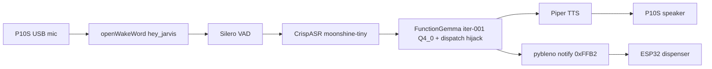

# Team Onboarding — gemma3-270M-finetune

A guided path from a fresh WSL2/Ubuntu laptop and a bare Synaptics SL2619 board to: running the FunctionGemma REPL on-device, running the voice-driven dispenser demo end-to-end (voice in, Piper speech out, real BLE notify to the ESP32 dispenser), and re-finetuning the FunctionGemma model from scratch.

This is the orientation doc. It gives you the spine plus the gotchas that actually bite, and points to the canonical runbook for each step. When this doc and a runbook disagree on a command, the runbook wins — tell the team so we fix this file.

Audience: an engineer new to this repo who has their own SL2619 board, a WSL2/Ubuntu PC, Distil Labs access, and access to the RTX 5080 fine-tune server.

---

## 0. What this repo is

Two active tracks share one piece of hardware (the SL2619: 2x Cortex-A55, 1.87 GiB RAM, ARMv8.2-A NEON+DOTPROD, no NPU/Vulkan):

1. FunctionGemma 270M-IT — closed-world function-calling over a synthetic patient registry. Iteration 001 shipped; the on-board variant is Q4_0.
2. Dispenser demo — a voice-driven medication dispenser. The voice loop is closed end-to-end: openWakeWord "Hey Jarvis" wake word, Silero VAD, CrispASR (Moonshine Tiny) speech-to-text, FunctionGemma brain, Piper neural text-to-speech, and a BLE notify to an ESP32 dispenser on a dispense intent.



Read [`README.md`](README.md) for the human-facing overview and [`CLAUDE.md`](CLAUDE.md) for the agent self-reference and current status. The full plans live in [`docs/plans/dispenser-demo/`](docs/plans/dispenser-demo/) and [`docs/plans/functiongemma/`](docs/plans/functiongemma/).

By the end of this doc you will have done: host setup, a host REPL smoke, a full board bring-up, an on-board demo run, and one full re-finetune iteration.

---

## 1. Accounts and access you need first

- GitHub access to this repo.
- Distil Labs account (cloud SFT) — you will `distil login`.
- SSH access to the RTX 5080 fine-tune server (referred to as `nouslogic-server` here; set your own alias).
- Your own SL2619 board plus a P10S USB speakerphone (ROFALL P1U-4 / "USB Audio 4.0", enumerates as `MV-SILICON P10S`).
- The Astra v2.4.0 image bundle for the board (Part C below).

The model weights are NOT in git (`*.gguf`/`*.safetensors` are gitignored; `CHECKSUMS.txt` is the authoritative SHA record). You get them either from the shared release store for iter-001 or by running a fine-tune yourself (Part E).

---

## 2. Values that are board-specific — change these for YOUR board

The examples below use one specific board's values. Do not copy them blindly. Set your own:

- SSH alias (`nouslogic-sl2619` / `nouslogic`) and the board IP in `~/.ssh/config`.
- Board IP — there is no DHCP reservation by default and the lease drifts. WSL2 cannot resolve `.local` or bare hostnames, so always use the IP from `networkctl status wlan0`.
- Hostname, Wi-Fi SSID/password, wlan0 MAC, SSH key filenames.
- Host repo clone path (examples use `/home/lanhp-wsl/nouslogic/gemma3-270M-finetune`).
- ALSA card number `<N>` — bus-order dependent; re-read `/proc/asound/cards` every session.
- Server alias `nouslogic-server`.

---

## Part A — Host setup (WSL2 / Ubuntu)

```bash
git clone <repo-url> gemma3-270M-finetune
cd gemma3-270M-finetune
uv venv .venv && source .venv/bin/activate
uv pip install -e ".[dev,functiongemma]"
```

Verify the toolchain is healthy before anything else:

```bash
uv run pytest                       # 734 passed (FunctionGemma + dispenser_demo + _legacy)
uv run ruff check src tests scripts/functiongemma
uv run mypy src
```

Get the iter-001 weights into place. They land under `releases/functiongemma-270m/001-baseline/` (`merged/` for the HF/tokenizer side, `gguf/` for the GGUF). The canonical FP16 sha is `1add620fbd45…` (518 MiB) and Q4_0 is `a484ad50d4b6…` (231 MiB) — both gitignored; `releases/functiongemma-270m/001-baseline/gguf/CHECKSUMS.txt` is the record. If you only have FP16, build Q4_0 yourself (Part E, Phase 4).

---

## Part B — Host smoke (the quick win)

Before touching the board, confirm the brain works on your laptop:

```bash
uv run python scripts/functiongemma/chat.py --probe "What is my blood pressure?"
# expect a get_vitals call + a one-sentence English answer; ~2 s after model load
```

This runs the same tool registry, dispatch, and formatter the board uses, just on the host GGUF. If this fails, fix it before moving on — a board problem on top of a host problem is two problems.

---

## Part C — Board bring-up from scratch

Six phases. Full detail per phase is in `docs/deployment/`; this is the guided spine. Do NOT flash from WSL — USB re-enumeration during flash drops the device out of WSL and the flash fails. Flash from bare-metal Linux or native Windows.

### Phase C1 — Flash Astra v2.4.0

v2.4.0 carries the revB pin-mux fix that makes BLE work; you must be on it. Image bundle (GitHub release tag is authoritative; the doc site may still show v2.3.0):

- `sl2619_scarthgap_6.12_v2.4.0.zip` from <https://github.com/synaptics-astra/sdk/releases/tag/scarthgap_6.12_v2.4.0>
- Unzip to the Astra system-image directory (`emmc_part_list`, `emmc_image_list`, `*.subimg`).

Two supported paths:

- Native Linux via `astra-update` — build from source at commit `f7a3cdd` or later (the vendored v1.0.6 binary predates SL26xx support). `git clone https://github.com/synaptics-astra/astra-update.git`, `sudo apt install libudev-dev cmake`, `cmake -B build -DCMAKE_BUILD_TYPE=Release && cmake --build build --config release`, install `config/99-astra-update.rules` to `/etc/udev/rules.d/`, then `./build/.../astra-update --chip sl2610 --board rdk --flash ./eMMCimg`.
- Native Windows via `usb_boot_tool.py` (board-verified, lowest-risk) — use the `sl261x` branch and follow [`docs/deployment/sl2619-windows-recovery.md`](docs/deployment/sl2619-windows-recovery.md). Two commands from the `usb-tool` dir with USB-C in the USB-Boot/CDC port: `python usb_boot_tool.py --op run-sm --ddr-type ddr4` then `python usb_boot_tool.py --op emmc --img-dir <path>\eMMCimg`.

USB-boot button sequence: hold RESET, press and hold USB_BOOT (still holding RESET) 1-2 s, release RESET while still holding USB_BOOT until the console prints, then release USB_BOOT. Flash takes 5-15 min and ends on `ALL OPERATIONS COMPLETE`. Cold-boot, then verify `adb devices` shows `sl2619 device` and `uname -a` shows kernel 6.12.x scarthgap.

WARNING: do NOT do device-tree surgery. The board was bricked once by writing a patched DTB directly into the signed FIT A/B boot partitions (`mmcblk0p10`/`p11`) — that invalidates the FIT hash and secure-boot signature and destroys A/B redundancy. v2.4.0 needs no device-tree change for BLE. If a DTS change is ever required, do it via a Yocto rebuild (which re-signs the FIT), never a raw partition write. Recovery is only possible because USB-boot lives in mask ROM. Full root-cause: [`docs/deployment/sl2619-recovery-reflash.md`](docs/deployment/sl2619-recovery-reflash.md).

### Phase C2 — First boot: network, IP, SSH, microSD

The image ships passwordless root, hostname `sl2619`, and root home at `/home/root` (NOT `/root`). Run on-board via `adb shell` or serial console. Full as-run procedure: [`docs/deployment/sl2619-postrecovery-bringup.md`](docs/deployment/sl2619-postrecovery-bringup.md).

Mount the microSD persistently (this is where models live):

```sh
mkdir -p /mnt/sdcard
mount -t ext4 /dev/mmcblk2p1 /mnt/sdcard
grep -q '/mnt/sdcard' /etc/fstab || \
  echo '/dev/mmcblk2p1  /mnt/sdcard  ext4  defaults,noatime,nofail  0  2' >> /etc/fstab
mount -a && mount | grep sdcard
```

Set a password and your hostname (`passwd`; `hostnamectl set-hostname <yours>`; update `/etc/hosts`). Bring up Wi-Fi persistently with systemd-networkd + `wpa_supplicant@wlan0` (see the runbook for the exact unit files). Then read your real IP:

```sh
networkctl status wlan0    # State: routable (configured), Online — THIS is your board IP
```

Gotcha: the IP from `networkctl` differs from a one-shot `udhcpc` lease; use the `networkctl` one and add a router DHCP reservation for the wlan0 MAC so it survives reboots.

SSH (Dropbear): the board ships only an RSA host key, so ed25519 client keys are silently rejected until you add an ed25519 host key on the board (`dropbearkey -t ed25519 -f /etc/dropbear/dropbear_ed25519_host_key` plus a `DROPBEAR_EXTRA_ARGS` line in `/etc/default/dropbear`). On the host, `ssh-keygen` an ed25519 key and `ssh-copy-id` it — `authorized_keys` lands in `/home/root/.ssh/`, not `/root/.ssh/`. Your `~/.ssh/config`:

```
Host nouslogic nouslogic-sl2619
    HostName <BOARD_IP>
    User root
    IdentityFile ~/.ssh/sl2619_<you>
    IdentitiesOnly yes
```

Put every alias you will type on the `Host` line (SSH does no partial matching), and `User root` is mandatory. After a reflash you will hit `REMOTE HOST IDENTIFICATION HAS CHANGED` — clear it with `ssh-keygen -f ~/.ssh/known_hosts -R <BOARD_IP>`. Also set NTP/timezone (`timedatectl set-ntp true`; `export TZ=...` via `/etc/profile.d/tz.sh` — the image has no tzdata, so use a POSIX TZ string, not `set-timezone`).

### Phase C3 — Cross-compile llama.cpp (aarch64) and stage it

The prebuilt arm64 release will not run (needs a newer libstdc++ than the board ships). Cross-compile against the Yocto SDK. Pinned: SDK `/opt/poky/5.0.9/`, llama.cpp tag `b8925` (commit `0adede8`). Full recipe: [`docs/deployment/sl2619-board.md`](docs/deployment/sl2619-board.md).

```bash
git clone --depth 1 --branch b8925 https://github.com/ggml-org/llama.cpp.git
cd llama.cpp
source /opt/poky/5.0.9/environment-setup-cortexa55-poky-linux
cmake -B build -DCMAKE_BUILD_TYPE=Release -DGGML_NATIVE=OFF -DLLAMA_CURL=OFF \
  -DLLAMA_BUILD_TESTS=OFF -DLLAMA_BUILD_EXAMPLES=ON -DLLAMA_BUILD_SERVER=ON -DBUILD_SHARED_LIBS=OFF
cmake --build build --target llama-cli llama-bench llama-completion -j$(nproc)
aarch64-poky-linux-strip build/bin/llama-cli build/bin/llama-bench build/bin/llama-completion
```

`LLAMA_BUILD_SERVER=ON` is required (OFF deletes `llama-cli` too). Stage to the board and confirm it runs:

```bash
ssh nouslogic-sl2619 'mountpoint -q /mnt/sdcard || mount /dev/mmcblk2p1 /mnt/sdcard; mkdir -p /mnt/sdcard/llama-cpp'
scp build/bin/llama-completion nouslogic-sl2619:/mnt/sdcard/llama-cpp/
ssh nouslogic-sl2619 'cd /mnt/sdcard/llama-cpp && chmod +x llama-* && ./llama-completion --version 2>&1 | head -n 6'
# expect: version 1 (0adede8), built with GNU 13.3.0 for Linux aarch64
```

The kernel exposes only 2 A55 cores (cores 2-3 are reserved for the secure world) — always use `-t 2`. `-t 4` is a measured 53x decode regression. `llama-completion` is the headless binary; `llama-cli` in b8925 is interactive-only.

### Phase C4 — Stage FunctionGemma and run the REPL

Prompt rendering is host-side (the board has no HF tokenizer); you ship pre-rendered prefix/suffix. Full recipe: [`docs/deployment/functiongemma-board-deploy.md`](docs/deployment/functiongemma-board-deploy.md).

```bash
# host: render templates + health table + stage scripts
uv run python scripts/functiongemma/data/gen_prompt_templates.py \
    --tokenizer releases/functiongemma-270m/001-baseline/merged/ --output-dir /tmp/fg_deploy/
uv run python -c "
import json, yaml
with open('data/health_table_v1.yaml') as f: d = yaml.safe_load(f)
json.dump(d, open('/tmp/fg_deploy/health_table.json','w'), indent=2, ensure_ascii=False)
"
cp scripts/functiongemma/deploy/chat_board.py /tmp/fg_deploy/
cp scripts/functiongemma/deploy/run_prompt.sh /tmp/fg_deploy/run-prompt.sh

# stage to board
ssh nouslogic-sl2619 'mkdir -p /mnt/sdcard/models/functiongemma-270m'
scp releases/functiongemma-270m/001-baseline/gguf/finetuned_functiongemma_q4_0.gguf \
    nouslogic-sl2619:/mnt/sdcard/models/functiongemma-270m/
scp /tmp/fg_deploy/{prompt-prefix.txt,prompt-suffix.txt,health_table.json,chat_board.py,run-prompt.sh} \
    nouslogic-sl2619:/mnt/sdcard/models/functiongemma-270m/
ssh nouslogic-sl2619 'sha256sum /mnt/sdcard/models/functiongemma-270m/finetuned_functiongemma_q4_0.gguf'
# expect: a484ad50d4b66fdbd6ccb482389eec734b0de9fe988e8811b5e6683daf180e14

# run
ssh nouslogic-sl2619 'python3 /mnt/sdcard/models/functiongemma-270m/chat_board.py --probe "When is my next appointment?"'
```

The first turn primes a warm prompt cache (`/tmp/fg_pc_<model>.bin`, ~28-32 s, one-time); subsequent turns are ~6 s wall at 10.3 tok/s decode. Keep only ONE GGUF resident in that directory — cohabiting variants thrash the page cache and inflate per-prompt wall ~4x.

### Phase C5 — USB audio (P10S)

The board image is ALSA-only: no PulseAudio/PipeWire, no `sox`/`ffmpeg`, no `opkg`. The P10S is capture-only at 48 kHz stereo. Full recipe plus the AEC probes: [`docs/guides/usb-audio-testing-sl2619.md`](docs/guides/usb-audio-testing-sl2619.md).

```bash
ssh nouslogic-sl2619 'lsusb; cat /proc/asound/cards'                       # find card <N>
ssh nouslogic-sl2619 'amixer -c <N>; amixer -c <N> sset PCM 50%'            # PCM at 0% = silent-success trap
ssh nouslogic-sl2619 'speaker-test -D plughw:<N>,0 -c 2 -r 48000 -t sine -f 440 -l 1'
ssh nouslogic-sl2619 'arecord -D plughw:<N>,0 -f S16_LE -r 48000 -c 1 -d 5 /tmp/mic.wav'
ssh nouslogic-sl2619 'aplay -D plughw:<N>,0 /tmp/mic.wav'
```

The P10S has firmware AEC (verified): no software AEC is needed for the duplex voice pipeline. Duplex gotcha: stereo-capture + stereo-playback at 48 kHz simultaneously throws an I/O error (USB endpoint bandwidth) — capture mono (`-c 1`) and start `arecord` before `aplay`.

### Phase C6 — BLE staging (pybleno + fcntl shim + gemma_tools)

The board has no `pip` and no `fcntl` stdlib module, so both are staged manually under `/tmp/pylibs`. `/tmp` is volatile — rebuild this after every reboot (or stage under `/mnt/sdcard/pylibs` for durability). Board BT is on UART/`hci0` (SYN43711 combo). Full runbook: [`docs/deployment/sl2619-ble-bringup.md`](docs/deployment/sl2619-ble-bringup.md).

```bash
# host: download + patch pybleno, then stage everything
python3 -m pip download pybleno --no-deps -d /tmp/dl && ( cd /tmp/dl && tar xzf pybleno-*.tar.gz )
python3 scripts/dispenser_demo/deploy/patch_pybleno_bluetoothhci.py \
    /tmp/dl/pybleno-*/pybleno/hci_socket/BluetoothHCI/BluetoothHCI.py
ssh nouslogic-sl2619 'mkdir -p /tmp/pylibs/gemma_tools/dispenser_demo && \
    : > /tmp/pylibs/gemma_tools/__init__.py && : > /tmp/pylibs/gemma_tools/dispenser_demo/__init__.py'
scp -r /tmp/dl/pybleno-*/pybleno                       nouslogic-sl2619:/tmp/pylibs/
scp scripts/dispenser_demo/deploy/board_fcntl_shim.py  nouslogic-sl2619:/tmp/pylibs/fcntl.py
scp src/gemma_tools/dispenser_demo/ble_client.py       nouslogic-sl2619:/tmp/pylibs/gemma_tools/dispenser_demo/
scp scripts/dispenser_demo/deploy/ble_test.py          nouslogic-sl2619:/tmp/
```

`ble_client.py` must land at the package path `gemma_tools/dispenser_demo/ble_client.py`, not flat. Every boot, before any pybleno run, run the mandatory reset cycle:

```sh
# board
systemctl stop bluetooth                    # pybleno needs exclusive control, not BlueZ
systemctl restart brcm_bt_start.service     # re-power + re-patch the chip (patch lives in chip RAM)
hciconfig hci0 up                           # mandatory HCI reset — else pybleno fails "Command Disallowed"
hciconfig hci0 down                         # release for pybleno's user-channel claim
```

Prove the radio with the standalone test runner and a phone (nRF Connect: scan, connect to `NousVoice`, enable notifications on characteristic `0xFFB2`, watch for `5A A5 01 00`):

```sh
PYTHONPATH=/tmp:/tmp/pylibs python3 /tmp/ble_test.py --hci hci0 --skip-patch-check --timeout-s 120
```

Footgun: never put the board `fcntl.py` shim on a heavy process's global PYTHONPATH — its import-time `find_library()` call crashes subprocess startup. The standalone `ble_test.py` is fine with the inline `PYTHONPATH` above because it is the only thing running; the voice loop instead injects `/tmp/pylibs` into `sys.path` at runtime via `--ble-libs` (see Part D).

---

## Part D — Run the dispenser voice demo on the board

The long-running voice loop is `scripts/dispenser_demo/deploy/dispenser_voice.py`. It wires the wake word, VAD, STT, FunctionGemma, Piper TTS, and the BLE notify into one process. First-run wall is ~10.7 s/turn end-to-end.

One-time board staging (in addition to Parts C4/C6) — see [`docs/plans/dispenser-demo/decisions-log.md`](docs/plans/dispenser-demo/decisions-log.md) for the exact layout:

- `/mnt/sdcard/python-deps/site/{onnxruntime,openwakeword}/` — the manylinux aarch64 onnxruntime wheel extracted, plus vendored openWakeWord (with `hey_jarvis_v0.1.onnx` under `resources/models/`).
- `/mnt/sdcard/models/functiongemma-270m/` — Q4_0 GGUF + `chat_board.py` + `chat_board_dispense.py` + `health_table_dispense.json` + prompt prefix/suffix.
- `/mnt/sdcard/models/moonshine-tiny/moonshine-tiny-q4_k.gguf` — the STT model.
- `/mnt/sdcard/bin/crispasr` — the STT engine (stripped aarch64 static binary).
- `/mnt/sdcard/dispenser_demo/{wake_ack.wav,command_ack.wav,piper-voices/,tts/,dispenser_voice.py}` — chimes, Piper voice model, fallback canned WAVs, the script.

Run it:

```bash
# board: reset hci0 once before launch (Part C6 reset cycle), then:
PYTHONPATH=/mnt/sdcard/python-deps/site python3 \
    /mnt/sdcard/dispenser_demo/dispenser_voice.py
# -v       pipeline-transition logging
# --trace  per-frame wake/VAD scores
# --no-ble skip the radio (dispense turns keep the [BLE->ESP32] stdout mock)
# --ble-libs DIR  where pybleno + fcntl shim + gemma_tools are staged (default /tmp/pylibs)
```

Note on the BLE staging: the pybleno staging dir is passed via `--ble-libs` and injected into `sys.path` at runtime, NOT exported on `PYTHONPATH` (the fcntl-shim footgun from Part C6). The `PYTHONPATH=/mnt/sdcard/python-deps/site` above is only for onnxruntime + openWakeWord, which are safe on the global path.

Flow per turn: say "Hey Jarvis", hear the wake chime, speak the command, hear the command-ack chime, the STT transcript prints, FunctionGemma answers (~6 s), Piper renders the answer, and `aplay` speaks it.

On a dispense intent (`get_medications_at_time` / `get_medication_by_name` are hijacked to the dispense intent), the loop fires a real `PyBlenoBleClient` notify (`5A A5 01 00`) on `0xFFB2` to the subscribed ESP32 and prints `[BLE] notify sent …`.

Safety note worth knowing: the loop is built to degrade, never block. With no subscribed central, or on any radio error, it prints `[BLE] ble_not_connected` (or the `[BLE->ESP32]` stdout mock under `--no-ble`) and STILL dispenses and speaks "dispensed". The spoken confirmation plays even on a degraded notify — so to confirm the dispenser physically actuated, watch the `[BLE]` stdout line, not the speech. This is deliberate for the demo; do not treat the spoken line as proof of actuation.

How the wiring works (so you can extend it): `chat_board_dispense.py` monkey-patches `chat_board.dispatch`; `dispatch` reads a module-global BLE client set via `set_ble_client()`. The voice loop constructs `PyBlenoBleClient` inside the mic context, advertises `NousVoice` once, injects it with `set_ble_client`, fires a notify per dispense turn on the live subscription, and releases `hci0` on exit. Host-side injection is covered by `tests/dispenser_demo/test_ble_client_injection.py` (no board, no pybleno — `MockBleClient` stands in).

---

## Part E — Re-finetune FunctionGemma end-to-end

Six phases. The production path is Distil Labs cloud SFT (Phase E2); the local Unsloth path (Phase E3) is a fallback for cases Distil's task type cannot express. Run everything from the repo root with the venv active.

Two path-name warnings up front:
- Some in-repo docstrings reference pre-reorg script names (e.g. `scripts/finetune.py`, `scripts/build_functiongemma_seeds.py`) that no longer exist. Use the actual paths below.
- `releases/functiongemma-270m/001-baseline/RECIPE.md` shows older Distil CLI verbs (`run-finetune`, `download-artifact`). The current canonical verbs are `run-training`, `download`, and `deploy local` (per the distil-cli skill's `references/cli-reference.md`). Use the current verbs.

### Phase E1 — Data prep

You edit Python, not JSONL. Seeds are generated from the `_CONVERSATIONS` literals inside `build_seeds.py`; hand-editing the JSONL is clobbered and fails the drift gate.

```bash
# after editing _CONVERSATIONS in scripts/functiongemma/data/build_seeds.py:
uv run python scripts/functiongemma/data/build_seeds.py            # regenerate
uv run python scripts/functiongemma/data/build_seeds.py --check    # CI drift gate

uv run python scripts/pre_commit_phi_scanner.py data/functiongemma/  # PHI gate — must be clean (exit 0)

uv run python scripts/functiongemma/data/build_splits.py           # writes train/val/test + holdout
uv run python scripts/functiongemma/data/build_splits.py --check   # drift gate
```

Notes: seeds are authored against the synthetic `data/health_table_v1.yaml`; keep the patient data synthetic (the PHI scanner allowlists only the `+1-555-` phone range). The train split folds in `data/functiongemma/llm_expanded_v1.jsonl`, not just the 50 seeds. `uv run pytest` must be green before editing `gemma_tools.functiongemma.{dataset,tools}` or `health_table.py`.

### Phase E2 — Distil Labs cloud SFT (production)

The upload set is RESHAPED, not `dataset_v1` verbatim. Distil's `multi-turn-tool-calling-closed-book` task wants, per row: drop the `system` message and `<think>` traces, drop the trailing NL summary, truncate to the first tool call; `question` = JSON array of the conversation up to the final tool-call turn; `answer` = JSON object `{"name":…, "parameters":…}`. The committed template for the staged shape is `releases/functiongemma-270m/001-baseline/distil/data/`. Copy that directory shape. Floors: at least 20 rows each in train and test, at least one example per tool, all tools in both sets, no cross-set exact `(question, answer)` duplicates (those fail upload).

```bash
curl -fsSL https://cli-assets.distillabs.ai/install.sh | sh   # first time
distil login && distil whoami --output json
distil model create fg-iter-002                               # capture the model id/name -> $MID

distil model upload-data $MID --data ./<your-distil-data-dir> --dry-run   # keystone test, zero credit
distil model upload-data $MID --data ./<your-distil-data-dir>             # real upload
distil model upload-status $MID --output json | jq '.status'              # await JOB_SUCCESS
```

Confirm the upload actually took (the CLI silently accepts re-uploads): compare `upload_ids[0]` from `distil model show $MID --output json` before and after.

Teacher evaluation is a free feasibility check before paying for SFT. The decision rule: judge >= 0.80 means high-confidence proceed; >= 0.70 acceptable; < 0.70 means iterate, do not train.

```bash
distil model run-teacher-evaluation $MID
# poll minutes-scale (sleep inside the loop; status via --output json | jq, never grep):
while true; do
  s=$(distil model teacher-evaluation $MID --output json | jq -r '.status')
  echo "$(date +%H:%M:%S) $s"; case "$s" in JOB_SUCCESS|JOB_FAILURE|JOB_STOPPED) break;; esac; sleep 60
done
distil model teacher-evaluation $MID --output json | jq '.results'
```

The prompt-iteration lesson from iter-001 (judge 0.7917 -> 0.8750 -> 0.9583): change ONE lever per iteration, in order — job_description first, then data, then synthgen/mutations, then teacher swap. Most iterations end at the first lever; exhaust prompt clarity before anything else. What moved the needle was the `task_description`: hard MUST/NEVER framing, numbered first-match-wins routing rules, worked-example blocks (`User: 'phrasing' -> tool(args)`), an explicit empty-`{}` rule for zero-arg tools, and the strip-noun rule. The full v3 prompt is baked into `gen_prompt_templates.py:SYSTEM_PROMPT` — start iter-002 from it. Editing `test.jsonl` or the judge instructions only changes the headline score; only `train.jsonl` and `task_description` changes improve the trained student.

```bash
distil model run-training $MID                 # long-running, ~4h28m total for iter-001
# poll hours-scale: same loop with `distil model training $MID` and sleep 600
distil model download $MID                      # -> merged/, adapter/, gguf/, Modelfile, model_client.py
```

Hyperparameters baked into iter-001 `config.yaml`: LoRA r=64 alpha=64 dropout 0.0, target modules `q_proj,v_proj`, 4 epochs, generation target 5000, validation similarity 0.90, mutators `["complexity"]`.

### Phase E3 — Local Unsloth fallback (RTX 5080)

When to use it: you need refusal classes or parallel-call workflows (Distil's one-call-per-turn task type structurally excludes both), or you want full hyperparameter control. Trade-off: no teacher synthesis, so the input is the dataset as-is and you should expect lower performance than Distil's synth corpus.

```bash
scp scripts/setup/server-bootstrap.sh nouslogic-server:~/
ssh -t nouslogic-server 'bash ~/server-bootstrap.sh --with-system-deps'   # idempotent; pins torch cu128 (sm_120)

scp scripts/functiongemma/train/finetune_local.py nouslogic-server:~/functiongemma-finetune/
scp -r src/gemma_tools/functiongemma/ src/gemma_tools/health_table.py src/gemma_tools/__init__.py \
    nouslogic-server:~/functiongemma-finetune/gemma_tools/
scp data/functiongemma/dataset_v1/{train,val,test}.jsonl nouslogic-server:~/functiongemma-finetune/data/

ssh nouslogic-server 'cd ~/functiongemma-finetune && source .venv/bin/activate && \
  python finetune_local.py --recipe mobile_actions_hf \
    --train-file data/train.jsonl --val-file data/val.jsonl --output-dir outputs/iter-002 \
    --lora-r 64 --lora-dropout 0.0 --target-modules q_proj,v_proj --epochs 4'   # ~60 min
```

`--recipe` is required (choices in `_RECIPES`). Confirm flags with `--help` since defaults are `None`. For Gemma 3 use `completion_only_loss=True` — `assistant_only_loss=True` silently no-ops (no `` markers in the template). Vendor hyperparam reference: [`docs/guides/finetune-best-practices.md`](docs/guides/finetune-best-practices.md) (paths in it are stale, values good).

Bridge into Phase E4. The Unsloth path ends at a LoRA adapter (plus merged HF weights) on the server, whereas E4's `build_variants.sh` expects a single `*fp16.gguf` already present in the release's `gguf/` dir. So before E4 you must produce that FP16 GGUF and stage it. The Distil path (E2 `download`) gives you a `gguf/` directly and skips this. On the server, merge the adapter to full HF weights if `finetune_local.py` did not already (`--merge-train-val` / its merge step), then convert with llama.cpp's canonical converter (installed by `server-bootstrap.sh`):

```bash
ssh nouslogic-server 'cd ~/functiongemma-finetune && source .venv/bin/activate && \
  python ~/llama.cpp/convert_hf_to_gguf.py outputs/iter-002-merged \
    --outfile outputs/iter-002-fp16.gguf --outtype f16'
# pull the FP16 GGUF into the release tree E4 reads from:
mkdir -p releases/functiongemma-270m/iter-002/gguf
scp nouslogic-server:~/functiongemma-finetune/outputs/iter-002-fp16.gguf \
    releases/functiongemma-270m/iter-002/gguf/finetuned_functiongemma_fp16.gguf
```

Confirm the exact converter path and merged-weights path on the server (`server-bootstrap.sh` reports where it put the llama.cpp build) — do not assume `~/llama.cpp`. Once the FP16 GGUF sits in `releases/functiongemma-270m/iter-002/gguf/`, E4 quantizes it to Q4_0.

### Phase E4 — Quantize FP16 -> Q4_0 (and why only Q4_0)

```bash
# one-time host build of llama-quantize
cd docs/references/upstream/llama.cpp
cmake -B build -DCMAKE_BUILD_TYPE=Release -DLLAMA_CURL=OFF -DLLAMA_BUILD_SERVER=ON
cmake --build build --target llama-quantize -j$(nproc)
cd ../../../..

scripts/functiongemma/quantize/build_variants.sh --release-dir releases/functiongemma-270m/iter-002
# --all for the full sweep (Q4_0, Q4_K_M, Q5_K_M, Q8_0, IQ4_XS); --force to rebuild
```

Why Q4_0 only on the board: the board's `llama-completion` (b8925, 2026-04-24) mis-handles K-quant / mixed-precision scale factors on a 270M model with a 262,144-token embedding table. Every K-quant and Q8_0/IQ4_XS variant breaks the FunctionGemma wire format on-board (drops the `<start_function_call>` open token, stops decoding early, or loops). They are all fine on the host (its runtime matches the quant tool) — the failure is version-skew specific to the board runtime. Q4_0's symmetric INT4 survives. Evidence: [`docs/bench-notes/functiongemma/2026-05-02_quantization-sweep.md`](docs/bench-notes/functiongemma/2026-05-02_quantization-sweep.md). Revisit only if the board runtime is refreshed to b8981+.

### Phase E5 — Holdout eval (gate the iteration)

```bash
# HF seam (server-side):
uv run python scripts/functiongemma/eval/eval_holdout.py \
    --checkpoint releases/functiongemma-270m/iter-002/merged \
    --holdout data/functiongemma/eval_holdout_v2_clean.jsonl

# GGUF seam (host CPU, byte-equivalent to deploy):
uv run python scripts/functiongemma/eval/eval_holdout.py \
    --gguf releases/functiongemma-270m/iter-002/gguf/finetuned_functiongemma_q4_0.gguf \
    --tokenizer-dir releases/functiongemma-270m/iter-002/merged \
    --holdout data/functiongemma/eval_holdout_v2_clean.jsonl

uv run python scripts/functiongemma/eval/eval_holdout.py --dry-run    # gold-vs-gold sanity, must be 100%
```

The gate: per-category tool-call equivalence >= 80% for EVERY category individually (an overall pass that hides one weak category fails). Only exact `match` counts; `partial` is diagnostic only. Holdouts are small (24-56 rows), so treat single-row swings as noise; only a >= 4-row pattern shift is a real regression.

### Phase E6 — Promote and deploy

```bash
# record checksums (weights are gitignored; CHECKSUMS.txt is the committed record)
(cd releases/functiongemma-270m/<iter>/gguf && sha256sum finetuned_*_q4_0.gguf finetuned_*_fp16.gguf > CHECKSUMS.txt)

# re-render board prompt templates against the new tokenizer
uv run python scripts/functiongemma/data/gen_prompt_templates.py \
    --tokenizer releases/functiongemma-270m/<iter>/merged --output-dir /tmp/fg_deploy/
```

Then deploy as in Part C4 (single Q4_0 file; first turn primes a new cache — clear stale ones with `rm /tmp/fg_pc_*.bin`). Verify with a board `--probe`.

### Cautionary tale — "trained" does not mean "shippable"

`releases/functiongemma-270m/002-dispenser-demo/` is trained but NOT deployed. Two quirks blocked promotion: the iter-002 Q4_0 collapsed even on the host runtime (not just the board skew), and the on-board output dropped the `<start_function_call>` opener. The shipping v1 demo therefore still runs iter-001 Q4_0 plus the dispatcher-hijack (`chat_board_dispense.py`). Lesson: a fresh iteration must clear BOTH host Q4_0 sanity AND an on-board wire-format probe before you touch `CLAUDE.md` or the deploy path. Diagnosis: [`docs/plans/dispenser-demo/decisions-log.md`](docs/plans/dispenser-demo/decisions-log.md) (2026-05-12 entries).

---

## The rules that bite — keep these in your head

- SSH to the board from the agent is read-only by default (a bounded non-destructive test exception exists). Deploy/`scp`/`systemctl` writes are run by a human. This is for the Claude Code agent; you, running your own board, run everything yourself.
- No model weights in git — `*.gguf`/`*.bin`/`*.safetensors`/`*.pt` are gitignored; `CHECKSUMS.txt` is the SHA record.
- Synthetic PHI only — keep patient YAML fake; the PHI scanner gates every staged JSONL.
- CrispASR runtime traps — any code invoking the board's crispasr binary MUST pass `-l en --no-punctuation -t 2`. Without `-l <code>` it silently fetches a ~77 MB language-ID model from HuggingFace at runtime; without `--no-punctuation` it fetches a ~80 MB punctuation model and adds a slow second pass. Both are fatal offline.
- 2 A55 cores -> always `-t 2`. `-t 4` is a 53x decode regression.
- Single resident GGUF on the board, or the page cache thrashes.
- BusyBox quirks: `date` emits a literal `%N` (use `/proc/uptime` for sub-second timing); `head -20` fails (use `head -n 20`); no `grep -P` (use `-E`).
- `/tmp` is volatile — rebuild BLE staging after every reboot, and run the `hciconfig hci0 up && hciconfig hci0 down` reset cycle before every pybleno run.
- The fcntl-shim footgun — never put the board `fcntl.py` shim on a heavy process's global PYTHONPATH; use the runtime `sys.path` injection (`--ble-libs`) instead.
- Root home on the board is `/home/root`, not `/root`. WSL must reach the board by IP, not hostname.

---

## Where to go next

- [`README.md`](README.md) — human-facing overview, status table, on-board demo transcript.
- [`CLAUDE.md`](CLAUDE.md) — agent self-reference: key paths, workflows, discipline.
- [`docs/deployment/`](docs/deployment/) — board cross-compile, FunctionGemma deploy, BLE bring-up, recovery/reflash runbooks.
- [`docs/plans/dispenser-demo/`](docs/plans/dispenser-demo/) — `plan.md` (phases, BLE wire contract, state machine), `decisions-log.md` (binding decisions).
- [`docs/plans/functiongemma/`](docs/plans/functiongemma/) — recipe, decisions-log, quantization-plan.
- [`docs/guides/`](docs/guides/) — finetune best practices, Distil iteration lessons, USB audio + AEC.
- [`docs/conventions/`](docs/conventions/) — normative Python/shell/testing/doc-update rules (changes go through PR review).
</content>
</invoke>
