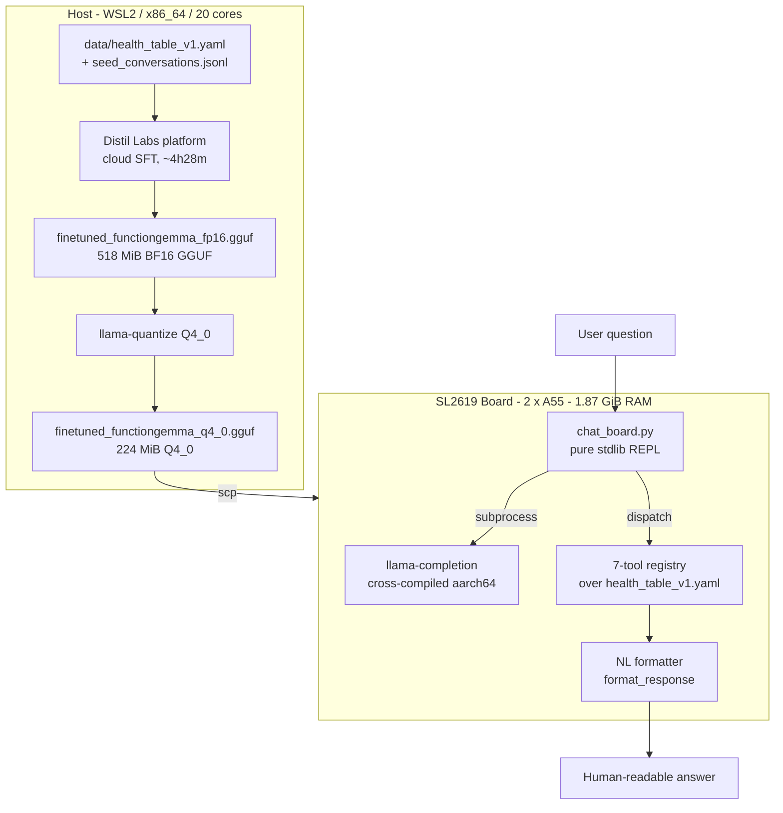
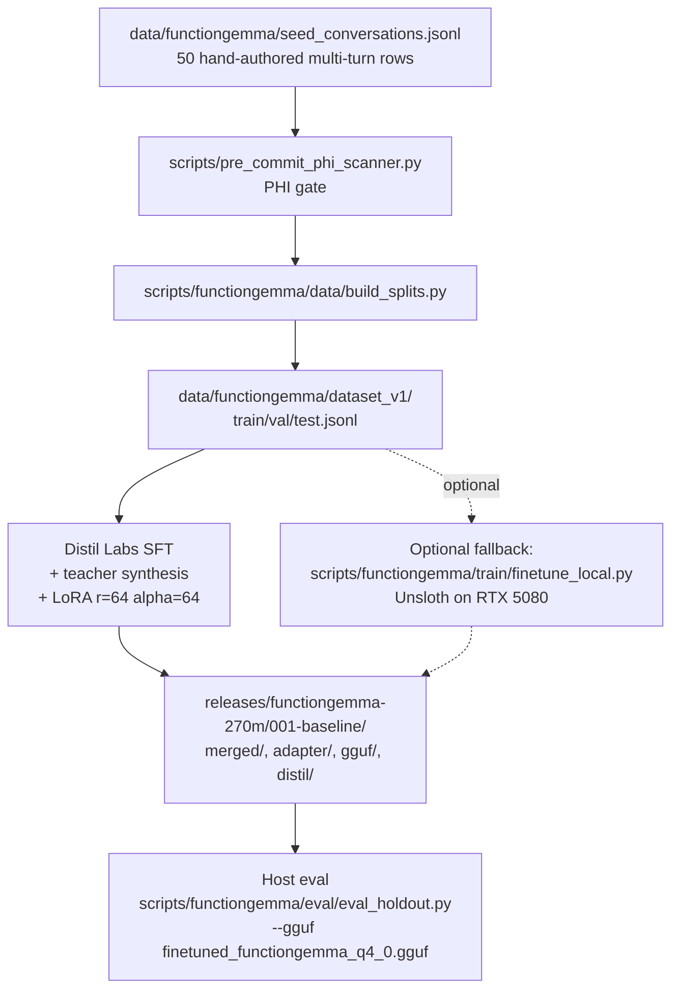
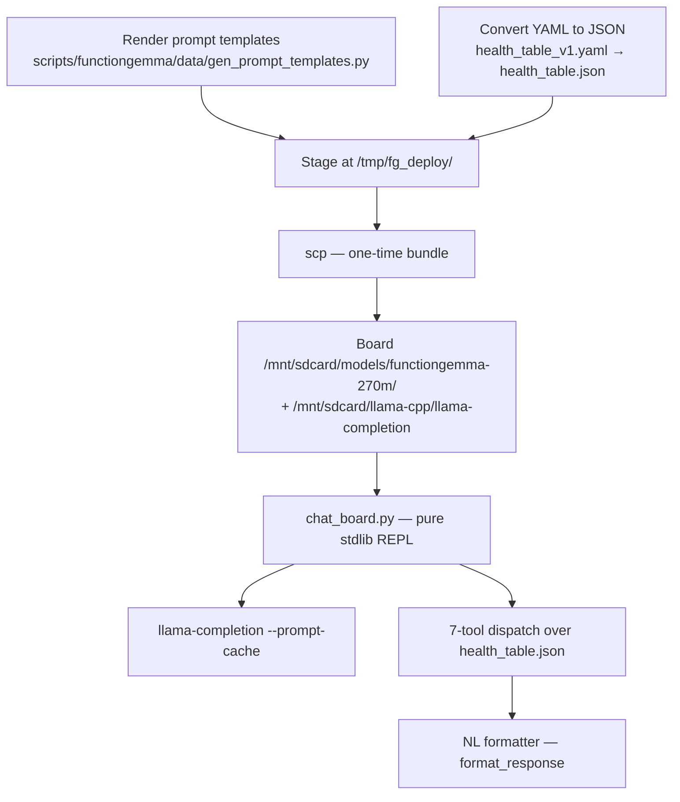
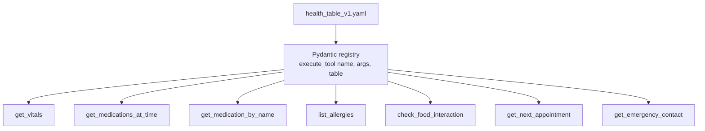

# gemma3-270M-finetune

Fine-tune **FunctionGemma 270M-IT** for closed-world function-calling against
a synthetic patient-record registry, quantize to Q4_0, and deploy to the
**Synaptics SL2619** Astra Machina board (Cortex-A55 × 2, 1.87 GiB RAM, no
NPU/Vulkan path).

The deliverable is a 224 MiB GGUF that answers natural-language health
questions on-device at **~10 tok/s decode**, with tool dispatch + a
human-readable formatter resolving the structured output back into one
sentence per question.

## Status

| Track | State |
| --- | --- |
| FunctionGemma iteration 001 (Distil Labs) | **DONE** — 0.9583 on every metric on the 24-row contaminated holdout (`releases/functiongemma-270m/001-baseline/distil/`) |
| INT4/INT8 board quantization sweep | **DONE 2026-05-02** — Q4_0 selected; full report in [`docs/bench-notes/functiongemma/2026-05-02_quantization-sweep.md`](docs/bench-notes/functiongemma/2026-05-02_quantization-sweep.md) |
| On-board interactive REPL (`chat_board.py`) | **DONE** — prompt-cache primed; ~6 s/turn after the one-time prime |

## Quick start

```bash
git clone <repo-url> gemma3-270M-finetune
cd gemma3-270M-finetune
uv venv .venv && source .venv/bin/activate
uv pip install -e ".[dev,functiongemma]"

# Build llama-quantize (host) — one-time
cd docs/references/upstream/llama.cpp
cmake -B build -DCMAKE_BUILD_TYPE=Release -DLLAMA_CURL=OFF -DLLAMA_BUILD_SERVER=ON
cmake --build build --target llama-quantize -j$(nproc)
cd ../../../..

# Generate Q4_0 from the canonical FP16 (gitignored)
scripts/functiongemma/quantize/build_variants.sh         # default: Q4_0 only

# 1. Host demo (Runs locally in WSL)
# Tests the full stack natively. Expected runtime: ~2 s after model load.
# Note: Expects the baseline weights at releases/functiongemma-270m/001-baseline/
uv run python scripts/functiongemma/chat.py --probe "What is my blood pressure?"

# 2. Board demo (Runs on the SL2619 edge device)
# Tests the fully quantized on-device solution.
# Assumes the board is up + reachable as `nouslogic-sl2619`, llama-completion is at
# /mnt/sdcard/llama-cpp/, and Q4_0 + prompt files are deployed (see "Deploy workflow" below).
ssh nouslogic-sl2619 'python3 /mnt/sdcard/models/functiongemma-270m/chat_board.py'
# UX Note: The first question takes roughly 32 seconds to process while the board
# primes the prompt cache. Every subsequent turn will take about ~6 seconds.
```

The host demo expects `releases/functiongemma-270m/001-baseline/`; the
canonical FP16 sha is `1add620fbd45…` (518 MiB) and Q4_0 is `a484ad50d4b6…`
(231 MiB). Both are gitignored — `CHECKSUMS.txt` is the authoritative
record.

## Architecture overview



## Hardware

- **Host (this WSL machine).** Ubuntu 24.04 / WSL2 / Python 3.12, x86_64
  20-core. Used for dataset prep, host smoke, holdout eval, and the
  llama-quantize sweep.
- **Fine-tune server** (only when the local Unsloth fallback path is used).
  RTX 5080 16 GiB VRAM, cu128, 47 GiB RAM, Tailscale-reachable. Bootstrapped
  via [`scripts/setup/server-bootstrap.sh`](scripts/setup/server-bootstrap.sh).
- **SL2619 board.** Synaptics SL2619 RDK / 2 × Cortex-A55 / 1.87 GiB RAM,
  ARMv8.2-A NEON+DOTPROD (no SVE). Yocto Linux + BusyBox. ~1.7 GiB
  MemAvailable. Cross-compiled `llama.cpp b8925`/`0adede8` aarch64 binaries
  staged at `/mnt/sdcard/llama-cpp/`.

## Finetune workflow



The Distil-platform path is current production. Teacher synthesis blew the
50-row seed corpus up to 5 054 training rows (5 000 synthesized + 50 seeds
+ deduped), expanded internally by Distil to 7 481 multi-turn samples. See
[`releases/functiongemma-270m/001-baseline/distil/README.md`](releases/functiongemma-270m/001-baseline/distil/README.md)
for the upload/re-upload/teacher-eval timeline (3 prompt-engineering
iterations lifted judge from 0.7917 → 0.8750 → 0.9583).

The local fallback path uses the same dataset shape against
`google/functiongemma-270m-it` via Unsloth + LoRA — useful when the Distil
platform is unavailable, or when the iteration adds refusal classes /
parallel-call workflows (which Distil's `multi-turn-tool-calling-closed-book`
task type doesn't fit).

## Deploy workflow (host → board)



The split exists because the board has neither HF tokenizer nor
`transformers`, so prompt rendering is host-side and pre-rendered
prefixes/suffixes ship to the board. Full board recipe:
[`docs/deployment/functiongemma-board-deploy.md`](docs/deployment/functiongemma-board-deploy.md).

```bash
# 1. Generate prompt templates + health-table JSON (host)
mkdir -p /tmp/fg_deploy
uv run python scripts/functiongemma/data/gen_prompt_templates.py \
    --tokenizer releases/functiongemma-270m/001-baseline/merged/ \
    --output-dir /tmp/fg_deploy/
uv run python -c "
import json, yaml
with open('data/health_table_v1.yaml') as f: data = yaml.safe_load(f)
with open('/tmp/fg_deploy/health_table.json', 'w') as f:
    json.dump(data, f, indent=2, ensure_ascii=False)
"
cp scripts/functiongemma/deploy/chat_board.py /tmp/fg_deploy/
cp scripts/functiongemma/deploy/run_prompt.sh /tmp/fg_deploy/run-prompt.sh
chmod +x /tmp/fg_deploy/run-prompt.sh

# 2. Stage on board
ssh nouslogic-sl2619 'mkdir -p /mnt/sdcard/models/functiongemma-270m'
scp releases/functiongemma-270m/001-baseline/gguf/finetuned_functiongemma_q4_0.gguf \
    nouslogic-sl2619:/mnt/sdcard/models/functiongemma-270m/
scp /tmp/fg_deploy/* nouslogic-sl2619:/mnt/sdcard/models/functiongemma-270m/
ssh nouslogic-sl2619 'sha256sum /mnt/sdcard/models/functiongemma-270m/finetuned_functiongemma_q4_0.gguf'
# expected: a484ad50d4b66fdbd6ccb482389eec734b0de9fe988e8811b5e6683daf180e14

# 3. Run interactive REPL on board
ssh nouslogic-sl2619 'python3 /mnt/sdcard/models/functiongemma-270m/chat_board.py'
# First turn primes the prompt cache (~32 s, one-time).
# Subsequent turns: ~6 s wall, 10.3 tok/s decode.
```

## Tool registry

Seven read-only tools defined in
[`src/gemma_tools/functiongemma/tools.py`](src/gemma_tools/functiongemma/tools.py),
schema-mirrored to
[`data/functiongemma/tools_v1.yaml`](data/functiongemma/tools_v1.yaml).
The patient record they read from is the synthetic
[`data/health_table_v1.yaml`](data/health_table_v1.yaml) (no real PHI).

**Patient Record Snapshot (`health_table_v1.yaml`):**

```yaml
patient:
  name: "Test Patient"
  age: 45
  sex: "F"
  blood_type: "O+"
vitals:
  heart_rate_bpm: 72
  blood_pressure_systolic: 118
  # ... other vitals ...
medications:
  - name: "Lisinopril"
    dose: "10 mg"
    schedule: "08:00"
    purpose: "blood pressure control"
    avoid_drugs: ["Potassium supplements", "NSAIDs"]
```



| Tool | Purpose | Required args |
| --- | --- | --- |
| `get_vitals` | Most-recent vitals snapshot | — |
| `get_medications_at_time` | Meds at HH:MM, or all meds if omitted | optional `time_24h` |
| `get_medication_by_name` | Single medication record (case-insensitive prefix match) | `name` |
| `list_allergies` | All known allergies | — |
| `check_food_interaction` | Food vs medication / dietary restriction | `food` |
| `get_next_appointment` | Earliest upcoming appointment | — |
| `get_emergency_contact` | First listed contact | — |

The model emits `<start_function_call>call:<NAME>{<args>}<end_function_call>`
in the FunctionGemma wire format; the runtime regex-extracts, dispatches,
then the formatter (`scripts/functiongemma/chat.py:format_response`)
turns the JSON tool result into a single English sentence keyed off the
question.

## Quantization sweep results (2026-05-02)

Source FP16: `finetuned_functiongemma_fp16.gguf` (sha256 `1add620fbd45…`).
Sanity = 7 in-distribution prompts on board (`scripts/functiongemma/bench.py`).
Holdout = 45-row all-novel-phrasing `eval_holdout_v2_clean.jsonl` (host eval
via `llama-cpp-python`).

| Variant | Size MiB | Holdout match | Board sanity | Decode tok/s (single-resident) | Verdict |
| --- | --- | --- | --- | --- | --- |
| FP16 baseline | 518 | 11/45 (24.4 %) | (skipped) | ~5–7 (per docs) | reference |
| **Q4_0 ★** | **224** | **13/45 (28.9 %)** | **7/7** | **10.27** | **DEPLOY** |
| Q4_K_M | 242 | 10/45 (22.2 %) | 1/7 | 7.0 | DISQUALIFIED — drops `<start_function_call>` open token on board |
| Q5_K_M | 248 | 13/45 (28.9 %) | 1/7 | 8.4 | DISQUALIFIED — same drop pattern |
| Q8_0 | 271 | 11/45 (24.4 %) | 3/7 | 9.1 | DISQUALIFIED — partial drop pattern |
| IQ4_XS | 224 | 7/45 (15.6 %) | 1/7 | 9.9 | DISQUALIFIED — host accuracy + tokenizer drift |

Failure mode for everything except Q4_0: the older on-board `llama-completion`
(b8925, Apr 24) mis-handles K-quant scale-factor encoding from the newer
host `llama-quantize` (b8981, Apr 29). On a 270M model with a 262 144-token
embedding table, the post-`<start_of_turn>model` distribution shifts off
the `<start_function_call>` mode → malformed wire format → parser rejects.
Q4_0 uses the simpler symmetric INT4 representation and survives the skew.

Refresh the on-board binary against `b8981`+ on the fine-tune server and
re-cross-compile to potentially recover the higher-bit variants — captured
as deferred follow-up.

The clean holdout is *out-of-distribution* for iter-001's training corpus;
even FP16 only hits 24.4 %. The realistic gate is therefore "no measurable
degradation vs FP16 (≥ 19.4 %)", set per advisor review.

Full per-row breakdown:
[`docs/bench-notes/functiongemma/2026-05-02_quantization-sweep.md`](docs/bench-notes/functiongemma/2026-05-02_quantization-sweep.md).

## Repo layout

```
gemma3-270M-finetune/
|- CLAUDE.md                          Agent self-reference (paths + workflows)
|- README.md                          This file (human-facing entry point)
|- pyproject.toml, uv.lock            Build + dependency manifests
|- src/gemma_tools/
|  |- __init__.py                     Package shim (version only)
|  |- health_table.py                 Pydantic loader for the patient YAML
|  |- functiongemma/                  Active sub-package: dataset, tools
|  |- _legacy/                        Frozen gemma3-270m health-QA modules
|- scripts/functiongemma/
|  |- chat.py                         Host interactive REPL (the local demo)
|  |- bench.py                        Two-mode bench harness (local + remote SL2619)
|  |- smoke.py                        Smoke runner
|  |- data/                           build_seeds, build_splits, ingest, gen_prompt_templates
|  |- train/finetune_local.py         Unsloth fallback SFT (server-side)
|  |- eval/eval_holdout.py            Host holdout evaluation (HF + GGUF seams)
|  |- quantize/build_variants.sh      Idempotent llama-quantize driver
|  |- bench/aggregate_quant.py        Sweep JSONL -> Markdown aggregator
|  |- deploy/                         chat_board.py, run_prompt.sh, ask_board.sh
|- scripts/
|  |- setup/server-bootstrap.sh       Idempotent Ubuntu-server SFT-stack bootstrap (RTX 5080)
|  |- pre_commit_phi_scanner.py       PHI scanner for FunctionGemma data ingest
|- tests/
|  |- functiongemma/                  Active tests (197 passed)
|  |- _legacy/                        gemma3-270m health-QA tests (still in CI)
|- data/
|  |- health_table_v1.yaml            Synthetic patient record (no real PHI)
|  |- functiongemma/                  dataset_v1, seed_conversations, eval_holdouts, tools_v1.yaml
|  |- _legacy/                        Frozen gemma3-270m SFT corpora + prompts.yaml
|- releases/functiongemma-270m/001-baseline/
|  |- RECIPE.md                       How iter-001 was produced + reproduce steps
|  |- merged/                         HF merged BF16 weights + tokenizer + chat template
|  |- adapter/                        LoRA adapter (r=64, alpha=64)
|  |- gguf/                           CHECKSUMS.txt, RECOMMENDED.md, Modelfile,
|  |  |                               finetuned_functiongemma_{fp16,q4_0}.gguf (gitignored)
|  |- distil/                         Distil platform deliverables (from running cloud SFT)
|  |  |- README.md                    Iteration timeline (3 versions)
|  |  |- config.yaml                  Distil hyperparameters
|  |  |- job_description.json         Routing rules + judge instructions
|  |  |- training-analysis.md         Aggregate + per-row metrics (final 0.9583)
|  |  |- teacher-eval-analysis.md     Teacher prediction analysis (v1, v2, v3)
|  |  |- data/{train,test}.jsonl      Dataset uploaded to platform
|  |  |- predictions/                 student.jsonl + teacher-v{1,2,3}.jsonl
|  |- model_client.py                 Distil deploy client (Ollama / vLLM HTTP wrapper)
|- bench/functiongemma/runs/2026-05-02-quant/   Per-variant board sweep JSONL
|- docs/
|  |- conventions/                    Normative coding rules (Python, shell, testing, doc-update)
|  |- references/upstream/            Opt-in submodules (gemma, llama.cpp, unsloth-notebooks)
|  |- plans/functiongemma/            recipe, decisions-log, quantization-plan, seed-authoring, llm-augmentation
|  |- bench-notes/functiongemma/      2026-05-02_quantization-sweep.md (the sweep report)
|  |- deployment/                     sl2619-board.md (cross-compile), functiongemma-board-deploy.md
|  |- guides/                         finetune-best-practices, distil-iteration-recipe-and-lessons
|- archive/
|  |- README.md                       Archive index
|  |- gemma3-270m-health-qa/          Frozen gemma3-270m track
|  |- functiongemma-pre-distil/       Frozen pre-distil FunctionGemma path
```

## Reproduce iteration 001

The full recipe lives at
[`releases/functiongemma-270m/001-baseline/RECIPE.md`](releases/functiongemma-270m/001-baseline/RECIPE.md).
The Distil platform path produces this exact iteration in ~4h 28m;
artifacts (`merged/`, `adapter/`, `gguf/finetuned_functiongemma_fp16.gguf`,
`Modelfile`, `model_client.py`, `distil/training-analysis.md`,
`distil/teacher-eval-analysis.md`, `distil/predictions/`,
`distil/data/{train,test}.jsonl`) are what the team should expect to land
under `releases/functiongemma-270m/<iter>/` after running cloud SFT.

```bash
# Production path (Distil Labs)
distil model create fg-iter-002
distil model upload-data fg-iter-002 --train-data train.jsonl \
    --test-data test.jsonl --dry-run
distil model upload-data fg-iter-002 --train-data train.jsonl --test-data test.jsonl
distil model run-teacher-evaluation fg-iter-002       # judge ≥ 0.80 = proceed bar
distil model run-finetune fg-iter-002
distil model download-artifact fg-iter-002 \
    --output releases/functiongemma-270m/iter-002/

# Local fallback (Unsloth on nouslogic-server, RTX 5080) — ~60 min
ssh -t nouslogic-server 'bash ~/server-bootstrap.sh --with-system-deps'
ssh nouslogic-server 'cd ~/functiongemma-finetune && source .venv/bin/activate && \
    python finetune_local.py --recipe mobile_actions_hf \
        --train-file data/train.jsonl --val-file data/val.jsonl \
        --output-dir outputs/iter-002 --epochs 4'
```

## Test / lint / typecheck

```bash
uv run pytest                    # 545 passed
uv run ruff check src tests
uv run mypy src
```

The legacy `_legacy/` track is preserved as a runnable reference (its tests
still pass in CI). Active development goes into the FunctionGemma tracks
under `src/gemma_tools/functiongemma/`, `scripts/functiongemma/`,
`data/functiongemma/`.

## URL references

| Resource | URL |
| --- | --- |
| FunctionGemma 270M-IT model card | <https://huggingface.co/google/functiongemma-270m-it> |
| Gemma 3 270M-IT (parent backbone) | <https://huggingface.co/google/gemma-3-270m-it> |
| FunctionGemma cookbook (vendor) | <https://github.com/google-deepmind/gemma/tree/main/cookbook/docs/functiongemma> |
| llama.cpp (cross-compile + quantize) | <https://github.com/ggml-org/llama.cpp> |
| llama-cpp-python (host inference) | <https://github.com/abetlen/llama-cpp-python> |
| Distil Labs platform (cloud SFT) | <https://app.distillabs.ai/> |
| Distil Labs blog "Making FunctionGemma Work" | <https://distillabs.ai/blog/making-functiongemma-work> |
| Unsloth (local LoRA SFT) | <https://github.com/unslothai/unsloth> |
| HuggingFace `transformers` chat templates | <https://huggingface.co/docs/transformers/chat_templating> |
| HuggingFace `peft` (LoRA adapter format) | <https://github.com/huggingface/peft> |
| Synaptics SL2610 / SL2619 RDK get-started | <https://developer.synaptics.com/sl2610> |
| Yocto scarthgap (board image) | <https://www.yoctoproject.org/software-overview/releases/scarthgap/> |
| Cortex-A55 ARM ref | <https://developer.arm.com/Processors/Cortex-A55> |
| GGUF format spec | <https://github.com/ggml-org/ggml/blob/master/docs/gguf.md> |
| llama.cpp prompt-cache flag (used in `chat_board.py`) | <https://github.com/ggml-org/llama.cpp/blob/master/common/arg.cpp> |

## Environment / discipline

- **No model weights in git** — `*.gguf`, `*.bin`, `*.safetensors`, `*.pt` are gitignored. `releases/.../gguf/CHECKSUMS.txt` is the authoritative SHA record.
- **Synthetic PHI only** — `data/health_table_v1.yaml` is hand-authored fake data. Any move to real patient data goes through OQ-5 review.
- **PHI scanner gates ingest** — `scripts/pre_commit_phi_scanner.py` runs on every staged JSONL before merge.
- **SSH to the board is read-only from agents** (R3) — deploy `scp`/`ssh` commands are emitted; the human runs them. `docs/tmp/` snapshots from `/board_probe` are gitignored.
- **No private keys / passphrases / Tailscale IPs in tracked files.** SSH credentials live in `.claude/CLAUDE.local.md` (gitignored). `.gitignore` covers `.claude/`, model weights, and `docs/tmp/`.

## License

Model weights inherit the `gemma` license (open weights, license-gated
download). Inference and finetune scripts in this repo are first-party.
See
[`releases/functiongemma-270m/001-baseline/merged/{LICENSE,STUDENT_LICENSE,TEACHER_LICENSE}`](releases/functiongemma-270m/001-baseline/merged/).
