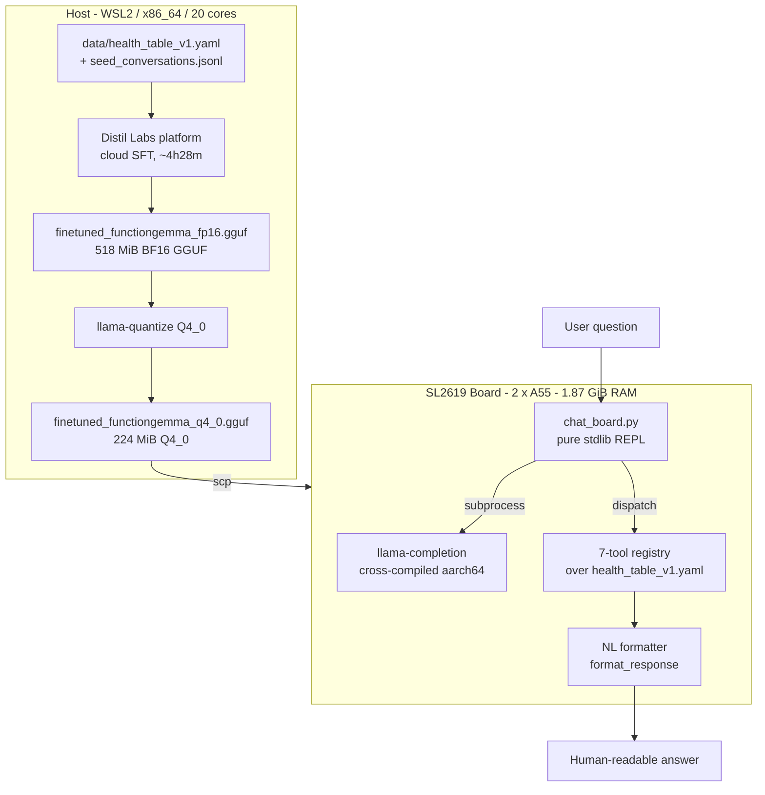
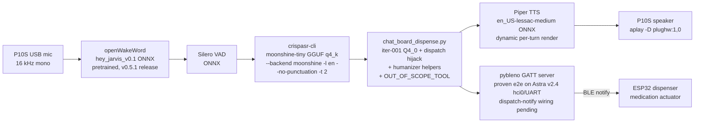
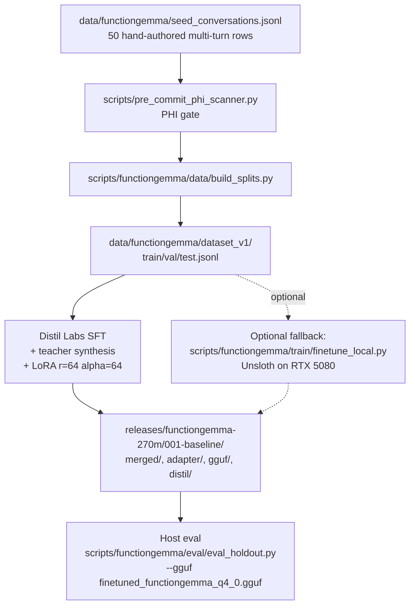
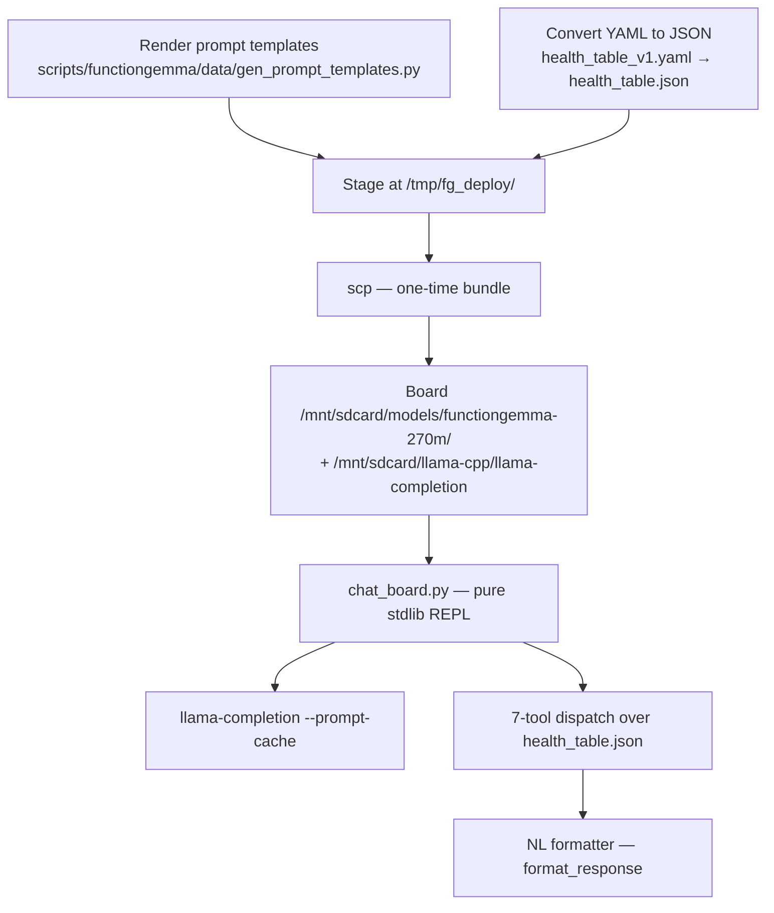
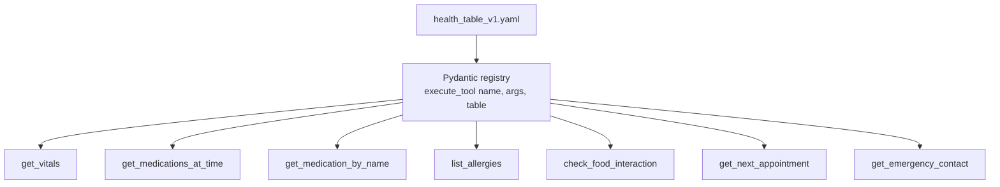

# function-gemma-270m-health-tools

Fine-tune **FunctionGemma 270M-IT** for closed-world function-calling against a synthetic patient-record registry, quantize to Q4_0, and deploy to the **Synaptics SL2619** Astra Machina board (Cortex-A55 × 2, 1.87 GiB RAM, no NPU/Vulkan path).

The deliverable is a 224 MiB GGUF that answers natural-language health questions on-device at **~10 tok/s decode**, with tool dispatch + a human-readable formatter resolving the structured output back into one sentence per question.

A second active track — the **dispenser demo** — stacks an on-device voice front-end (pretrained openWakeWord `hey_jarvis_v0.1` ONNX + Silero VAD + CrispASR + Moonshine Tiny GGUF, non-streaming) plus **Piper neural TTS** (en_US-lessac-medium) on the P10S speaker, all driving the FunctionGemma brain, with a BLE-driven ESP32 medication dispenser as the final actuator. The v1 demo runtime is **iter-001 + a dispatcher-hijack wrapper** ([`scripts/functiongemma/deploy/chat_board_dispense.py`](scripts/functiongemma/deploy/chat_board_dispense.py)) that short-circuits two existing tools to the §6 dispense intent (mock BLE notify + canned response) — iter-002 ([`releases/functiongemma-270m/002-dispenser-demo/`](releases/functiongemma-270m/002-dispenser-demo/)) is trained but NOT deployed for v1 pending wire-format reconciliation. Phase 0 (STT runtime spike) closed 2026-05-11; Phase 3 (voice integration) Layers B, C, and D all closed 2026-05-12 via the long-running [`scripts/dispenser_demo/deploy/dispenser_voice.py`](scripts/dispenser_demo/deploy/dispenser_voice.py), first-run wall ~10.7 s/turn end-to-end including Piper render. Layer A (WSL host) was skipped — WSL2 doesn't expose a mic via WSLg in this user's setup. **BLE was proven end-to-end on 2026-06-01**: the revB pin-mux blocker (Synaptics bug 37861/37374) is resolved by Astra v2.4.0, `hci0` enumerates on UART, and pybleno advertised `NousVoice` to a phone that subscribed to `0xFFB2` and received `5A A5 01 00`. The only remaining v1 item is swapping the `[BLE→ESP32]` stdout-mock in `chat_board_dispense.py:dispatch` for a real `PyBlenoBleClient.notify` — see [`docs/deployment/sl2619-ble-bringup.md`](docs/deployment/sl2619-ble-bringup.md). See [`docs/plans/dispenser-demo/plan.md`](docs/plans/dispenser-demo/plan.md) and [`decisions-log.md`](docs/plans/dispenser-demo/decisions-log.md).

## Status

| Track | State |
| --- | --- |
| FunctionGemma iteration 001 (Distil Labs) | **DONE** — 0.9583 on every metric on the 24-row contaminated holdout (`releases/functiongemma-270m/001-baseline/distil/`); no retrain planned |
| INT4/INT8 board quantization sweep | **DONE 2026-05-02** — Q4_0 selected; full report in [`docs/bench-notes/functiongemma/2026-05-02_quantization-sweep.md`](docs/bench-notes/functiongemma/2026-05-02_quantization-sweep.md) |
| On-board interactive REPL (`chat_board.py`) | **DONE** — prompt-cache primed; ~6 s/turn after the one-time prime |
| Dispenser demo — Phase 0 (CrispASR STT spike) | **DONE 2026-05-11** — pinned `cstr/moonshine-tiny-GGUF` via `--backend moonshine` (superseded the streaming variant the same afternoon; archive recipe at `archive/dispenser-demo-moonshine-streaming/`). Board: 4.66 s wall / 11 s audio, 49.6 MB RSS; extrapolated 3 s utterance ≈ 1.27 s / ≈ 50 MB, well inside the ≤ 2.0 s / ≤ 250 MB gate. Audit: [`docs/plans/dispenser-demo/crispasr-spike-notes.md`](docs/plans/dispenser-demo/crispasr-spike-notes.md) |
| Dispenser demo — iter-002 (Distil retrain) | **TRAINED, NOT DEPLOYED** — artifacts at `releases/functiongemma-270m/002-dispenser-demo/`. Host Q4_0 host-eval collapsed to 30 %; on-board output omits `<start_function_call>` opener. Held until wire-format reconciled |
| Dispenser demo — Phase 1 (data + Distil retrain to land iter-002) | **DEFERRED** — v1 demo bridges with iter-001 + dispatcher-hijack (`chat_board_dispense.py`) instead. See `docs/plans/dispenser-demo/decisions-log.md` 2026-05-12 entries |
| Dispenser demo — Phase 2 (BLE GATT on board) | **PROVEN END-TO-END 2026-06-01** — Astra v2.4.0 resolves the revB pin-mux blocker (Synaptics bug 37861/37374); `hci0` enumerates on UART and pybleno advertised `NousVoice` to a phone that subscribed to `0xFFB2` and received `5A A5 01 00`. Board deps staged manually (no `pip`/`fcntl` → `patch_pybleno_bluetoothhci.py` + `board_fcntl_shim.py`); mandatory pre-bleno `hciconfig hci0 up && down` reset. Only remaining v1 item: swap the `[BLE→ESP32]` stdout-mock in `chat_board_dispense.py:dispatch` for a real `PyBlenoBleClient.notify`. Runbook: `docs/deployment/sl2619-ble-bringup.md` |
| Dispenser demo — Phase 2 (P10S audio) | **DONE 2026-05-11** — speaker + mic + firmware AEC all verified; recipe in `docs/guides/usb-audio-testing-sl2619.md` |
| Dispenser demo — Phase 3 Layer A (wake + VAD + STT on WSL host, stdout only) | **SKIPPED** — WSL2 doesn't expose a mic via WSLg in this user's setup. Documented for future sessions on a machine with a working mic |
| Dispenser demo — Phase 3 Layer B (wake + VAD + STT on board, stdout only) | **DONE 2026-05-12** — board wake→STT smoke green; details in `docs/plans/dispenser-demo/decisions-log.md` |
| Dispenser demo — Phase 3 Layer C (full pipeline on board: wake→STT→FunctionGemma→stdout) | **DONE 2026-05-12** — long-running [`scripts/dispenser_demo/deploy/dispenser_voice.py`](scripts/dispenser_demo/deploy/dispenser_voice.py) wires Layer B into iter-001 hijack. First-run wall ~10.7 s/turn (wake ~1.55 s → STT 1.14 s → FunctionGemma 6.48 s → dispense override + canned line). |
| Dispenser demo — Phase 3 Layer D (Piper TTS → P10S speaker) | **DONE 2026-05-12** — dynamic per-turn Piper render of `chat_board.format_response`'s output (`_capture_format` wrapper), humanizer helpers normalize dates/times/schedules/vitals for natural cadence, out-of-scope refusals routed through `format_response` so the TTS layer speaks them, wake-ack + command-ack chimes, `-v`/`--trace` logging split. Layer C.1 arecord-overrun closed inside Layer D via `ArecordMic.drain()`. See `decisions-log.md` 2026-05-12 (afternoon) entry |

## Quick start

```bash
git clone <repo-url> gemma3-270M-finetune
cd gemma3-270M-finetune
uv venv .venv && source .venv/bin/activate
uv pip install -e ".[dev,functiongemma]"

# Build llama-quantize (host) — one-time
cd docs/references/upstream/llama.cpp
cmake -B build -DCMAKE_BUILD_TYPE=Release -DLLAMA_CURL=OFF -DLLAMA_BUILD_SERVER=ON
cmake --build build --target llama-quantize -j$(nproc)
cd ../../../..

# Generate Q4_0 from the canonical FP16 (gitignored)
scripts/functiongemma/quantize/build_variants.sh         # default: Q4_0 only

# 1. Host demo (Runs locally in WSL)
# Tests the full stack natively. Expected runtime: ~2 s after model load.
# Note: Expects the baseline weights at releases/functiongemma-270m/001-baseline/
uv run python scripts/functiongemma/chat.py --probe "What is my blood pressure?"

# 2. Board demo (Runs on the SL2619 edge device)
# Tests the fully quantized on-device solution.
# Assumes the board is up + reachable as `nouslogic-sl2619`, llama-completion is at
# /mnt/sdcard/llama-cpp/, and Q4_0 + prompt files are deployed (see "Deploy workflow" below).
ssh nouslogic-sl2619 'python3 /mnt/sdcard/models/functiongemma-270m/chat_board.py'
# UX Note: The first question takes roughly 32 seconds to process while the board
# primes the prompt cache. Every subsequent turn will take about ~6 seconds.
```

The host demo expects `releases/functiongemma-270m/001-baseline/`; the canonical FP16 sha is `1add620fbd45…` (518 MiB) and Q4_0 is `a484ad50d4b6…` (231 MiB). Both are gitignored — `CHECKSUMS.txt` is the authoritative record.

## Architecture overview



### Dispenser-demo voice pipeline (v1 shipping shape)



Phase 0 (STT runtime) closed 2026-05-11. Phase 3 (voice integration): Layer A (WSL host) skipped — no WSLg mic in this user's setup. Layers B, C, and D all closed 2026-05-12 via the long-running [`scripts/dispenser_demo/deploy/dispenser_voice.py`](scripts/dispenser_demo/deploy/dispenser_voice.py); first-run wall ~10.7 s/turn end-to-end including Piper render. Phase 1 (Distil retrain to land iter-002) is deferred; the v1 demo bridges via iter-001 + dispatcher-hijack with runtime humanizer helpers in `chat_board.py` / `chat.py` (kept in lockstep; `tests/functiongemma/test_chat_formatters.py` parametrizes both copies). **BLE was proven end-to-end on the board 2026-06-01** (Astra v2.4.0 fixes the revB pin-mux blocker; `hci0`/UART enumerates and pybleno advertised `NousVoice` to a subscribing phone). The only remaining v1 item is the real-radio dispatch-notify wiring; the board-side bring-up runbook is [`docs/deployment/sl2619-ble-bringup.md`](docs/deployment/sl2619-ble-bringup.md). Full plan, BLE wire contract, and wake-word state machine: [`docs/plans/dispenser-demo/plan.md`](docs/plans/dispenser-demo/plan.md); binding decisions: [`docs/plans/dispenser-demo/decisions-log.md`](docs/plans/dispenser-demo/decisions-log.md).

## Hardware

- **Host (this WSL machine).** Ubuntu 24.04 / WSL2 / Python 3.12, x86_64 20-core. Used for dataset prep, host smoke, holdout eval, and the llama-quantize sweep.
- **Fine-tune server** (only when the local Unsloth fallback path is used). RTX 5080 16 GiB VRAM, cu128, 47 GiB RAM, Tailscale-reachable. Bootstrapped via [`scripts/setup/server-bootstrap.sh`](scripts/setup/server-bootstrap.sh).
- **SL2619 board.** Synaptics SL2619 RDK / 2 × Cortex-A55 / 1.87 GiB RAM, ARMv8.2-A NEON+DOTPROD (no SVE). Yocto Linux (Astra `scarthgap_6.12_v2.4.0`, kernel 6.12.62) + BusyBox. ~1.7 GiB MemAvailable. Cross-compiled `llama.cpp b8925`/`0adede8` aarch64 binaries staged at `/mnt/sdcard/llama-cpp/`. BT (`hci0`) on UART via the M.2 SYN43711 combo; BLE functional since the v2.4.0 pin-mux fix. The board was reflashed v2.3.0 → v2.4.0 during 2026-06-01 recovery — see `docs/deployment/sl2619-recovery-reflash.md`.

## Finetune workflow



The Distil-platform path is current production. Teacher synthesis blew the 50-row seed corpus up to 5 054 training rows (5 000 synthesized + 50 seeds + deduped), expanded internally by Distil to 7 481 multi-turn samples. See [`releases/functiongemma-270m/001-baseline/distil/README.md`](releases/functiongemma-270m/001-baseline/distil/README.md) for the upload/re-upload/teacher-eval timeline (3 prompt-engineering iterations lifted judge from 0.7917 → 0.8750 → 0.9583).

The local fallback path uses the same dataset shape against `google/functiongemma-270m-it` via Unsloth + LoRA — useful when the Distil platform is unavailable, or when the iteration adds refusal classes / parallel-call workflows (which Distil's `multi-turn-tool-calling-closed-book` task type doesn't fit).

## Deploy workflow (host → board)



The split exists because the board has neither HF tokenizer nor `transformers`, so prompt rendering is host-side and pre-rendered prefixes/suffixes ship to the board. Full board recipe: [`docs/deployment/functiongemma-board-deploy.md`](docs/deployment/functiongemma-board-deploy.md).

```bash
# 1. Generate prompt templates + health-table JSON (host)
mkdir -p /tmp/fg_deploy
uv run python scripts/functiongemma/data/gen_prompt_templates.py \
    --tokenizer releases/functiongemma-270m/001-baseline/merged/ \
    --output-dir /tmp/fg_deploy/
uv run python -c "
import json, yaml
with open('data/health_table_v1.yaml') as f: data = yaml.safe_load(f)
with open('/tmp/fg_deploy/health_table.json', 'w') as f:
    json.dump(data, f, indent=2, ensure_ascii=False)
"
cp scripts/functiongemma/deploy/chat_board.py /tmp/fg_deploy/
cp scripts/functiongemma/deploy/run_prompt.sh /tmp/fg_deploy/run-prompt.sh
chmod +x /tmp/fg_deploy/run-prompt.sh

# 2. Stage on board
ssh nouslogic-sl2619 'mkdir -p /mnt/sdcard/models/functiongemma-270m'
scp releases/functiongemma-270m/001-baseline/gguf/finetuned_functiongemma_q4_0.gguf \
    nouslogic-sl2619:/mnt/sdcard/models/functiongemma-270m/
scp /tmp/fg_deploy/* nouslogic-sl2619:/mnt/sdcard/models/functiongemma-270m/
ssh nouslogic-sl2619 'sha256sum /mnt/sdcard/models/functiongemma-270m/finetuned_functiongemma_q4_0.gguf'
# expected: a484ad50d4b66fdbd6ccb482389eec734b0de9fe988e8811b5e6683daf180e14

# 3. Run interactive REPL on board
ssh nouslogic-sl2619 'python3 /mnt/sdcard/models/functiongemma-270m/chat_board.py'
# First turn primes the prompt cache (~32 s, one-time).
# Subsequent turns: ~6 s wall, 10.3 tok/s decode.
```

## On-board demo proof

This transcript is from the SL2619 board running the Q4_0 GGUF with the synthetic health record loaded. It demonstrates direct health-record questions, tool dispatch, natural-language formatting, and follow-up questions such as resolving "her" after asking for the emergency contact.

```text
root@nouslogic:~# python3 /mnt/sdcard/models/functiongemma-270m/chat_board.py
[chat] model=/mnt/sdcard/models/functiongemma-270m/finetuned_functiongemma_q4_0.gguf threads=2 n_predict=64
[chat] prefix=7187b suffix=35b health-record loaded (5 meds, 2 allergies)
[chat] prompt-cache: /tmp/fg_pc_finetuned_functiongemma_q4_0.gguf.bin (existing, 20242 KiB)

FunctionGemma chat (on-board) — model.gguf staged. Slash commands: /exit /quit /reset /history /raw

you> what is my heart rate?
[thinking…]

→ {"tool": "get_vitals", "args": {}}
  ⤷ {"heart_rate_bpm": 72, "blood_pressure_systolic": 118, "blood_pressure_diastolic": 76, "spo2_percent": 98, "body_temperature_c": 36.7, "respiratory_rate": 16, "last_measured": "2026-04-24 08:15"}
  >> Your heart rate is 72 bpm (measured 2026-04-24 08:15).
  [prompt 13 (32.8 tok/s) + decode 10 (10.7 tok/s) in 6.05s wall]
you> when is my next appointment?
[thinking…]

→ {"tool": "get_next_appointment", "args": {}}
  ⤷ {"date": "2026-05-06", "time": "10:30", "provider": "Dr. Evelyn Chen", "purpose": "quarterly diabetes check-up", "location": "Maple Clinic, Room 204"}
  >> Your next appointment is on 2026-05-06 at 10:30.
  [prompt 13 (32.8 tok/s) + decode 11 (10.6 tok/s) in 6.15s wall]
you> Why am I taking Aspirin?
[thinking…]

→ {"tool": "get_medication_by_name", "args": {"name": "Aspirin"}}
  ⤷ {"name": "Aspirin", "dose": "81 mg", "schedule": "08:00", "with_food": true, "purpose": "cardiovascular protection", "avoid_foods": [], "avoid_drugs": ["Ibuprofen", "Warfarin"]}
  >> You take Aspirin for cardiovascular protection.
  [prompt 14 (32.1 tok/s) + decode 22 (10.7 tok/s) in 7.24s wall]
you> who is my emergency contact?
[thinking…]

→ {"tool": "get_emergency_contact", "args": {}}
  ⤷ {"name": "Jane Doe", "relation": "daughter", "phone": "+1-555-0142"}
  >> Your emergency contact is Jane Doe (daughter).
  [prompt 13 (32.7 tok/s) + decode 11 (10.7 tok/s) in 6.14s wall]
you> what is her phone number?
[thinking…]

→ {"tool": "get_emergency_contact", "args": {}}
  ⤷ {"name": "Jane Doe", "relation": "daughter", "phone": "+1-555-0142"}
  >> Call Jane Doe (daughter) at +1-555-0142.
  [prompt 13 (32.7 tok/s) + decode 11 (10.6 tok/s) in 6.15s wall]
```

## Try the voice loop (dispenser demo, on board)

The long-running voice pipeline lives at [`scripts/dispenser_demo/deploy/dispenser_voice.py`](scripts/dispenser_demo/deploy/dispenser_voice.py). Phase 3 Layers B/C/D all closed 2026-05-12; first-run wall is ~10.7 s/turn end-to-end on a P10S USB speakerphone plugged into the SL2619.

Prerequisites on the board (one-time staging, see [`decisions-log.md`](docs/plans/dispenser-demo/decisions-log.md) for the exact layout):

- `/mnt/sdcard/python-deps/site/{onnxruntime,openwakeword}/` — extracted manylinux_2_28 aarch64 wheel + vendored openWakeWord (with `hey_jarvis_v0.1.onnx` under `resources/models/`).
- `/mnt/sdcard/models/functiongemma-270m/` — Q4_0 GGUF + `chat_board.py` + `chat_board_dispense.py` + `health_table_dispense.json` + prompt prefix/suffix.
- `/mnt/sdcard/models/moonshine-tiny/moonshine-tiny-q4_k.gguf` — STT model.
- `/mnt/sdcard/bin/crispasr` — STT engine (stripped aarch64 static binary; sha256 `5bfedc14...`).
- `/mnt/sdcard/dispenser_demo/{wake_ack.wav,command_ack.wav,piper-voices/,tts/,dispenser_voice.py}` — chimes, Piper voice model, fallback canned WAVs, the script itself.

Run on board:

```bash
PYTHONPATH=/mnt/sdcard/python-deps/site python3 \
    /mnt/sdcard/dispenser_demo/dispenser_voice.py
# add -v for pipeline-transition logging, --trace for per-frame wake/VAD scores
```

Flow per turn: say "Hey Jarvis" → wake chime → speak the command → command-ack chime → STT transcript prints → FunctionGemma turn (~6 s) → Piper renders the answer → aplay speaks it on the P10S speaker. The dispense intent additionally prints `[BLE→ESP32] 5A A5 01 00` (still a stdout-mock inside the voice loop — BLE itself is proven on the board, but the `dispatch` path is not yet wired to the real `PyBlenoBleClient.notify`; see [`docs/deployment/sl2619-ble-bringup.md`](docs/deployment/sl2619-ble-bringup.md)). Out-of-scope queries route through `format_response` via the `OUT_OF_SCOPE_TOOL` sentinel and are spoken as a canned refusal.

## Tool registry

Seven read-only tools defined in [`src/gemma_tools/functiongemma/tools.py`](src/gemma_tools/functiongemma/tools.py), schema-mirrored to [`data/functiongemma/tools_v1.yaml`](data/functiongemma/tools_v1.yaml). The patient record they read from is the synthetic [`data/health_table_v1.yaml`](data/health_table_v1.yaml) (no real PHI).

**Patient Record Snapshot (`health_table_v1.yaml`):**

```yaml
patient:
  name: "Test Patient"
  age: 45
  sex: "F"
  blood_type: "O+"
vitals:
  heart_rate_bpm: 72
  blood_pressure_systolic: 118
  # ... other vitals ...
medications:
  - name: "Lisinopril"
    dose: "10 mg"
    schedule: "08:00"
    purpose: "blood pressure control"
    avoid_drugs: ["Potassium supplements", "NSAIDs"]
```



| Tool | Purpose | Required args |
| --- | --- | --- |
| `get_vitals` | Most-recent vitals snapshot | — |
| `get_medications_at_time` | Meds at HH:MM, or all meds if omitted | optional `time_24h` |
| `get_medication_by_name` | Single medication record (case-insensitive prefix match) | `name` |
| `list_allergies` | All known allergies | — |
| `check_food_interaction` | Food vs medication / dietary restriction | `food` |
| `get_next_appointment` | Earliest upcoming appointment | — |
| `get_emergency_contact` | First listed contact | — |

The model emits `<start_function_call>call:<NAME>{<args>}<end_function_call>` in the FunctionGemma wire format; the runtime regex-extracts, dispatches, then the formatter (`scripts/functiongemma/chat.py:format_response`) turns the JSON tool result into a single English sentence keyed off the question.

## Quantization sweep results (2026-05-02)

Source FP16: `finetuned_functiongemma_fp16.gguf` (sha256 `1add620fbd45…`).
Sanity = 7 in-distribution prompts on board (`scripts/functiongemma/bench.py`).
Holdout = 45-row all-novel-phrasing `eval_holdout_v2_clean.jsonl` (host eval via `llama-cpp-python`).

| Variant | Size MiB | Holdout match | Board sanity | Decode tok/s (single-resident) | Verdict |
| --- | --- | --- | --- | --- | --- |
| FP16 baseline | 518 | 11/45 (24.4 %) | (skipped) | ~5–7 (per docs) | reference |
| **Q4_0 ★** | **224** | **13/45 (28.9 %)** | **7/7** | **10.27** | **DEPLOY** |
| Q4_K_M | 242 | 10/45 (22.2 %) | 1/7 | 7.0 | DISQUALIFIED — drops `<start_function_call>` open token on board |
| Q5_K_M | 248 | 13/45 (28.9 %) | 1/7 | 8.4 | DISQUALIFIED — same drop pattern |
| Q8_0 | 271 | 11/45 (24.4 %) | 3/7 | 9.1 | DISQUALIFIED — partial drop pattern |
| IQ4_XS | 224 | 7/45 (15.6 %) | 1/7 | 9.9 | DISQUALIFIED — host accuracy + tokenizer drift |

Failure mode for everything except Q4_0: the older on-board `llama-completion` (b8925, Apr 24) mis-handles K-quant scale-factor encoding from the newer host `llama-quantize` (b8981, Apr 29). On a 270M model with a 262 144-token embedding table, the post-`<start_of_turn>model` distribution shifts off the `<start_function_call>` mode → malformed wire format → parser rejects. Q4_0 uses the simpler symmetric INT4 representation and survives the skew.

Refresh the on-board binary against `b8981`+ on the fine-tune server and re-cross-compile to potentially recover the higher-bit variants — captured as deferred follow-up.

The clean holdout is *out-of-distribution* for iter-001's training corpus; even FP16 only hits 24.4 %. The realistic gate is therefore "no measurable degradation vs FP16 (≥ 19.4 %)", set per advisor review.

Full per-row breakdown: [`docs/bench-notes/functiongemma/2026-05-02_quantization-sweep.md`](docs/bench-notes/functiongemma/2026-05-02_quantization-sweep.md).

## Repo layout

```
gemma3-270M-finetune/
|- CLAUDE.md                          Agent self-reference (paths + workflows)
|- README.md                          This file (human-facing entry point)
|- pyproject.toml, uv.lock            Build + dependency manifests
|- src/gemma_tools/
|  |- __init__.py                     Package shim (version only)
|  |- health_table.py                 Pydantic loader for the patient YAML
|  |- functiongemma/                  Active sub-package: dataset, tools
|  |- _legacy/                        Frozen gemma3-270m health-QA modules
|- scripts/functiongemma/
|  |- chat.py                         Host interactive REPL (the local demo)
|  |- bench.py                        Two-mode bench harness (local + remote SL2619)
|  |- smoke.py                        Smoke runner
|  |- data/                           build_seeds, build_splits, ingest, gen_prompt_templates
|  |- train/finetune_local.py         Unsloth fallback SFT (server-side)
|  |- eval/eval_holdout.py            Host holdout evaluation (HF + GGUF seams)
|  |- quantize/build_variants.sh      Idempotent llama-quantize driver
|  |- bench/aggregate_quant.py        Sweep JSONL -> Markdown aggregator
|  |- deploy/                         chat_board.py, chat_board_dispense.py (v1 hijack), run_prompt.sh, ask_board.sh
|- scripts/dispenser_demo/
|  |- spike/                          Phase 0 CrispASR smoke (host + board)
|  |- data/                           Iter-002 dataset prep (build_seeds, build_splits, build_distil_data, gen_prompt_templates)
|  |- eval/eval_holdout.py            Iter-002 holdout eval (not used by v1 demo)
|  |- deploy/ble_test.py              BLE GATT peripheral smoke (pybleno; proven on board hci0/UART)
|  |- deploy/patch_pybleno_bluetoothhci.py  Board pybleno HCI patch (no pip on board)
|  |- deploy/board_fcntl_shim.py      fcntl shim for board Python (stdlib lacks it)
|  |- deploy/dispenser_voice.py       Phase 3 Layers B/C/D long-running entry — wake→VAD→STT→FunctionGemma→Piper TTS→speaker, iter-001 hijack
|  |- chat.py                         Iter-002 host REPL (not used by v1 demo)
|- scripts/
|  |- setup/server-bootstrap.sh       Idempotent Ubuntu-server SFT-stack bootstrap (RTX 5080)
|  |- sl2619/p10s_aec_probe.py        P10S firmware AEC tone-suppression probe (duplex)
|  |- sl2619/p10s_aec_speech_probe.py P10S speech-survival follow-up (operator speaks during duplex)
|  |- pre_commit_phi_scanner.py       PHI scanner for FunctionGemma data ingest
|- tests/
|  |- functiongemma/                  Active FunctionGemma tests
|  |- dispenser_demo/                 Phase 0 smoke-script tests (23 cases)
|  |- _legacy/                        gemma3-270m health-QA tests (still in CI)
|- data/
|  |- health_table_v1.yaml            Synthetic patient record (no real PHI) — v1 fixture (Test Patient)
|  |- health_table_v1_dispense_demo.yaml  Dispenser-demo patient (David Smith) — paired with chat_board_dispense.py
|  |- health_table_v2.yaml            Iter-002 patient fixture (v2 schema)
|  |- functiongemma/                  dataset_v1, seed_conversations, eval_holdouts, tools_v1.yaml
|  |- dispenser_demo/                 Iter-002 training substrate (dataset_v1, seed_conversations)
|  |- _legacy/                        Frozen gemma3-270m SFT corpora + prompts.yaml
|- releases/functiongemma-270m/
|  |- 001-baseline/                   Iter-001 deployable (v1 demo runtime source)
|  |  |- RECIPE.md                    How iter-001 was produced + reproduce steps
|  |  |- merged/                      HF merged BF16 weights + tokenizer + chat template
|  |  |- adapter/                     LoRA adapter (r=64, alpha=64)
|  |  |- gguf/                        CHECKSUMS.txt, RECOMMENDED.md, Modelfile,
|  |  |                               finetuned_functiongemma_{fp16,q4_0}.gguf (gitignored)
|  |  |- distil/                      Distil platform deliverables (config, training-analysis, predictions, etc.)
|  |  |- model_client.py              Distil deploy client (Ollama / vLLM HTTP wrapper)
|  |- 002-dispenser-demo/             Iter-002 (TRAINED, NOT DEPLOYED for v1)
|  |  |- DISTIL_README.md             Distil platform writeup
|  |  |- merged/ adapter/ gguf/       HF merged + LoRA + GGUF (host Q4_0 host-eval collapsed; see decisions-log.md)
|  |  |- distil/                      Distil platform deliverables
|  |  |- Modelfile model_client.py model.tar
|- bench/functiongemma/runs/2026-05-02-quant/   Per-variant board sweep JSONL
|- docs/
|  |- conventions/                    Normative coding rules (Python, shell, testing, doc-update)
|  |- references/upstream/            Opt-in submodules (gemma, llama.cpp, CrispASR, openWakeWord, silero-vad, distil-cli-skill, synaptic-sl2619, unsloth-notebooks)
|  |- plans/functiongemma/            recipe, decisions-log, quantization-plan, seed-authoring, llm-augmentation
|  |- plans/dispenser-demo/           plan, crispasr-spike-notes, decisions-log (Phase 0 closed 2026-05-11)
|  |- bench-notes/functiongemma/      2026-05-02_quantization-sweep.md (the sweep report)
|  |- deployment/                     sl2619-board.md (cross-compile), functiongemma-board-deploy.md,
|  |                                   sl2619-ble-bringup.md, sl2619-{recovery-reflash,windows-recovery,postrecovery-bringup}.md
|  |- guides/                         finetune-best-practices, distil-iteration-recipe-and-lessons, usb-audio-testing-sl2619
|- archive/
|  |- README.md                       Archive index
|  |- gemma3-270m-health-qa/          Frozen gemma3-270m track
|  |- functiongemma-pre-distil/       Frozen pre-distil FunctionGemma path
|  |- dispenser-demo-moonshine-streaming/  Superseded streaming-STT recipe (2026-05-11 AM)
```

## Reproduce iteration 001

The full recipe lives at [`releases/functiongemma-270m/001-baseline/RECIPE.md`](releases/functiongemma-270m/001-baseline/RECIPE.md). The Distil platform path produces this exact iteration in ~4h 28m; artifacts (`merged/`, `adapter/`, `gguf/finetuned_functiongemma_fp16.gguf`, `Modelfile`, `model_client.py`, `distil/training-analysis.md`, `distil/teacher-eval-analysis.md`, `distil/predictions/`, `distil/data/{train,test}.jsonl`) are what the team should expect to land under `releases/functiongemma-270m/<iter>/` after running cloud SFT.

```bash
# Production path (Distil Labs)
distil model create fg-iter-002
distil model upload-data fg-iter-002 --train-data train.jsonl \
    --test-data test.jsonl --dry-run
distil model upload-data fg-iter-002 --train-data train.jsonl --test-data test.jsonl
distil model run-teacher-evaluation fg-iter-002       # judge ≥ 0.80 = proceed bar
distil model run-finetune fg-iter-002
distil model download-artifact fg-iter-002 \
    --output releases/functiongemma-270m/iter-002/

# Local fallback (Unsloth on nouslogic-server, RTX 5080) — ~60 min
ssh -t nouslogic-server 'bash ~/server-bootstrap.sh --with-system-deps'
ssh nouslogic-server 'cd ~/functiongemma-finetune && source .venv/bin/activate && \
    python finetune_local.py --recipe mobile_actions_hf \
        --train-file data/train.jsonl --val-file data/val.jsonl \
        --output-dir outputs/iter-002 --epochs 4'
```

## Test / lint / typecheck

```bash
uv run pytest                    # 729 passed (FunctionGemma + dispenser_demo + _legacy)
uv run ruff check src tests
uv run mypy src
```

The legacy `_legacy/` track is preserved as a runnable reference (its tests still pass in CI). Active development goes into the FunctionGemma tracks under `src/gemma_tools/functiongemma/`, `scripts/functiongemma/`, `data/functiongemma/`.

## Test USB audio peripheral (SL2619 board)

Smoke-test a USB speakerphone (e.g. ROFALL P1U-4 / "USB Audio 4.0", which enumerates as `MV-SILICON P10S`) plugged into the board. The board image is ALSA-only — no PulseAudio/PipeWire, no `sox`/`ffmpeg`, no `opkg`. Substitute `<N>` with the card number from step 1. Full recipe with gotchas, signal-level interpretation, and triage matrix in [`docs/guides/usb-audio-testing-sl2619.md`](docs/guides/usb-audio-testing-sl2619.md).

```bash
# 1. Detect the USB audio device and its native PCM formats
ssh nouslogic-sl2619 'lsusb; cat /proc/asound/cards; cat /proc/asound/card<N>/stream0'

# 2. Inspect mixer; raise PCM if it's at 0% (common default after plug-in — otherwise tests "succeed" silently)
ssh nouslogic-sl2619 'amixer -c <N>'
ssh nouslogic-sl2619 "amixer -c <N> sset 'PCM' 50%"

# 3. Speaker test — 440 Hz sine on both channels, at the device's native rate (see step 1)
ssh nouslogic-sl2619 'speaker-test -D plughw:<N>,0 -c 2 -r 48000 -t sine -f 440 -l 1'

# 4. Mic capture — 5 s at native format (P10S is 48 kHz capture only)
ssh nouslogic-sl2619 'arecord -D plughw:<N>,0 -f S16_LE -r 48000 -c 2 -d 5 /tmp/usb_mic_test.wav'

# 5. Signal analysis — Python stdlib, no sox/ffmpeg needed
ssh nouslogic-sl2619 "python3 -W ignore::DeprecationWarning - <<'PY'
import wave, audioop, math
with wave.open('/tmp/usb_mic_test.wav','rb') as w:
    nch, sw, sr, nf = w.getnchannels(), w.getsampwidth(), w.getframerate(), w.getnframes()
    frames = w.readframes(nf)
print(f'channels={nch} rate={sr} frames={nf} duration={nf/sr:.2f}s')
db = lambda v: float('-inf') if v == 0 else 20*math.log10(v/32768)
for name, ch in (('L', audioop.tomono(frames, sw, 1.0, 0.0)),
                 ('R', audioop.tomono(frames, sw, 0.0, 1.0))):
    p, r = audioop.max(ch, sw), audioop.rms(ch, sw)
    print(f'{name}: peak={p:5d} ({db(p):+6.1f} dBFS)   rms={r:5d} ({db(r):+6.1f} dBFS)')
PY
"

# 6. End-to-end loopback — play the recording back through the same device
ssh nouslogic-sl2619 'aplay -D plughw:<N>,0 /tmp/usb_mic_test.wav'
```

Healthy voice peaks at −20 to −6 dBFS; below −50 dBFS means no signal reached the mic. On single-mic speakerphones L and R should be within ~1 dB (single capsule duplicated to stereo).

### Probe the firmware echo canceller (AEC)

The P10S is a Zoom-certified speakerphone and ships with on-chip AEC. Two stdlib-only probes verify this without external tooling — confirmed 2026-05-11 that the firmware suppresses device echo by ~65 dB during single-talk and ~55 dB during double-talk while preserving near-end speech (Δ -1.9 dB). No software AEC (`speexdsp`, `webrtc-audio-processing`) is needed for a duplex voice pipeline targeting this device.

```bash
# Tone test — does AEC exist?
scp scripts/sl2619/p10s_aec_probe.py nouslogic-sl2619:/tmp/
ssh nouslogic-sl2619 'python3 -W ignore::DeprecationWarning /tmp/p10s_aec_probe.py'

# Speech-survival follow-up — is AEC selective?
scp scripts/sl2619/p10s_aec_speech_probe.py nouslogic-sl2619:/tmp/
ssh -tt nouslogic-sl2619 'python3 -u -W ignore::DeprecationWarning /tmp/p10s_aec_speech_probe.py'
# Speak during the "=== SPEAK NOW ===" prompts; use the same phrase in both phases.
```

Full results, decision criteria, and the critical duplex gotcha (USB endpoint scheduling fails on stereo+stereo @ 48 kHz — must use mono capture and start `arecord` before `aplay`) are in [`docs/guides/usb-audio-testing-sl2619.md`](docs/guides/usb-audio-testing-sl2619.md).

## URL references

| Resource | URL |
| --- | --- |
| FunctionGemma 270M-IT model card | <https://huggingface.co/google/functiongemma-270m-it> |
| Gemma 3 270M-IT (parent backbone) | <https://huggingface.co/google/gemma-3-270m-it> |
| FunctionGemma cookbook (vendor) | <https://github.com/google-deepmind/gemma/tree/main/cookbook/docs/functiongemma> |
| llama.cpp (cross-compile + quantize) | <https://github.com/ggml-org/llama.cpp> |
| llama-cpp-python (host inference) | <https://github.com/abetlen/llama-cpp-python> |
| Distil Labs platform (cloud SFT) | <https://app.distillabs.ai/> |
| Distil Labs blog "Making FunctionGemma Work" | <https://distillabs.ai/blog/making-functiongemma-work> |
| Unsloth (local LoRA SFT) | <https://github.com/unslothai/unsloth> |
| HuggingFace `transformers` chat templates | <https://huggingface.co/docs/transformers/chat_templating> |
| HuggingFace `peft` (LoRA adapter format) | <https://github.com/huggingface/peft> |
| Synaptics SL2610 / SL2619 RDK get-started | <https://developer.synaptics.com/sl2610> |
| Yocto scarthgap (board image) | <https://www.yoctoproject.org/software-overview/releases/scarthgap/> |
| Cortex-A55 ARM ref | <https://developer.arm.com/Processors/Cortex-A55> |
| GGUF format spec | <https://github.com/ggml-org/ggml/blob/master/docs/gguf.md> |
| llama.cpp prompt-cache flag (used in `chat_board.py`) | <https://github.com/ggml-org/llama.cpp/blob/master/common/arg.cpp> |

## Environment / discipline

- **No model weights in git** — `*.gguf`, `*.bin`, `*.safetensors`, `*.pt` are gitignored. `releases/.../gguf/CHECKSUMS.txt` is the authoritative SHA record.
- **Synthetic PHI only** — `data/health_table_v1.yaml` is hand-authored fake data. Any move to real patient data goes through OQ-5 review.
- **PHI scanner gates ingest** — `scripts/pre_commit_phi_scanner.py` runs on every staged JSONL before merge.
- **CrispASR runtime traps** — any production code invoking the board's crispasr binary MUST pass `-l en --no-punctuation -t 2`. Auto-LID and auto-punctuation silently fetch models from HF at runtime — fatal on the offline SL2619 and a RAM bomb on the 2 GB device. See [`docs/plans/dispenser-demo/decisions-log.md`](docs/plans/dispenser-demo/decisions-log.md).
- **SSH to the board is read-only from agents** (R3) — deploy `scp`/`ssh` commands are emitted; the human runs them. `docs/tmp/` snapshots from `/board_probe` are gitignored.
- **No private keys / passphrases / Tailscale IPs in tracked files.** SSH credentials live in `.claude/CLAUDE.local.md` (gitignored). `.gitignore` covers `.claude/`, model weights, and `docs/tmp/`.
