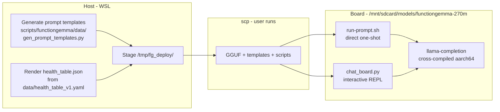

# FunctionGemma 270M — SL2619 board deployment

End-to-end recipe for staging the FunctionGemma 270M GGUF on the SL2619 board
and running it via SSH. Replaces the prior split between
`sl2619-functiongemma.md`, `sl2619-functiongemma-simple.md`,
`BOARD_DEPLOYMENT_QUICK_START.md`, and `BOARD_CLEANUP.md`.

For board cross-compile / baseline llama.cpp build, see
`docs/deployment/sl2619-board.md` (still the canonical board-bringup doc).

## Workflow at a glance



The split exists because the board has neither HF tokenizer nor `transformers`,
so prompt rendering is done host-side and pre-rendered prefixes/suffixes are
shipped to the board.

## Pre-flight

- Run `/board_probe` against the SL2619 first; confirm:
  - `/mnt/sdcard` mounted, ≥ 1 GiB free
  - `/mnt/sdcard/llama-cpp/llama-completion` present (cross-compiled aarch64 build)
  - 2 × Cortex-A55, NEON+dotprod
- Confirm host artifacts exist:
  - `releases/functiongemma-270m/001-baseline/gguf/finetuned_functiongemma_q4_0.gguf` (~224 MiB) — **the recommended on-board variant**, see `releases/.../gguf/RECOMMENDED.md`
  - `releases/functiongemma-270m/001-baseline/gguf/finetuned_functiongemma_fp16.gguf` (~518 MiB) — FP16 baseline
  - `releases/functiongemma-270m/001-baseline/merged/` (HF tokenizer + chat template)

R3 forbids the agent from writing to the board. All `scp`/`ssh` commands below
are intended for the user to run from the WSL host shell.

## Host setup (one-time per release)

```bash
cd /home/lanhp-wsl/nouslogic/gemma3-270M-finetune

# Render prompt templates from the chat template + tools registry.
uv run python scripts/functiongemma/data/gen_prompt_templates.py \
    --tokenizer releases/functiongemma-270m/001-baseline/merged/ \
    --output-dir /tmp/fg_deploy/

# Convert the patient-record YAML to JSON for the board.
uv run python -c "
import json, yaml
with open('data/health_table_v1.yaml') as f: data = yaml.safe_load(f)
with open('/tmp/fg_deploy/health_table.json', 'w') as f:
    json.dump(data, f, indent=2, ensure_ascii=False)
"

# Stage the board scripts alongside.
cp scripts/functiongemma/deploy/chat_board.py /tmp/fg_deploy/
cp scripts/functiongemma/deploy/run_prompt.sh /tmp/fg_deploy/run-prompt.sh
chmod +x /tmp/fg_deploy/run-prompt.sh

ls -lh /tmp/fg_deploy/
```

`gen_prompt_templates.py` produces `prompt-prefix.txt` (~7.2 KiB, system prompt
+ tools + user-msg opening) and `prompt-suffix.txt` (~35 B, assistant turn opener).

## Deploy to board (user runs)

```bash
ssh nouslogic-sl2619 'mkdir -p /mnt/sdcard/models/functiongemma-270m'

scp releases/functiongemma-270m/001-baseline/gguf/finetuned_functiongemma_q4_0.gguf \
    nouslogic-sl2619:/mnt/sdcard/models/functiongemma-270m/finetuned_functiongemma_q4_0.gguf

scp /tmp/fg_deploy/{prompt-prefix.txt,prompt-suffix.txt,health_table.json,chat_board.py,run-prompt.sh} \
    nouslogic-sl2619:/mnt/sdcard/models/functiongemma-270m/

ssh nouslogic-sl2619 'ls -lh /mnt/sdcard/models/functiongemma-270m/ \
    && sha256sum /mnt/sdcard/models/functiongemma-270m/finetuned_functiongemma_q4_0.gguf'
# expected sha256: a484ad50d4b66fdbd6ccb482389eec734b0de9fe988e8811b5e6683daf180e14
```

Expected: 224 MiB transfer in ~10–15 s on 5 GHz Wi-Fi (or ~120 s on a
saturated link). **Cleanup tip**: keep ONLY the recommended variant in
`/mnt/sdcard/models/functiongemma-270m/`. Cohabiting Q4_K_M / Q5_K_M / Q8_0
/ FP16 GGUFs evict each other from the board's page cache and inflate
per-prompt wall ~4× (observed in the 2026-05-02 sweep — see
`docs/bench-notes/functiongemma/2026-05-02_quantization-sweep.md`).

## Run

### One-shot prompt

```bash
ssh nouslogic-sl2619 'bash /mnt/sdcard/models/functiongemma-270m/run-prompt.sh "What is my blood pressure?"'
```

Expected output:

```
[fg] prompt: What is my blood pressure?
[fg] running inference...
<start_function_call>call:get_vitals{}<end_function_call>
common_perf_print: prompt eval time = ...
common_perf_print: eval time = ...
```

### Interactive REPL

```bash
ssh nouslogic-sl2619 'python3 /mnt/sdcard/models/functiongemma-270m/chat_board.py'
```

Slash commands inside the REPL: `/exit`, `/reset`, `/history`, `/raw`.

For a single probe without REPL:

```bash
ssh nouslogic-sl2619 'python3 /mnt/sdcard/models/functiongemma-270m/chat_board.py --probe "When is my next appointment?"'
```

### Full bench (host driver, board executor)

```bash
uv run python scripts/functiongemma/bench.py --mode remote \
    --ssh-host nouslogic-sl2619 \
    --remote-binary /mnt/sdcard/llama-cpp/llama-completion \
    --remote-model  /mnt/sdcard/models/functiongemma-270m/finetuned_functiongemma_q4_0.gguf \
    --threads 2 --warmup 1
```

Output lands in `bench/functiongemma/runs/functiongemma_remote_<timestamp>.jsonl`.

## Test prompts (tool-routing sanity)

| Prompt | Expected tool |
|---|---|
| `What is my blood pressure?` | `get_vitals` |
| `When is my next appointment?` | `get_next_appointment` |
| `Can I drink alcohol?` | `check_food_interaction` |
| `What am I allergic to?` | `list_allergies` |
| `What pills do I take at 8 AM?` | `get_medications_at_time` |
| `Who is my emergency contact?` | `get_emergency_contact` |
| `Do I take ibuprofen?` | `get_medication_by_name` |

## Expected performance

After the 2026-05-02 INT4 sweep, **Q4_0 is the recommended on-board
variant** (see `releases/functiongemma-270m/001-baseline/gguf/RECOMMENDED.md`):

| Target | Variant | Decode tok/s | Prompt eval tok/s | Per-prompt wall (cold) |
|---|---|---|---|---|
| Board (A55 × 2, CPU) | **Q4_0 (recommended)** | **10.27** | **60.1** | **~28 s** |
| Board (A55 × 2, CPU) | FP16 baseline | 5–7 | 30–60 | 25–60 s |
| Host (WSL2, 10 threads) | Q4_0 | ~30 | ~900 | 1–2 s |
| Host (WSL2, 10 threads) | FP16 | ~50 | ~900 | 2–4 s |

The Q4_0 board numbers above assume **single-resident** GGUF on
`/mnt/sdcard/models/functiongemma-270m/`. With multiple variants resident
the board's page cache thrashes and per-prompt wall inflates ~4× — clean
the directory after the demo.

Full sweep + per-row breakdown:
[`docs/bench-notes/functiongemma/2026-05-02_quantization-sweep.md`](../bench-notes/functiongemma/2026-05-02_quantization-sweep.md).

## Cleanup (board storage hygiene)

Audit before deleting:

```bash
ssh nouslogic-sl2619 'du -sh /mnt/sdcard/models/* 2>/dev/null | sort -rh'
```

Safe to remove (run interactively, never automated):

| Target | When safe |
|---|---|
| `/mnt/sdcard/models/<old-iteration>/` | After a newer release is staged and validated |
| `/mnt/sdcard/*bench*.jsonl`, `/mnt/sdcard/*chat*.json` | After bench results synced back to host |
| `/tmp/fg_prompt_*.txt` | Auto-cleaned by `run-prompt.sh` trap |

Never remove `/mnt/sdcard/llama-cpp/` — it contains the cross-compiled binaries.

Storage budget for the simplified workflow: ~545 MiB (518 MiB GGUF + 20 MiB
binaries + ~7 KiB templates). With `/mnt/sdcard` at 119 GiB, plenty of headroom.

## Troubleshooting

| Issue | Fix |
|---|---|
| `llama-completion: file not found` | Board build missing — see `docs/deployment/sl2619-board.md` §2 |
| `model.gguf: file not found` | Re-run the deploy `scp` |
| `prompt-prefix.txt: file not found` | Re-run `gen_prompt_templates.py` host-side |
| Load fails: `unknown model architecture` | Board llama.cpp too old — rebuild on `nouslogic-server` against latest tag |
| Garbage output / no parseable call | Special-token-as-bytes regression — verify `chat_template.jinja` alignment in `prompt-prefix.txt` |
| Decode rate < 1 tok/s | Board under load — check `top`, close other processes or reboot |

## Known limitations

- **No quantized variants on the board yet** — only the FP16 GGUF. INT4/INT8
  sweep is the planned next step (see quantization plan).
- **Prompt templates are pre-rendered host-side** — the board cannot serve
  arbitrary chat templates standalone. Fixing the FunctionGemma `--jinja` flag
  upstream (build `0adede8` does not propagate `tools=` to the chat template)
  or shipping the HF tokenizer to the board would unlock on-device rendering.
- **CPU-only path** — `syna_npu` is loaded on the board but llama.cpp has no
  Vulkan/SyNAP backend yet. A Torq/IREE FunctionGemma build is a separate track.

## Files referenced

| Path | Purpose |
|---|---|
| `releases/functiongemma-270m/001-baseline/gguf/model.gguf` | Distil iter-001 FunctionGemma GGUF |
| `releases/functiongemma-270m/001-baseline/merged/` | HF tokenizer + `chat_template.jinja` |
| `scripts/functiongemma/data/gen_prompt_templates.py` | Renders `prompt-{prefix,suffix}.txt` |
| `scripts/functiongemma/deploy/chat_board.py` | Board-side stdlib REPL |
| `scripts/functiongemma/deploy/run_prompt.sh` | Board-side one-shot wrapper |
| `scripts/functiongemma/bench.py` | Two-mode bench driver (local + remote) |
| `bench/functiongemma/runs/` | Where bench JSONL output lands |
| `/mnt/sdcard/models/functiongemma-270m/` | On-board deployment dir |
| `/mnt/sdcard/llama-cpp/llama-completion` | Cross-compiled llama.cpp aarch64 binary |
