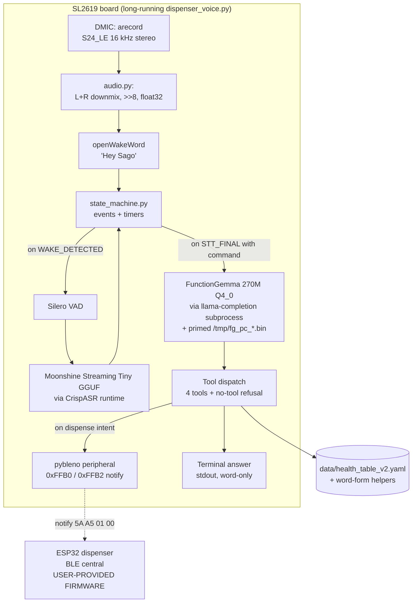
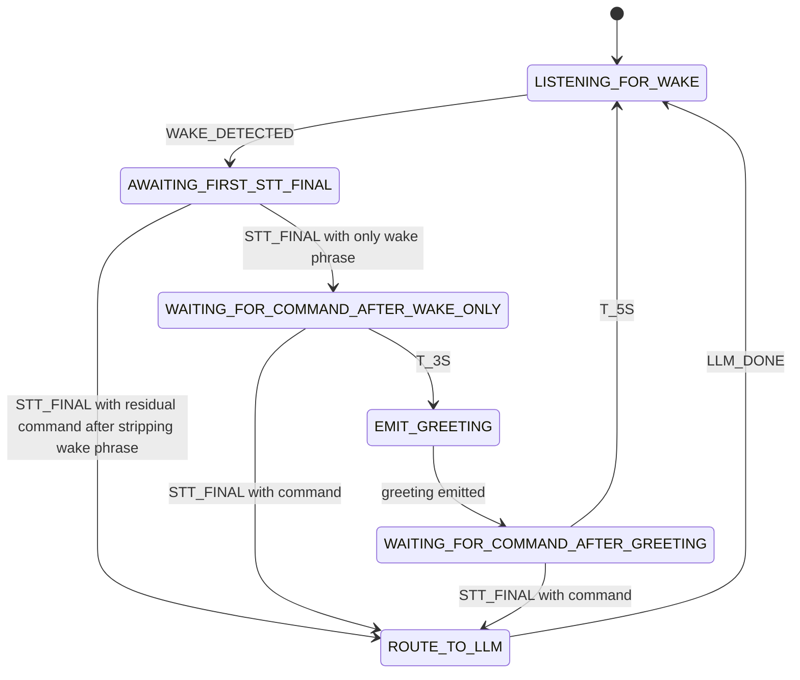

# Dispenser Demo — Implementation Plan

> **Status:** Spec frozen, implementation pending.
> **Date:** 2026-05-11.
> **Owner:** Lan.
> **Headline goal:** Voice-driven medication-dispenser demo on SL2619 using a
> dedicated FunctionGemma 270M iteration (`002-dispenser-demo`), wake word
> "Hey Sago", word-only TTS-ready answers, and a BLE notification to an
> ESP32 dispenser using the existing `pybleno` peripheral scaffold.

---

## 1. Goals and non-goals

### Goals

- Voice command from DMIC → `Hey Sago` wake word → STT → FunctionGemma intent
  → terminal answer + (for medication intent) BLE notification to ESP32.
- Closed, narrow scope: patient profile, next appointment, emergency contact,
  dispense medication, refuse everything else.
- All user-facing strings are **word-only** (no digits anywhere — dates, times,
  ages, phone numbers, room numbers). This is enforced at the tool boundary,
  not the LLM (see §6).
- Reuse the proven FunctionGemma + Distil Labs synthgen recipe. Reuse the
  existing pybleno peripheral scaffold from `docs/references/old-dispenser-demo/`.
- Ship a separate release artifact at `releases/functiongemma-270m/002-dispenser-demo/`.
  Do not mix into `001-baseline/`.

### Non-goals

- TTS / spoken answer playback. **v1 is terminal text only.** A future v2 will
  add speaker output and revisit barge-in / echo cancellation.
- ESP32 firmware development. The ESP32 firmware is **user-provided**; this
  plan only fixes the wire contract (§7.2).
- Multi-turn conversation memory. Each utterance starts fresh.
- Confirmation dialogs for dispense. Spec is "fire on first valid intent".
- Optimizing wake-to-answer latency. Functional correctness first; latency
  budget deferred per user.

---

## 2. Decisions made on convention that contradict interview sign-offs

Two answers from the interview need flagging because subsequent research
showed they conflict with existing repo convention. The plan adopts the
convention.

| ID | Interview answer | Convention | Plan decision |
| --- | --- | --- | --- |
| **D-1** | `out_of_scope_refusal()` tool | Refusals in `seed_conversations.jsonl` use no tool (`tool_calls` field absent), with refusal text in `content` after `</think>`. | **4 tools, not 5.** Refusal is a no-tool row (category `out_of_scope_refusal`). |
| **D-2** | Model produces word-only output through training pressure alone | Existing R-2 rule "quote verbatim" — small models reliably quote tool fields, unreliably rewrite digits. | Word-form fields baked into the **tool response** (e.g. `phone_words`, `age_words`). Model just quotes them. |

If either reversal is unwanted, flag it before Phase 1 starts.

---

## 3. Current repo context (inspected during planning)

| Area | Status | Key file pointers |
| --- | --- | --- |
| FunctionGemma tool-calling format | Reusable as-is | `src/gemma_tools/functiongemma/tools.py:1-80` (Pydantic-validated dispatch), `dataset.py:1-100` (JSONL validator) |
| Existing tools `get_next_appointment`, `get_emergency_contact` | Reusable (return-shape will be extended for `*_words`) | `src/gemma_tools/functiongemma/tools.py` |
| `health_table_v2.yaml` | Present; covers patient + appointments + emergency_contacts. No `medications` (acceptable — dispense is unconditional). | `data/health_table_v2.yaml` |
| Distil Labs synthgen path | Production path, ready to reuse | `releases/functiongemma-270m/001-baseline/distil/config.yaml`, `RECIPE.md` |
| `llama-quantize` Q4_0 build | Reusable | `scripts/functiongemma/quantize/build_variants.sh` |
| On-board llama-completion driver + prompt-cache trick | Library-extract; do not subclass `chat_board.py` directly | `scripts/functiongemma/deploy/chat_board.py` |
| DMIC capture | Documented; **no Python wrapper exists yet**. 48 dB S24_LE upper-bits trap is a gotcha. | `docs/references/sl2619-dmic.md` |
| Moonshine STT | Documented ONNX path; **new STT runtime (CrispASR/GGUF) chosen** — unproven on board (§5). | `docs/references/sl2619-moonshine.md` |
| Wake-word | **No engine in repo.** Will add openWakeWord. | — |
| VAD | **No engine in repo.** Will add Silero VAD. | — |
| BLE peripheral scaffold | Reusable; **but adapter changed from RTL USB → Broadcom M.2 — bring-up differs.** | `docs/references/old-dispenser-demo/{ble_peripheral.py,pybleno-setup-guide.md}` |
| Existing release `001-baseline` | Frozen. Do not mutate. | `releases/functiongemma-270m/001-baseline/` |

### M.2 Broadcom note

Old setup guide assumes the **RTL8822BU USB stick** (`btusb.ko` + `btrtl.ko`,
firmware in `/lib/firmware/rtl_bt/`). The board now uses the **M.2 daughter
card on SDIO1 (mmc1)** with Broadcom Wi-Fi/BT combo, per
`docs/references/upstream/synaptic-sl2619/docs/plans/backlogs.md` and
`tech-reference.md`. Different driver (`btbcm.ko`), different firmware path
(`/lib/firmware/brcm/*`), possibly different hci device name (`hci0` is not
guaranteed; could be `hci1` depending on devicetree order). Killing Wi-Fi may
break BT on a combo module. **Phase 2 must verify on the board via
`/board_probe` before assuming pybleno will work as-is.** See §10 pre-flight.

### Reference paths (saved to memory for future sessions)

```
docs/references/upstream/synaptic-sl2619/references/Synaptics
docs/references/upstream/synaptic-sl2619/docs/datasheets/sl2610-datasheets
```

The `references/Synaptics/linux-drivers-synaptics` submodule is **not
initialized**. Initialize on demand to find exact Broadcom chipset / firmware
file names:

```bash
git submodule update --init docs/references/upstream/synaptic-sl2619/references/Synaptics/linux-drivers-synaptics
```

---

## 4. Proposed directory layout

```
src/gemma_tools/dispenser_demo/
    __init__.py
    tools.py              # 4 tools + refusal helper; word-only response shapes
    dataset.py            # JSONL validator; word-only assertion (regex [0-9])
    system_prompt.py      # Short, scope-locked prompt for this demo
    state_machine.py      # Pure-logic FSM (wake / VAD / STT / timers) — no I/O
    ble_client.py         # pybleno peripheral wrapper; abstract BleClient ABC for tests
    audio.py              # arecord pipeline + S24_LE >>8 + L+R downmix + float

scripts/dispenser_demo/
    data/
        build_seeds.py            # ~40 hand-authored seeds (8 per category × 5)
        build_splits.py           # stratified train/val/test from seeds + LLM-aug
        gen_prompt_templates.py   # on-board prompt prefix/suffix gen
    train/
        finetune_local.py         # Unsloth fallback only (Distil is the production path)
    eval/
        eval_holdout.py           # category pass-rate + digit-free regex gate
    deploy/
        dispenser_voice.py        # ← NEW long-running daemon (the demo binary)
        ble_test.py               # standalone BLE notify smoke test (host or board)
        prompt_cache_prime.py     # extracted from chat_board.py: prime /tmp/fg_pc_<model>.bin
    quantize/
        # reuse scripts/functiongemma/quantize/build_variants.sh
    spike/
        crispasr_host_smoke.py    # Phase 0: does it build/load/decode on host?
        crispasr_board_smoke.sh   # Phase 0: does it run on SL2619? RSS? latency?

data/dispenser_demo/
    seed_conversations.jsonl
    llm_expanded_v1.jsonl
    dataset_v1/{train,val,test}.jsonl
    eval_holdout_v1.jsonl
    eval_holdout_v1_digit_free.jsonl   # subset gated on `re.search(r"[0-9]", ...)` == None

releases/functiongemma-270m/002-dispenser-demo/
    merged/                    # HF BF16 weights post-Distil
    adapter/                   # LoRA only
    gguf/
        finetuned_dispenser_fp16.gguf
        finetuned_dispenser_q4_0.gguf
        CHECKSUMS.txt
        Modelfile
        RECOMMENDED.md
    distil/
        config.yaml
        job_description.json
        README.md
        data/{train,test}.jsonl
        predictions/
    RECIPE.md
    model_client.py

docs/plans/dispenser-demo/
    plan.md                    # this file
    decisions-log.md           # to be created during implementation
    crispasr-spike-notes.md    # Phase 0 results

tests/dispenser_demo/
    test_dataset_validator.py
    test_tools_word_only.py
    test_state_machine.py
    test_ble_client.py
    test_end_to_end_simulated.py
    test_health_table_v2.py
```

**Registered ownership** in `docs/conventions/doc-update.md §8.1`:

| Domain | Canonical file |
| --- | --- |
| Dispenser demo plan | `docs/plans/dispenser-demo/plan.md` |
| Dispenser tool registry + word-only rules | `src/gemma_tools/dispenser_demo/tools.py` |
| Dispenser BLE wire contract | this file §7.2 |
| Dispenser STT spike notes | `docs/plans/dispenser-demo/crispasr-spike-notes.md` |

To be added to `doc-update.md §8.1` in the same PR that lands this plan.

---

## 5. Architecture overview



---

## 6. Data and schema

### 6.1 `health_table_v2.yaml`

Stays as currently committed: **digit-form**. No rewrite. Word-form derivation
is the loader's responsibility:

```python
# src/gemma_tools/dispenser_demo/tools.py (sketch)
def get_patient_profile(table: HealthTableV2) -> dict:
    return {
        "name": table.patient.name,                   # "David Smith"
        "age": table.patient.age,                     # 45
        "age_words": number_to_words(table.patient.age),  # "forty five"
        "sex": table.patient.sex,                     # "Male"
        "diagnoses": table.patient.diagnoses,         # [...]
        "diagnoses_words": _join_words(table.patient.diagnoses),  # "Type Two Diabetes and Hypertension"
    }
```

Tool responses for **all** tools include the `*_words` companion field for
every digit-containing field. The model is trained to quote those fields, not
to derive them.

### 6.2 Word-form rules (centralized in one helper)

| Field | Raw form | Word-form rule |
| --- | --- | --- |
| age | `45` | `"forty five"` (two-digit, no hyphen) |
| date | `"2026-05-20"` | `"May twentieth, twenty twenty six"` (no weekday) |
| time | `"10:30"` | `"ten thirty"` (no AM/PM) |
| phone | `"+1-555-0142"` | digit-by-digit, comma-grouped: `"plus one, five five five, zero one four two"` |
| room | `"Room 204"` | `"Room two hundred four"` |
| diagnosis name with digits | `"Type 2 Diabetes"` | `"Type Two Diabetes"` |

Single source: `src/gemma_tools/dispenser_demo/wordform.py`. Pure functions,
table-driven unit tests with `desc=` per `docs/conventions/testing.md`.

### 6.3 Health table v2 stays as-is

No `medications` array needed — the dispense intent is unconditional. The
canned answer `"Your medication is being dispensed. Please check the
dispenser."` references no specific medication.

---

## 7. Dispense intent: tool, BLE wire contract, ESP32 contract

### 7.1 `dispense_medication()` tool — side-effecting

This is the **only** side-effecting tool in the repo to date. Convention
extension required:

- BLE write happens at **tool-call dispatch time**, before the "tool response"
  is constructed.
- The tool response is the post-action status:
  ```json
  {"status": "dispensed"}              // BLE peer subscribed, notify sent OK
  {"status": "ble_not_connected"}      // no subscriber yet — degrade gracefully
  ```
- The model's next assistant turn quotes the canned answer
  `"Your medication is being dispensed. Please check the dispenser."`
  on `"dispensed"`, and a fallback `"I cannot reach the dispenser right now."`
  on `"ble_not_connected"`.
- The dispatcher accepts an injectable `BleClient` ABC. Production wires
  pybleno; unit tests inject `MockBleClient`.

### 7.2 BLE wire contract (mirror old peripheral scheme)

| Item | Value |
| --- | --- |
| SL2619 BLE role | **Peripheral** |
| Adapter | M.2 daughter card (Broadcom, SDIO1 — see §3 note) |
| Userspace stack | BlueZ + pybleno |
| Advertising device name | `NousVoice` |
| Advertising service UUID | `0x00FB` |
| Primary service UUID | `0xFFB0` |
| Notify characteristic UUID | `0xFFB2` |
| Dispense notification payload | `0x5A 0xA5 0x01 0x00` (4 bytes) |
| Header bytes | `0x5A 0xA5` |
| Command opcode | `0x01` |
| Status byte | `0x00` (success) |

Verified: spelling is `dispense` (with final `e`). No `dispens` truncation
anywhere in `docs/references/old-dispenser-demo/`.

### 7.3 ESP32 firmware contract (user-provided — out-of-repo)

The ESP32 dispenser firmware is NOT part of this repo. The seam:

- Act as BLE **central**.
- Scan for advertising name `NousVoice` **or** 16-bit service UUID `0x00FB`.
- Connect, discover primary service `0xFFB0`, characteristic `0xFFB2`.
- Subscribe to notifications.
- On receiving `5A A5 01 00`: trigger dispense actuator.
- Reconnect on disconnect.

This contract is the integration contract. Document it in
`docs/plans/dispenser-demo/esp32-firmware-contract.md` (one-page),
add to the §8.1 registry.

---

## 8. Tool registry (final, with reasoning blocks)

| Tool | Args | Return | Reused / new |
| --- | --- | --- | --- |
| `get_patient_profile()` | none | `{name, age, age_words, sex, diagnoses, diagnoses_words}` | **new** |
| `get_next_appointment()` | none | `{date, date_words, time, time_words, provider, purpose, location, location_words}` | reuse w/ extended return |
| `get_emergency_contact()` | none | `{name, relation, phone, phone_words}` | reuse w/ extended return |
| `dispense_medication()` | none | `{status}` (side-effects BLE notify) | **new (side-effecting)** |
| (refusal — no tool) | n/a | category `out_of_scope_refusal`; `tool_calls: null`; canned content | **new pattern usage** |

Tools-per-row in seeds: embedded as full JSON-Schema array, matching iter-001
convention.

System prompt (canonical, `src/gemma_tools/dispenser_demo/system_prompt.py`):

```
You are Sago, a health assistant for a single patient. You can call exactly
these four tools when relevant: get_patient_profile, get_next_appointment,
get_emergency_contact, dispense_medication. If the user asks for anything
else, refuse politely and do not call any tool. Always quote tool response
fields ending in "_words" verbatim. Never produce digits in your final answer.
```

---

## 9. Wake-word and timeout state machine

### 9.1 Explicit events (resolves the "after decoding is successful" caveat)

| Event | Source | Meaning |
| --- | --- | --- |
| `WAKE_DETECTED` | openWakeWord | wake-phrase classifier crossed threshold |
| `VAD_SPEECH_START` | Silero VAD | speech onset within capture window |
| `VAD_SPEECH_END` | Silero VAD | trailing silence ≥ N ms after speech |
| `STT_FINAL` | Moonshine Streaming Tiny | final transcript emitted, joint with `VAD_SPEECH_END` |
| `T_3S` | timer | 3 s elapsed in `WAITING_FOR_COMMAND_AFTER_WAKE_ONLY` |
| `T_5S` | timer | 5 s elapsed in `WAITING_FOR_COMMAND_AFTER_GREETING` |
| `LLM_DONE` | dispenser_voice | model produced final answer + tools dispatched |

### 9.2 State diagram



### 9.3 Edge rules

- **One-breath wake+command (E1).** First `STT_FINAL` after `WAKE_DETECTED`:
  strip wake phrase (case-insensitive, leading match). If residual non-empty →
  route to LLM, skip greeting, skip both timers.
- **Greeting playback / barge-in (E2).** Greeting is terminal print in v1 — no
  barge-in needed. Audio during `EMIT_GREETING` state is ignored. **Code
  comment must call out the future v2 speaker variant: revisit echo
  cancellation + VAD-during-TTS-gating.**
- **Dispense confirmation (E3).** None. Fire on first valid intent.
- **Timeout sound (D-7).** Silent. No spoken phrase. Just transition back to
  `LISTENING_FOR_WAKE`.
- **Pure FSM, no I/O.** Implementation under `state_machine.py`; events
  arrive as tagged tuples; tests inject a fake clock.

---

## 10. Phased implementation

Numbered phases, sequenced per user instruction (train first, BLE next, voice
last). Each phase has a clear exit gate. Use `/clear` between phases.

### Phase 0 — CrispASR runtime spike (gate)

**Why first**: `cstr/moonshine-streaming-tiny-GGUF` is unproven on this board.
Find out before committing the voice stack to it.

| Step | Action | Pass criterion |
| --- | --- | --- |
| 0.1 | Host smoke (`scripts/dispenser_demo/spike/crispasr_host_smoke.py`): build CrispASR for x86_64, decode a known WAV. | Decoded text matches expected sentence; runtime ≤ 1 s for a 3 s clip. |
| 0.2 | Board smoke: cross-compile or use prebuilt aarch64 CrispASR; decode the same WAV on SL2619. Measure RSS + decode latency. | RSS ≤ 250 MB; decode ≤ 2 s for a 3 s clip. |
| 0.3 | Decision: keep CrispASR or fall back to documented Moonshine Tiny float ONNX. Record in `docs/plans/dispenser-demo/crispasr-spike-notes.md`. | Either path proven; one chosen. |

**Phase 0 fallback rule:** If 0.2 fails (build, OOM, latency > 5 s), fall back
to **Moonshine Tiny float ONNX** per `docs/references/sl2619-moonshine.md` —
documented, no spike risk. The fallback is the only safe net.

### Phase 1 — Data + Distil training (long-running, user priority)

Done **in parallel** with Phase 0 (Phase 1 only needs synthetic data + Distil
server time; doesn't touch the board).

| Step | Action | Pass criterion |
| --- | --- | --- |
| 1.1 | Author 40 seeds in `data/dispenser_demo/seed_conversations.jsonl`. 8 rows × 5 categories: `patient_profile`, `next_appointment`, `emergency_contact`, `dispense`, `out_of_scope_refusal`. Use wordforms verbatim from §6.2. | `pytest tests/dispenser_demo/test_dataset_validator.py` green. PHI scan green. |
| 1.2 | Write `src/gemma_tools/dispenser_demo/tools.py` + `wordform.py` + `dataset.py`. Unit tests for word-only invariants (regex `[0-9]` over every assistant content field). | `uv run pytest tests/dispenser_demo/` green, `mypy src` clean. |
| 1.3 | Build splits via `scripts/dispenser_demo/data/build_splits.py`. Stratified split: train 60% / val 20% / test 20%. | `train.jsonl + val.jsonl + test.jsonl` validate via `dataset.py`. |
| 1.4 | Author Distil config + job_description for `002-dispenser-demo`. Mirror `001-baseline/distil/config.yaml` with task `multi-turn-tool-calling-closed-book`, synthgen target 1500, validation_similarity_threshold 0.90. `job_description.json` includes the word-only rule explicitly. | Both files lint-clean. |
| 1.5 | Upload to Distil Labs, run synthgen, iterate task description as in iter-001's 3-round flow. Headline metric: judge ≥ 0.92 on hold-out, 100 % digit-free over post-`</think>` text. | Judge ≥ 0.92 AND digit-free 100 %. |
| 1.6 | Download merged HF weights to `releases/functiongemma-270m/002-dispenser-demo/merged/`. Run host eval via `scripts/dispenser_demo/eval/eval_holdout.py --checkpoint ...`. | Per-category pass-rate ≥ 90 %. |
| 1.7 | Quantize: `scripts/functiongemma/quantize/build_variants.sh --release-dir releases/functiongemma-270m/002-dispenser-demo`. Q4_0 + FP16. CHECKSUMS.txt committed. | Q4_0 GGUF eval ≥ 88 % (≤ 2 pp drop). |

Exit Phase 1 with a deployable Q4_0 GGUF and a passing host eval.

### Phase 2 — Board BLE bring-up (M.2 module verification)

**Pre-step:** Run `/board_probe` before any Phase 2 action. Specific BT-side
commands the probe must run:

```bash
hciconfig -a
dmesg | grep -iE 'brcm|broadcom|bluetooth|bt[a-z]*\.ko'
ls /lib/firmware/brcm/ 2>/dev/null || ls /lib/firmware/ | grep -i b
systemctl status bluetooth
lsmod | grep -E 'btbcm|btusb|btrtl|hci'
ls -la /sys/bus/mmc/devices/mmc1*/
```

Optionally: `git submodule update --init docs/references/upstream/synaptic-sl2619/references/Synaptics/linux-drivers-synaptics`
to read exact chipset / firmware filename.

| Step | Action | Pass criterion |
| --- | --- | --- |
| 2.1 | `/board_probe` confirms an `hci*` interface UP. Note its name and chipset; update `docs/references/old-dispenser-demo/pybleno-setup-guide.md` (or fork to `docs/references/sl2619-ble-m2.md`) with the M.2 Broadcom bring-up. | One `hci*` UP on board. |
| 2.2 | Port the pybleno scaffold to a clean `src/gemma_tools/dispenser_demo/ble_client.py` (or `_peripheral.py` since the role is peripheral). Keep the Python 3.12 / kernel 6.x patches from the old setup guide. Expose: `start_advertising()`, `wait_for_subscriber()`, `send_dispense_notify()`. | Code lints clean, unit tests with `MockBleClient` green. |
| 2.3 | Standalone `scripts/dispenser_demo/deploy/ble_test.py`: on the board, start advertising as `NousVoice`, wait for the ESP32 to connect+subscribe, send one `5A A5 01 00` notify. | ESP32 actuator fires once. Logged on both sides. |

**Branch rule:** if pybleno fails against the Broadcom path (BlueZ socket
issues, kernel mismatches), fall back to `bluez-peripheral` or a thin
D-Bus shim. Decision logged in `decisions-log.md`.

Exit Phase 2 with a one-shot BLE notification firing the real ESP32.

### Phase 3 — Voice stack integration

| Step | Action | Pass criterion |
| --- | --- | --- |
| 3.1 | `audio.py`: arecord subprocess wrapper, S24_LE >> 8, L+R downmix to mono float32 at 16 kHz. Host unit test on synthetic WAV. | Output bit-exact vs reference. |
| 3.2 | openWakeWord integration. Train custom "Hey Sago" model (Colab via openwakeword tool) OR find pretrained. Drop ONNX to `/mnt/sdcard/models/wakeword/`. | False-positive rate ≤ 1 / hour on bench audio; true-positive rate ≥ 90 %. |
| 3.3 | Silero VAD wrapper. CPU onnxruntime. | Speech-start / speech-end events on bench utterances. |
| 3.4 | STT runtime per Phase 0 outcome (CrispASR or fallback). Wrap in `stt.py` with a single `decode_streaming()` API; state machine consumes `STT_FINAL` events. | Decoded transcripts match expected for ≥ 8 / 10 bench utterances. |
| 3.5 | `state_machine.py` + `dispenser_voice.py` glue. Prompt-cache priming on startup via `prompt_cache_prime.py` (extracted from `chat_board.py`). | Cold start ≤ 60 s (prime + load); warm path functional. |
| 3.6 | End-to-end smoke on the board: each of the 5 intents (× 3 paraphrases) drives the right tool dispatch + right terminal text + (for dispense) BLE fire. | 12 / 15 utterances pass. |

### Phase 4 — Acceptance

| Gate | Method | Target |
| --- | --- | --- |
| Per-intent accuracy (model) | `eval_holdout.py` on 50-row holdout | ≥ 90 % per category |
| Digit-free outputs | regex `[0-9]` over post-`</think>` text | 100 % |
| BLE dispense write to real ESP32 | manual on-board test | ≥ 1 successful, repeatable |
| End-to-end on board, 5 intents | live demo session | each intent answered + correct behavior |
| Memory budget | `/usr/bin/time -v dispenser_voice.py` on board | record max RSS; flag if > 700 MB; no hard ceiling yet |

Latency budget: **deferred per user**. Recorded but not gated.

---

## 11. Test and verification matrix

| Layer | Test | Marker | Runs in |
| --- | --- | --- | --- |
| Wordform helpers | `test_wordform.py` — parametrized table per §6.2 | none | CI |
| Tool registry | `test_tools_word_only.py` — every tool response field is either non-string or digit-free | none | CI |
| Dataset validator | `test_dataset_validator.py` — schema + word-only across all seeds | none | CI |
| State machine | `test_state_machine.py` — pure FSM, fake clock, every edge in §9.2 covered | none | CI |
| BLE client | `test_ble_client.py` — MockBleClient verifies the right bytes are emitted on `dispense` | none | CI |
| Simulated end-to-end | `test_end_to_end_simulated.py` — synthetic STT inputs → expected terminal outputs + mock BLE bytes | none | CI |
| Holdout eval | `eval_holdout.py` | none | CI on every model |
| Server training | Distil round trip | `@pytest.mark.server` | on-demand |
| Board BLE | one-shot notify to real ESP32 | `@pytest.mark.hardware` | on-demand |
| Board end-to-end | live voice → dispense | `@pytest.mark.hardware` | on-demand |

PHI scanner gate: every seed JSONL passes `scripts/pre_commit_phi_scanner.py`
before merge.

---

## 12. Risks and open decisions

| ID | Risk / decision | Severity | Mitigation |
| --- | --- | --- | --- |
| R1 | CrispASR fails to build / runs OOM on board | high | Phase 0 spike gates; fallback to Moonshine Tiny float ONNX. |
| R2 | pybleno fails against M.2 Broadcom path | medium | Phase 2 step 2.2 branches to `bluez-peripheral` or D-Bus shim. |
| R3 | Memory ceiling (~600 MB) exceeded once everything is loaded | medium | Phase 4 incremental measurement; cut openWakeWord (replace with smaller) or VAD if needed. |
| R4 | openWakeWord custom training quality | medium | Burn one day to train + tune threshold; fallback to Porcupine if FPR > 5 / hr. |
| R5 | 270M model still generates digits despite word-only fields | medium | Eval gate fails the release; iterate task_description text + add more digit-trap seeds. |
| R6 | ESP32 firmware not ready when Phase 2 starts | low | Phase 2 step 2.3 acceptable with `nRF Connect` standing in for ESP32 (subscribes + reads notification). |
| O1 | `STT_FINAL` semantics — is "joint VAD-end + STT-final" event the intended trigger for the 3-s timer? | open | **Default in this plan: yes.** Override before Phase 3 if not. |
| O2 | Greeting **content** for the dispense response when BLE peer not connected | open | Default in this plan: `"I cannot reach the dispenser right now."` — override if you want it dropped. |
| O3 | `out_of_scope_refusal` paraphrases (8 seeds) — what topics? | open | Default: stock health-adjacent (medication advice, symptom diagnosis, treatment), plus generic (weather, news, joke, math). |
| O4 | Wake-phrase tolerance: should `"Hey Sago"` also match `"Hi Sago"`, `"OK Sago"`? | open | Default: only `"Hey Sago"` matches the openWakeWord model. Strict. |

---

## 13. Context-management guidance (separate Claude Code sessions)

Use `/clear` between major phases — each one is a heavy chunk that benefits
from a fresh context.

| Session | Scope | When to `/clear` |
| --- | --- | --- |
| **S1** | Phase 0 + Phase 1.1–1.3 (data authoring + validator + splits) | After splits committed. |
| **S2** | Phase 1.4–1.7 (Distil config, upload, iterate, quantize) | After Q4_0 release committed. |
| **S3** | Phase 2 (BLE on board, runs `/board_probe`) | After BLE smoke fires the real ESP32. |
| **S4** | Phase 3 (voice integration on board) | After end-to-end smoke. |
| **S5** | Phase 4 (acceptance + decisions-log + plan update) | Final. |

Each new session: open this plan first; the plan is the durable handoff.

---

## 14. Pointers

- Source convention: `docs/plans/functiongemma/recipe.md` (template for this plan's tone/sections).
- Quantization recipe: `docs/plans/functiongemma/quantization-plan.md`.
- DMIC: `docs/references/sl2619-dmic.md`.
- Moonshine ONNX (fallback): `docs/references/sl2619-moonshine.md`.
- Old BLE peripheral (scaffold to fork): `docs/references/old-dispenser-demo/ble_peripheral.py`.
- SL2619 Broadcom M.2 specifics: `docs/references/upstream/synaptic-sl2619/{references/Synaptics, docs/datasheets/sl2610-datasheets}` — submodule, init on demand.
- Conventions: `docs/conventions/{code-style-python.md, code-style-shell.md, testing.md, doc-update.md}`.
- Iron laws: `.claude/CLAUDE.local.md` (R1 pre-flight, R3 SSH read-only).
