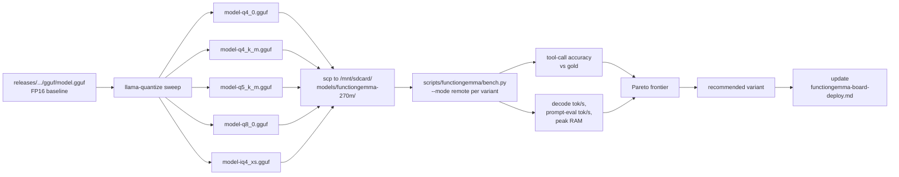

# FunctionGemma 270M — INT4/INT8 quantization plan for SL2619

Find the best-performing quantized variant of
`releases/functiongemma-270m/001-baseline/gguf/model.gguf` (FP16, 518 MiB) on the
SL2619 board, where "best" balances tool-call accuracy against decode latency.

## Status

PLANNED, not yet executed. Kicks off the post-iteration-001 work track.

## Goals

- Produce ≥ 4 quantized variants of `model.gguf` using `llama.cpp` `llama-quantize`.
- Bench each variant on the SL2619 board with consistent prompts (the 7 patient
  YAML tool-call probes from `bench/functiongemma/runs/2026-05-02-iter-001/`).
- Identify the variant on the Pareto frontier of decode tok/s vs accuracy.
- Document the recommended on-board variant in
  `docs/deployment/functiongemma-board-deploy.md`.

## Workflow



## Variants to test

Starting matrix. Add or drop based on early results.

| Variant | Size estimate | Why include |
|---|---|---|
| `Q4_0` | ~130 MiB | Baseline INT4, fastest decode on A55 with `dotprod` |
| `Q4_K_M` | ~145 MiB | Higher-quality K-quant; small accuracy bump over Q4_0 |
| `Q5_K_M` | ~170 MiB | Middle ground; tests whether Q4 underflow is the bottleneck |
| `Q8_0` | ~270 MiB | INT8 reference; tests the cliff between INT4 and FP |
| `IQ4_XS` | ~115 MiB | Importance-weighted INT4; smallest variant likely to clear the accuracy bar |

If Q4_0 already clears the accuracy bar at acceptable speed, the higher-bit
variants become reference points only. If Q4_0 fails accuracy, escalate to
Q5_K_M and IQ4_XS first (those use better importance weighting).

## Setup dimensions to sweep

For each variant, evaluate at:

| Dimension | Values | Notes |
|---|---|---|
| Threads | 2, 4 | A55 has 2 cores; over-subscription rarely helps but cheap to confirm |
| Context size (`-c`) | 2048, 4096 | Lower context = lower KV-cache RAM; check whether 2048 is enough for the 7-tool prompts |
| Flash attention (`-fa`) | on, off | `0adede8` build supports `-fa`; check whether on-CPU FA helps the A55 |
| Prompt eval batch (`-b`) | default, 256 | Smaller batch reduces peak RAM during prefill |
| KV cache type | `f16`, `q8_0` | `--cache-type-k q8_0 --cache-type-v q8_0` halves KV RAM at minimal accuracy cost |

Most permutations are not worth running. **Stage 1**: fix `threads=2`,
`ctx=4096`, `-fa off`, default batch, `cache=f16`; sweep variants. **Stage 2**:
take the Pareto-frontier variants from stage 1 and sweep one dimension at a time.

## Methodology

### Producing quantized variants (host)

```bash
QUANT=q4_0
docs/references/upstream/llama.cpp/build/bin/llama-quantize \
    releases/functiongemma-270m/001-baseline/gguf/model.gguf \
    releases/functiongemma-270m/001-baseline/gguf/model-${QUANT}.gguf \
    Q4_0
```

Repeat for each variant in the matrix.

Stash variants under `releases/functiongemma-270m/001-baseline/gguf/model-<quant>.gguf`
(gitignored). Record sha256 in
`releases/functiongemma-270m/001-baseline/gguf/CHECKSUMS.txt` (tracked).

### Benching on the board

For each variant:

```bash
# 1. Stage on board (user runs from host)
scp releases/functiongemma-270m/001-baseline/gguf/model-${QUANT}.gguf \
    nouslogic-sl2619:/mnt/sdcard/models/functiongemma-270m/

# 2. Run bench (host driver, board executor)
uv run python scripts/functiongemma/bench.py --mode remote \
    --ssh-host nouslogic-sl2619 \
    --remote-binary /mnt/sdcard/llama-cpp/llama-completion \
    --remote-model  /mnt/sdcard/models/functiongemma-270m/model-${QUANT}.gguf \
    --threads 2 --warmup 1 \
    --out bench/functiongemma/runs/2026-05-XX-quant/${QUANT}.jsonl
```

Each run produces one JSONL file under
`bench/functiongemma/runs/2026-05-XX-quant/`. Aggregate with a small Python
script (write under `scripts/functiongemma/bench/aggregate_quant.py` when
needed).

### Tool-call accuracy

Two passes:

1. **Round-trip parity** vs FP16 baseline — same prompts produce the same
   parsed `(tool_name, args)` tuple. This is the strongest signal a quantized
   variant didn't break tool-routing.
2. **Holdout eval** — `scripts/functiongemma/eval/eval_holdout.py` against
   `data/functiongemma/eval_holdout_v2_clean.jsonl`. Same metrics as iteration
   001's `teacher-eval-analysis.md` (judge, ROUGE, tool-call equivalence,
   binary, staged).

Pass bar:

- **Accuracy floor**: tool-call equivalence ≥ 0.90 (vs the iteration-001
  baseline of 0.9583 — accept up to 5pp degradation for the quant gain).
- **Latency floor**: decode ≥ 10 tok/s on A55 × 2 (target; FP16 baseline is
  ~5–7 tok/s, so any INT4 variant should clear this).

## Output

When the sweep is complete, this doc gets a results section with the matrix
filled in. The recommended variant gets:

- A note in `releases/functiongemma-270m/001-baseline/gguf/RECOMMENDED.md`
  pointing at the chosen `.gguf` filename.
- An update to `docs/deployment/functiongemma-board-deploy.md` "Run" section
  to use the recommended variant by default instead of FP16.
- Optionally: a follow-up `docs/bench-notes/functiongemma/2026-05-XX_quantization-sweep.md`
  with the full per-variant breakdown.

## Deferred

- **iMatrix calibration.** `llama-imatrix` produces an importance matrix from
  representative prompts that improves Q4_K_M and IQ4_XS quality. Worth
  trying if the basic Q4_K_M and IQ4_XS variants fail the accuracy floor.
- **vLLM/AWQ paths.** Out of scope here — llama.cpp is the canonical board
  runtime per the deployment doc.
- **Iteration 002 retraining at a different LoRA rank or with parallel-call
  classes added.** Captured as OQ-Q3 in `decisions-log.md`.
