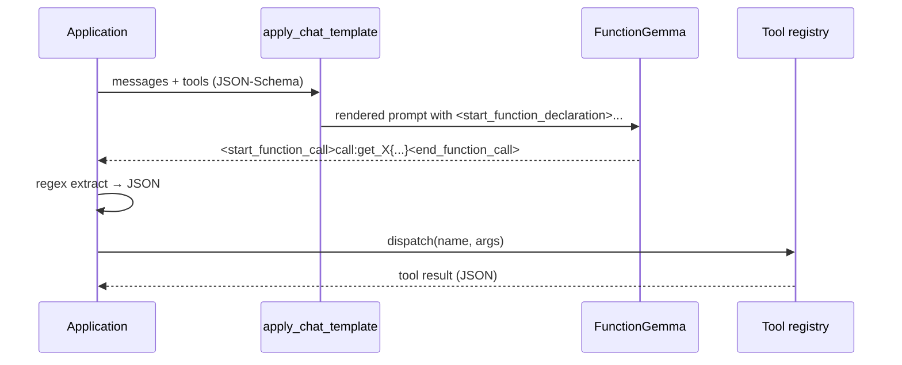
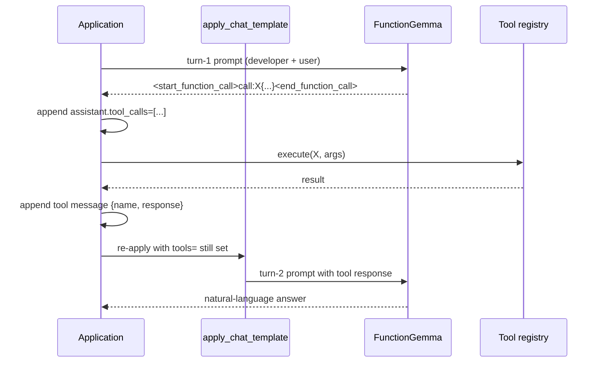

# FunctionGemma 270M — working recipe

What FunctionGemma is, how the wire format works, and the live training/eval
paths that produce `releases/functiongemma-270m/001-baseline/gguf/finetuned_functiongemma_fp16.gguf`
(the canonical distil iter-001 deployable; renamed from `model.gguf` 2026-05-02).

For the full historical narrative (Phase A–E plan, 2321 lines), see
`archive/functiongemma-pre-distil/plans/phase-d-readme-original.md`.

## Model identity

| Property | Value |
|---|---|
| HF id | `google/functiongemma-270m-it` |
| Backbone | Gemma 3 270M architecture (4 attn heads, 1 KV head, vocab 262 144, sliding window 512, 18 layers, hidden 640) |
| Chat format | **Different from Gemma 3** — adds `developer` role, function-call/declaration/response control tokens, `<escape>` string delimiter |
| Knowledge cutoff | August 2024 |
| Training tokens | 6T |
| Headline BFCL Simple (0-shot) | 61.6 |
| Headline BFCL Live Multiple | 25.7 |
| License | `gemma` (open weights, license-gated) |

FunctionGemma is *not* a drop-in for closed-world QA — where Gemma 3 270M-IT
*retrieves and quotes* YAML, FunctionGemma *issues a tool call* against a Python
function that reads the YAML.

## Wire format

Special tokens:

| Token pair | Purpose |
|---|---|
| `<start_function_declaration>` / `<end_function_declaration>` | Defines a tool (placed inside the `developer` turn) |
| `<start_function_call>` / `<end_function_call>` | Model emits a tool invocation |
| `<start_function_response>` / `<end_function_response>` | Tool result (provided by the orchestration loop, role `tool`) |
| `<escape>` | Delimits all string values inside structured blocks |

Roles:

| HF chat-template role | On-the-wire token | Purpose |
|---|---|---|
| `developer` | `<start_of_turn>developer` | System / tool declarations / first turn only |
| `user` | `<start_of_turn>user` | User utterance |
| `assistant` | `<start_of_turn>model` | Model output (function call OR final NL answer) |
| `tool` | `<start_of_turn>tool` | Function-result payload, role-injected by orchestration |

Application code **never writes** the special-token strings by hand. Pass
standard JSON-Schema tool definitions to
`processor.apply_chat_template(..., tools=[...])`; the chat template renders
the wire format. Verbatim parser regex (canonical, from the vendor cookbook):

```python
re.findall(r"<start_function_call>call:(\w+)\{(.*?)\}<end_function_call>", text, re.DOTALL)
re.findall(r"(\w+):(?:<escape>(.*?)<escape>|([^,}]*))", args)
```

The first developer-turn line **must literally read** "You are a model that
can do function calling with the following functions" — the vendor cookbook
notes that this string is the prompt-based trigger that activates the
function-calling logic. Do not paraphrase.

## Single-turn flow



## Multi-turn flow with tool result



Cell 20 of `full-function-calling-sequence-with-functiongemma.ipynb` warns
verbatim: "Using `globals()` to call functions dynamically can be dangerous in
production." `src/gemma_tools/functiongemma/tools.py:default_registry()` is
the dispatch dictionary used in this repo — no `globals()` lookups.

## Sampling defaults

The HF model card and the GA docs do not pin temperature / top_p / top_k.
Repo conventions:

- **Tests / smoke / eval**: `do_sample=False, max_new_tokens=128` (deterministic).
- **Production agent runs**: `do_sample=True, temperature=0.2, top_p=0.95, top_k=64, min_p=0.0`.

Document the chosen pair next to every bench artifact.

## Known limitations (vendor)

- Not explicitly trained for **multi-step (chained)** workflows where Tool A's output is Tool B's input.
- Not explicitly trained for **multi-turn slot-filling** that requires state across turns to fill in tool args.
- English-only safety eval.
- Knowledge cutoff August 2024.
- **Tokenizer note**: the tokenizer has new PAD/BOS/EOS tokens that differ from the model config and generation config — always set `tokenizer.pad_token_id` before generation.

## Live paths in this repo

```mermaid
flowchart TB
    subgraph Data[data preparation]
        S[seed_conversations.jsonl] --> SP[build_splits]
        SP --> DS[dataset_v1/{train,val,test}.jsonl]
    end
    subgraph Train[training - two paths]
        DS --> Distil[Distil Labs platform<br/>current production path]
        DS --> Local[scripts/functiongemma/train/finetune_local.py<br/>Unsloth fallback - no platform dep]
    end
    Distil --> Iter[releases/functiongemma-270m/001-baseline/distil/]
    Local --> Out[outputs/]
    Iter --> Rel[releases/functiongemma-270m/001-baseline/]
    Out --> Rel
    Rel --> Eval[scripts/functiongemma/eval/eval_holdout.py]
    Rel --> Chat[scripts/functiongemma/chat.py]
    Rel --> Bench[scripts/functiongemma/bench.py]
```

### Current production path: Distil Labs

`releases/functiongemma-270m/001-baseline/distil/` holds the iteration that produced
`releases/functiongemma-270m/001-baseline/`. The hyperparameters live in
`releases/functiongemma-270m/001-baseline/distil/config.yaml`; the metrics in
`training-analysis.md` and `teacher-eval-analysis.md` next to it.

Hit rate at iteration 001: **0.9583** on every metric (judge, ROUGE,
tool-call equivalence, binary, staged) on the 24-row contaminated
holdout. See `releases/functiongemma-270m/001-baseline/distil/README.md` for the full
upload/run/eval timeline.

Upstream skill reference: `.claude/skills/distil-cli/distil-cli/SKILL.md`.

### Local fallback: Unsloth + LoRA

`scripts/functiongemma/train/finetune_local.py` is the runnable fallback
when the Distil platform is unavailable or when full hyperparameter control
is needed. Implements two vendor-faithful baselines selectable via
`--recipe {mobile_actions_hf, mobile_actions_tunix}`. Mirrors the LoRA
r=64 / `q_proj,v_proj` / 4-epoch shape of iteration 001 via the override
flags. Server-side: requires `nouslogic-server` (RTX 5080, ~16 GiB VRAM,
cu128 stack provisioned by `scripts/setup/server-bootstrap.sh`).
Run `uv run python scripts/functiongemma/train/finetune_local.py --help`
for the full flag set; `--dry-run` validates splits without a GPU.

## Tool registry

Seven read-only patient-record tools, defined in
`src/gemma_tools/functiongemma/tools.py` and mirrored as JSON-Schema in
`data/functiongemma/tools_v1.yaml`. The patient fixture they read from is
`data/health_table_v1.yaml` (synthetic — no real PHI; OQ-5 reviewed).

| Tool | Purpose |
|---|---|
| `get_vitals` | Most-recent vitals snapshot |
| `get_medications_at_time` | Meds scheduled for a clock time (e.g. 8 AM) |
| `get_medication_by_name` | Single medication record by name |
| `list_allergies` | Allergy list |
| `check_food_interaction` | Per-medication food-interaction check |
| `get_next_appointment` | Earliest upcoming appointment |
| `get_emergency_contact` | First listed emergency contact |

## Dataset workflow

```mermaid
flowchart LR
    HA[hand-authored seeds<br/>seed_conversations.jsonl] --> Aug[LLM augmentation<br/>recipe in seed-authoring-recipe.md]
    Aug --> Raw[data/functiongemma/_raw/<br/>teacher dumps]
    Raw --> Stage[manual stager<br/>shape-clean repair]
    Stage --> Inc[data/functiongemma/_incoming/<br/>batch_NNN_*_repaired.jsonl]
    Inc --> Phi[pre_commit_phi_scanner.py]
    Phi --> Ing[scripts/functiongemma/data/ingest.py]
    Ing --> LLM[llm_expanded_v1.jsonl]
    Ing --> Q[quarantine.jsonl]
    LLM --> Splits[scripts/functiongemma/data/build_splits.py]
    Splits --> DS[dataset_v1/{train,val,test}.jsonl]
```

PHI scanner (`scripts/pre_commit_phi_scanner.py`) gates ingest — every staged
JSONL is scanned for PHI-like strings before merge into `llm_expanded_v1.jsonl`.

## Eval

```bash
uv run python scripts/functiongemma/eval/eval_holdout.py \
    --model releases/functiongemma-270m/001-baseline/merged \
    --holdout data/functiongemma/eval_holdout_v2_clean.jsonl
```

Output Markdown table lands in `docs/bench-notes/functiongemma/<today>_functiongemma-eval.md`
by default. Per-row JSONL output in the bench artifact dir.

## Acceptance gates

- **G_DATASET_SHAPE** — every `dataset_v1` row passes the Pydantic shape validator (`functiongemma/dataset.py:validate_file`).
- **G_TOOLS_TESTS** — `tests/functiongemma/test_tools.py` ≥ 90 % branch coverage; every tool returns a stable JSON-serializable dict.
- **G_EVAL** — held-out `eval_holdout_v2_clean.jsonl` ≥ 80 % tool-call equivalence vs gold.

## Companion plan docs

- `docs/plans/functiongemma/decisions-log.md` — major decisions table.
- `docs/plans/functiongemma/quantization-plan.md` — current INT4/INT8 SL2619 work.
- `docs/plans/functiongemma/seed-authoring-recipe.md` — how to author a hand seed batch.
- `docs/plans/functiongemma/llm-augmentation-prompt.md` — verbatim prompt for LLM augmentation.
- `docs/plans/functiongemma/upstream-issue-drafts.md` — `--no-conversation`/`-no-cnv` and tools= bugs.
